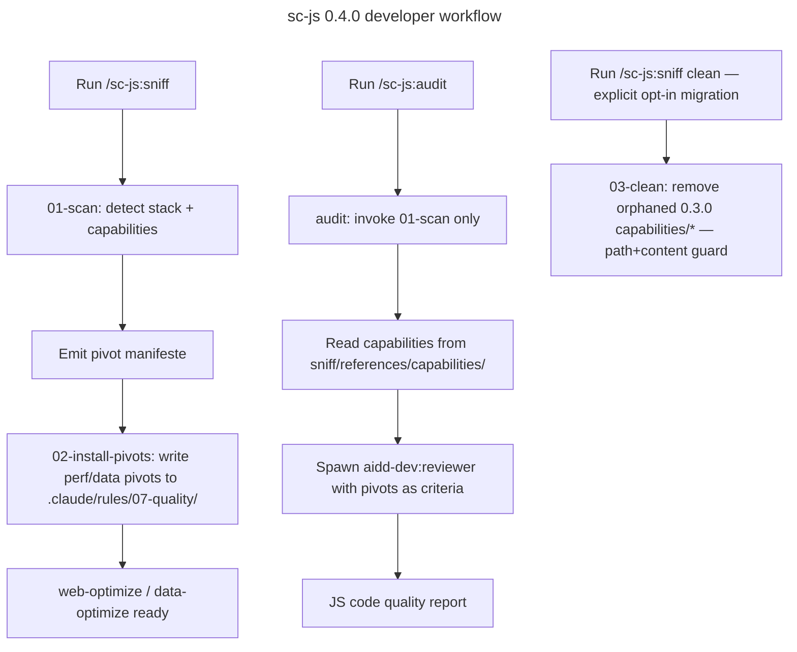

# Master Plan: sc-js 0.4.0 — JS Knowledge Provider

## Overview

- **Goal**: Transform sc-js from a rule-file installer into a JS knowledge provider; sniff detects stack and emits a pivot manifeste; audit loads JS capability pivots and delegates code review to aidd-dev:reviewer; setup skill removed; perf/data pivot contract with web-optimize/data-optimize preserved
- **Risk Score**: 7/10
- **Branch**: `feat/sc-js-0.4.0/`

## Child Plans

| #   | Plan                    | File                                              | Status   | Validated |
| --- | ----------------------- | ------------------------------------------------- | -------- | --------- |
| 1   | Foundation — References | `./2026_05_28-sc-js-knowledge-provider-part-1.md` | pending  | [ ]       |
| 2   | Sniff Refactor          | `./2026_05_28-sc-js-knowledge-provider-part-2.md` | blocked  | [ ]       |
| 3   | Audit Skill             | `./2026_05_28-sc-js-knowledge-provider-part-3.md` | blocked  | [ ]       |
| 4   | Release                 | `./2026_05_28-sc-js-knowledge-provider-part-4.md` | blocked  | [ ]       |

## Validation Protocol

1. Complete Part 1 — verify references moved, setup deleted
2. [ ] Checkpoint 1: Part 1 acceptance criteria met
3. Unblock Part 2 — refactor sniff actions
4. [ ] Checkpoint 2: Part 2 acceptance criteria met
5. Unblock Part 3 — create audit skill
6. [ ] Checkpoint 3: Part 3 acceptance criteria met
7. Unblock Part 4 — release
8. [ ] Final: `plugin.json` version = "0.4.0", audit skill present, setup directory absent

## Architecture Projection (validated)

### Files to modify

- `plugins/sc-js/.claude-plugin/plugin.json` — bump 0.3.0 → 0.4.0, reframe description
- `plugins/sc-js/skills/sniff/SKILL.md` — reframe as detector + manifeste producer, remove install-capabilities reference
- `plugins/sc-js/skills/sniff/actions/01-scan.md` — output = manifeste of applicable pivots; remove all capabilities/* install targets; update perf source paths to sniff/references/capabilities/perf/
- `plugins/sc-js/skills/sniff/actions/02-sync.md` — renamed to 02-install-pivots.md; scope restricted to perf/data pivots only

### Files to create

- `plugins/sc-js/skills/sniff/references/capabilities/**` — moved from skills/setup/references/capabilities/ (excluding styling/design-system.md)
- `plugins/sc-js/skills/sniff/actions/02-install-pivots.md` — replaces 02-sync; installs only to .claude/rules/07-quality/
- `plugins/sc-js/skills/sniff/actions/03-clean.md` — migration: removes 0.3.0 orphaned capabilities/* by path-list + content-match guard
- `plugins/sc-js/skills/audit/SKILL.md` — new skill: JS code audit against detected pivots
- `plugins/sc-js/skills/audit/actions/01-audit.md` — Step 1 = invoke 01-scan only; Step 2 = read capabilities refs; Step 3 = spawn aidd-dev:reviewer
- `plugins/sc-js/CHANGELOG.md` — breaking change migration note 0.3.0 → 0.4.0

### Files to delete

- `plugins/sc-js/skills/setup/` — entire directory; install-all model removed
- `plugins/sc-js/skills/sniff/actions/02-sync.md` — replaced by 02-install-pivots.md

## Applicable Rules

| Tool | Name | Path | Why it applies |
| ---- | ---- | ---- | -------------- |
| none | —    | —    | Plugin source is markdown only; no AI tool rules apply to this refactor |

## User Journey

## Confidence Assessment

- **Score**: 9/10
- ✓ Architecture projection gate passed after 2 challenge rounds — all deal-breakers resolved
- ✓ Dependency chain clean: references moved in Part 1 before sniff reads from new location in Part 2
- ✓ perf/data pivot contract with web-optimize preserved — 02-install-pivots keeps .claude/rules/07-quality/ path
- ✓ 03-clean safeguarded against accidental user rule deletion (path list + content match)
- ✓ audit → 01-scan only: no install-pivots or clean side effects
- ✓ ${CLAUDE_PLUGIN_ROOT} confirmed as real binding in Claude Code plugin env (used in aidd-dev 01-plan.md)
- ✗ 03-clean content-match requires deciding how to store/compare 0.3.0 reference checksums — implementation detail flagged in Part 2 acceptance criteria

## Estimations

- **Confidence**: 9/10
- **Duration**: 1 session
