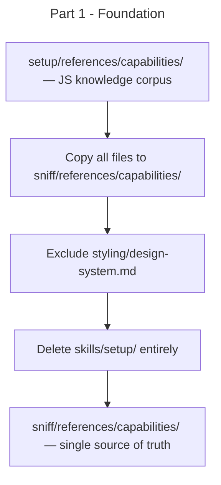

# Instruction: sc-js 0.4.0 — Part 1: Foundation — References

## Feature

- **Summary**: Relocate all JS capability reference files from the setup skill to the sniff skill; delete skills/setup entirely; no logic changes in this phase
- **Stack**: Markdown, Claude Code plugin system
- **Branch name**: `feat/sc-js-0.4.0/`
- **Parent Plan**: `./2026_05_28-sc-js-knowledge-provider-master.md`
- **Sequence**: `1 of 4`
- Confidence: 9/10
- Time to implement: 10 minutes

## Architecture projection

### Files to modify

- none

### Files to create

- `skills/sniff/references/capabilities/code-splitting/defineAsyncComponent.md` — moved from setup
- `skills/sniff/references/capabilities/code-splitting/dynamic-import.md` — moved from setup
- `skills/sniff/references/capabilities/components/shared-scope.md` — moved from setup
- `skills/sniff/references/capabilities/data/drizzle.md` — moved from setup
- `skills/sniff/references/capabilities/data/graphql.md` — moved from setup
- `skills/sniff/references/capabilities/data/mongoose.md` — moved from setup
- `skills/sniff/references/capabilities/data/prisma.md` — moved from setup
- `skills/sniff/references/capabilities/data/trpc.md` — moved from setup
- `skills/sniff/references/capabilities/data/typeorm.md` — moved from setup
- `skills/sniff/references/capabilities/icons/lucide-vue.md` — moved from setup
- `skills/sniff/references/capabilities/icons/svg-inline.md` — moved from setup
- `skills/sniff/references/capabilities/images/web-optimization.md` — moved from setup
- `skills/sniff/references/capabilities/networking/preconnect.md` — moved from setup
- `skills/sniff/references/capabilities/perf/alpine.md` — moved from setup
- `skills/sniff/references/capabilities/perf/nuxt.md` — moved from setup
- `skills/sniff/references/capabilities/perf/static.md` — moved from setup
- `skills/sniff/references/capabilities/perf/vite.md` — moved from setup
- `skills/sniff/references/capabilities/perf/vue-spa.md` — moved from setup
- `skills/sniff/references/capabilities/server/nitro-imports.md` — moved from setup
- `skills/sniff/references/capabilities/ssr/storage-guards.md` — moved from setup
- `skills/sniff/references/capabilities/state/alpine-store.md` — moved from setup
- `skills/sniff/references/capabilities/state/pinia.md` — moved from setup
- `skills/sniff/references/capabilities/styling/css-transitions.md` — moved from setup (design-system.md excluded)

### Files to delete

- `skills/setup/` — entire directory; install-all model removed

## Applicable Rules

| Tool | Name | Path | Why it applies |
| ---- | ---- | ---- | -------------- |
| none | —    | —    | File move only; no logic |

## User Journey

## Risk register

| Risk | Impact | Mitigation |
| ---- | ------ | ---------- |
| design-system.md copied by mistake | Project-specific template pollutes plugin knowledge corpus | Explicit exclusion — never copy styling/design-system.md |
| styling/ directory left with no files after exclusion | Empty directory in sniff/references | If css-transitions.md is the only other file in styling/, it is still copied — no empty dir |

## Implementation phases

### Phase 1: Move references and delete setup

> Copy every capability reference file from setup to sniff (excluding design-system.md), then delete skills/setup.

#### Tasks

1. Read each file in `skills/setup/references/capabilities/` recursively to confirm contents before moving
2. Write each file to the matching path under `skills/sniff/references/capabilities/`, excluding `styling/design-system.md`
3. Verify all expected files exist at their new paths
4. Delete `skills/setup/` directory entirely

#### Acceptance criteria

- [ ] `skills/sniff/references/capabilities/` exists and contains the same subdirectory structure as the former `skills/setup/references/capabilities/` (minus design-system.md)
- [ ] `skills/setup/` does not exist
- [ ] `skills/sniff/references/capabilities/styling/design-system.md` does NOT exist

## Amendments

## Log

## Validation flow demonstration

1. List `skills/sniff/references/capabilities/` — confirms all capability dirs present
2. Confirm `skills/setup/` is absent
3. Confirm `skills/sniff/references/capabilities/styling/design-system.md` is absent
