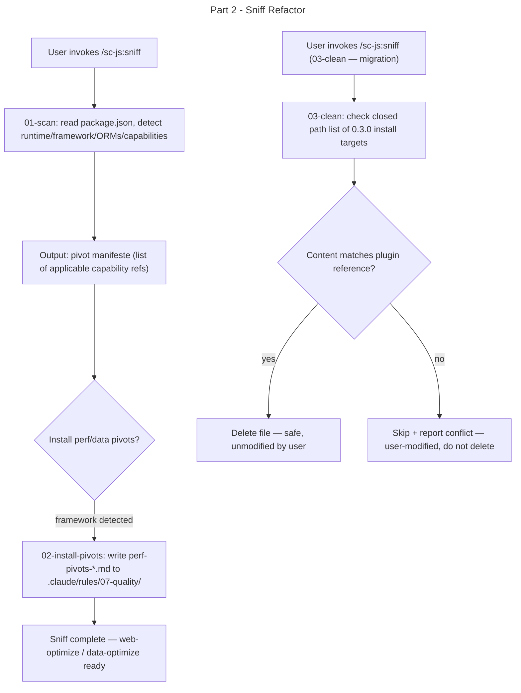

# Instruction: sc-js 0.4.0 — Part 2: Sniff Refactor

## Feature

- **Summary**: Rewrite sniff actions so 01-scan outputs a pivot manifeste only (no install targets for capabilities/*); rename 02-sync to 02-install-pivots (perf/data only); add 03-clean for 0.3.0 → 0.4.0 migration; update SKILL.md description
- **Stack**: Markdown, Claude Code plugin system
- **Branch name**: `feat/sc-js-0.4.0/`
- **Parent Plan**: `./2026_05_28-sc-js-knowledge-provider-master.md`
- **Sequence**: `2 of 4`
- Confidence: 9/10
- Time to implement: 30 minutes

## Architecture projection

### Files to modify

- `skills/sniff/SKILL.md` — reframe description: detector + manifeste producer; remove "installs matching coding rules"; add reference to new 03-clean action
- `skills/sniff/actions/01-scan.md` — remove all capabilities/* install targets from the capability → rule mapping table; update perf source paths from `capabilities/perf/` to `sniff/references/capabilities/perf/` (relative to ${CLAUDE_PLUGIN_ROOT}); output section becomes "pivot manifeste" not "install manifest"

### Files to create

- `skills/sniff/actions/02-install-pivots.md` — replaces 02-sync; maps detected framework to perf/data pivot files in sniff/references/capabilities/; installs only to .claude/rules/07-quality/; reads source from ${CLAUDE_PLUGIN_ROOT}/skills/sniff/references/capabilities/perf/ and /data/
- `skills/sniff/actions/03-clean.md` — migration action; closed path list of all 0.3.0 capability install targets; for each path, deletes only if file content matches the corresponding plugin reference (byte-for-byte comparison); aborts per-file if content differs and reports the conflict to user

### Files to delete

- `skills/sniff/actions/02-sync.md` — replaced by 02-install-pivots.md

## Applicable Rules

| Tool | Name | Path | Why it applies |
| ---- | ---- | ---- | -------------- |
| none | —    | —    | Plugin source is markdown |

## User Journey

## Risk register

| Risk | Impact | Mitigation |
| ---- | ------ | ---------- |
| 01-scan still references capabilities/* install paths after edit | sniff 0.4.0 still installs rule files — breaks the model | Acceptance criterion: grep for "capabilities/" install targets returns 0 matches |
| 03-clean deletes user-modified rule | Data loss | Content-match guard: skip + report if content differs from plugin reference |
| Content comparison ambiguity (whitespace, line endings) | False positive match → delete modified file | Normalize line endings (CRLF → LF) before comparing |

## Implementation phases

### Phase 1: Rewrite 01-scan output section

> Remove all capabilities/* install targets from 01-scan; update perf source paths; change output format to pivot manifeste.

#### Tasks

1. Read current `skills/sniff/actions/01-scan.md`
2. Remove the entire "Reference → Target" install column from capability tables (keep capability detection logic)
3. Add a new output format section: "pivot manifeste" listing applicable capability reference paths (no install targets)
4. Update all perf pivot source paths from `capabilities/perf/` to `${CLAUDE_PLUGIN_ROOT}/skills/sniff/references/capabilities/perf/`
5. Update all data pivot source paths similarly

#### Acceptance criteria

- [ ] `01-scan.md` contains no `→ .claude/rules/capabilities/` install target strings
- [ ] `01-scan.md` output section is titled "pivot manifeste" and lists reference paths, not install targets
- [ ] Perf pivot source paths reference `sniff/references/capabilities/perf/`

### Phase 2: Create 02-install-pivots and delete 02-sync

> Write the new 02-install-pivots action; delete the old 02-sync.

#### Tasks

1. Write `skills/sniff/actions/02-install-pivots.md` — reads perf/data pivot files from `${CLAUDE_PLUGIN_ROOT}/skills/sniff/references/capabilities/perf/` and `/data/`; writes only to `.claude/rules/07-quality/perf-pivots-*.md` and `data-pivots-*.md`
2. Delete `skills/sniff/actions/02-sync.md`

#### Acceptance criteria

- [ ] `02-install-pivots.md` exists and contains no reference to `.claude/rules/capabilities/`
- [ ] `02-install-pivots.md` source paths reference `sniff/references/capabilities/perf/` and `/data/`
- [ ] `02-sync.md` does not exist

### Phase 3: Create 03-clean

> Write the migration action with closed path list and content-match guard.

#### Tasks

1. Write `skills/sniff/actions/03-clean.md`
2. Include the complete closed list of paths that sc-js 0.3.0 would have installed (all `capabilities/*` entries from the former 01-scan.md mapping table)
3. Specify the content-match guard: normalize line endings, compare file content to plugin reference byte-for-byte; delete only on exact match; skip + report on mismatch
4. Add a dry-run reporting mode (list what would be deleted, without deleting)

#### Acceptance criteria

- [ ] `03-clean.md` contains the closed path list of all 0.3.0 install targets (≥ 8 paths from the former mapping table)
- [ ] Content-match guard is explicitly described with normalization step
- [ ] Dry-run mode is defined and explicitly named in 03-clean.md

### Phase 4: Update SKILL.md

> Reframe the sniff skill description to reflect its new role; define the invocation mechanism for 03-clean.

#### Tasks

1. Rewrite `skills/sniff/SKILL.md` description: remove "installs matching coding rules"; add "emits pivot manifeste"; add 03-clean action to the actions table
2. Define the default flow: `01-scan → 02-install-pivots` (default); `03-clean` is an **opt-in migration step** invoked explicitly by the user as `/sc-js:sniff clean` — it is never triggered automatically by the default sniff flow

#### Acceptance criteria

- [ ] `SKILL.md` description no longer contains "installs" or "install" in reference to capability rules
- [ ] Actions table lists 01-scan, 02-install-pivots, 03-clean
- [ ] Default flow section explicitly states: default = `01-scan → 02-install-pivots`; `03-clean` = opt-in via `/sc-js:sniff clean`

## Amendments

## Log

## Validation flow demonstration

1. `grep -n "capabilities/" skills/sniff/actions/01-scan.md` — should return 0 install target lines
2. `ls skills/sniff/actions/` — should show 01-scan.md, 02-install-pivots.md, 03-clean.md (no 02-sync.md)
3. Review 03-clean.md path list — count ≥ 8 entries matching former 01-scan.md mapping table
