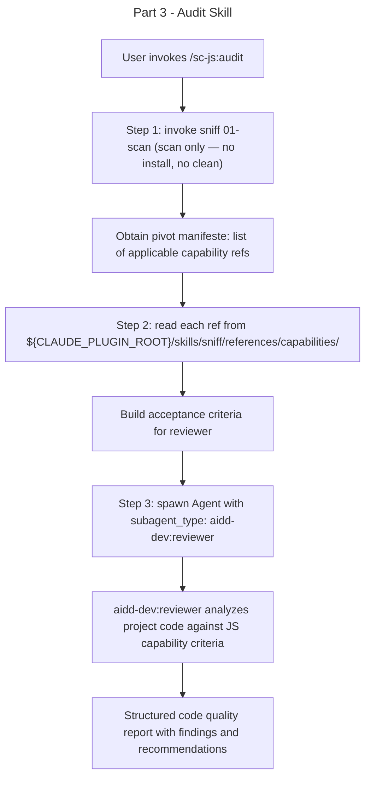

# Instruction: sc-js 0.4.0 — Part 3: Audit Skill

## Feature

- **Summary**: Create the new audit skill that orchestrates sniff (01-scan only) to detect applicable JS capability pivots, reads them from the plugin, and delegates code analysis to an aidd-dev:reviewer subagent using the pivots as acceptance criteria
- **Stack**: Markdown, Claude Code plugin system
- **Branch name**: `feat/sc-js-0.4.0/`
- **Parent Plan**: `./2026_05_28-sc-js-knowledge-provider-master.md`
- **Sequence**: `3 of 4`
- Confidence: 9/10
- Time to implement: 20 minutes

## Architecture projection

### Files to modify

- none

### Files to create

- `skills/audit/SKILL.md` — trigger description, model, actions reference
- `skills/audit/actions/01-audit.md` — three-step action: scan → load → review

### Files to delete

- none

## Applicable Rules

| Tool | Name | Path | Why it applies |
| ---- | ---- | ---- | -------------- |
| none | —    | —    | Plugin source is markdown |

## User Journey

## Risk register

| Risk | Impact | Mitigation |
| ---- | ------ | ---------- |
| audit accidentally triggers 02-install-pivots or 03-clean | Unwanted file writes/deletes during an audit | 01-audit.md must explicitly state: "invoke 01-scan only — never 02-install-pivots or 03-clean" |
| reviewer agent has no project files in scope | Generic review with no file:line references | 01-audit.md must instruct: pass project src path(s) as review target to reviewer |
| ${CLAUDE_PLUGIN_ROOT} resolves incorrectly for audit skill | Capability refs not found | audit is in the same plugin (sc-js) as sniff — ${CLAUDE_PLUGIN_ROOT} resolves to the same root |

## Implementation phases

### Phase 1: Create SKILL.md

> Write the audit skill manifest with trigger description and action reference.

#### Tasks

1. Write `skills/audit/SKILL.md` with:
   - `name`: audit
   - `model`: sonnet
   - `description`: trigger conditions covering "audit JS", "audit code quality", "/sc-js:audit", "check JS best practices", "review my JS code"
   - Actions block referencing `@actions/01-audit.md`

#### Acceptance criteria

- [ ] `skills/audit/SKILL.md` exists with valid frontmatter (name, model, description)
- [ ] Description covers at least 4 trigger phrases relevant to JS code audit
- [ ] Actions block references `@actions/01-audit.md`

### Phase 2: Create 01-audit.md

> Write the three-step audit action.

#### Tasks

1. Write `skills/audit/actions/01-audit.md` with these explicit steps:
   - **Step 1 — Detect**: invoke sniff `01-scan` (scan only — never invoke `02-install-pivots` or `03-clean`); obtain pivot manifeste
   - **Step 2 — Load**: for each applicable capability in the manifeste, read the reference file from `${CLAUDE_PLUGIN_ROOT}/skills/sniff/references/capabilities/<category>/<pivot>.md`; build a list of acceptance criteria from the loaded content
   - **Step 3 — Review**: spawn an Agent with `subagent_type: aidd-dev:reviewer`; pass the loaded capability pivots as the `agreed_plan` (acceptance criteria); pass the project source files identified in Step 1 as the `review_target`
2. Add a transversal rule: "Never install files to .claude/rules/; audit is read-only except for the review report written by aidd-dev:reviewer"

#### Acceptance criteria

- [ ] `01-audit.md` contains the phrase "01-scan only" (or equivalent explicit restriction)
- [ ] `01-audit.md` mentions `${CLAUDE_PLUGIN_ROOT}/skills/sniff/references/capabilities/`
- [ ] `01-audit.md` contains `aidd-dev:reviewer` as the subagent_type
- [ ] `01-audit.md` has a transversal rule stating audit makes no writes to `.claude/rules/`
- [ ] `01-audit.md` mentions `install-pivots` and `03-clean` only in prohibition rules ("never", "Do not invoke") — no unconditional invocation of these actions

## Amendments

🤖 Acceptance criterion "grep install-pivots|03-clean → 0 matches" was too strict: the implementation correctly names these actions in prohibition rules (never/Do not invoke), which is the appropriate documentation pattern. Criterion updated to verify absence of unconditional invocations rather than absence of any mention.

## Log

## Validation flow demonstration

1. Read `skills/audit/SKILL.md` — confirm name, model, description, and @actions reference
2. Read `skills/audit/actions/01-audit.md` — confirm three steps are present, scan-only restriction explicit, ${CLAUDE_PLUGIN_ROOT} path present, aidd-dev:reviewer named
3. `grep -n "install-pivots\|03-clean" skills/audit/actions/01-audit.md` — should return 0 matches (no accidental invocation of side-effecting actions)
