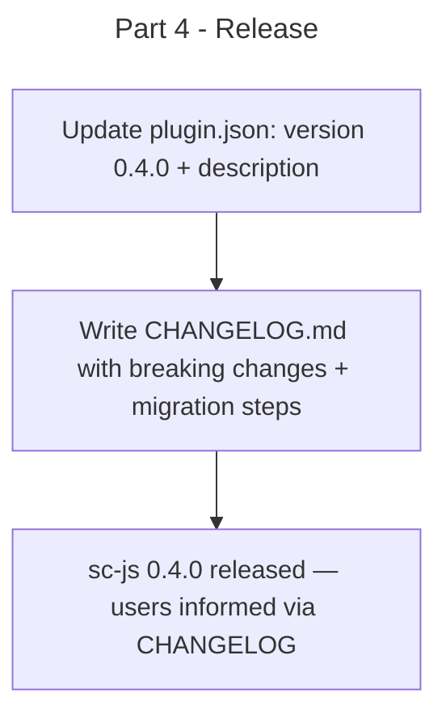

# Instruction: sc-js 0.4.0 — Part 4: Release

## Feature

- **Summary**: Bump plugin version to 0.4.0, update the plugin description to reflect the knowledge-provider model, write CHANGELOG.md documenting the breaking changes and migration path for 0.3.0 users
- **Stack**: JSON, Markdown, Claude Code plugin system
- **Branch name**: `feat/sc-js-0.4.0/`
- **Parent Plan**: `./2026_05_28-sc-js-knowledge-provider-master.md`
- **Sequence**: `4 of 4`
- Confidence: 10/10
- Time to implement: 10 minutes

## Architecture projection

### Files to modify

- `plugins/sc-js/.claude-plugin/plugin.json` — version "0.3.0" → "0.4.0"; description updated to knowledge-provider framing

### Files to create

- `plugins/sc-js/CHANGELOG.md` — breaking change note with migration instructions

### Files to delete

- none

## Applicable Rules

| Tool | Name | Path | Why it applies |
| ---- | ---- | ---- | -------------- |
| none | —    | —    | JSON + Markdown only |

## User Journey

## Risk register

| Risk | Impact | Mitigation |
| ---- | ------ | ---------- |
| CHANGELOG missing the migration step for 03-clean | 0.3.0 users don't know how to clean up orphaned rules | Acceptance criterion: CHANGELOG must mention /sc-js:sniff (03-clean) migration command |

## Implementation phases

### Phase 1: Bump plugin.json

> Update version and description.

#### Tasks

1. Read `plugins/sc-js/.claude-plugin/plugin.json`
2. Set `version` to `"0.4.0"`
3. Set `description` to: "JS knowledge provider: detects runtime (web/desktop), framework (Nuxt/Vue/Alpine/Vite/Astro), ORMs and capabilities, then emits a pivot manifeste. /sc-js:audit delegates code review to aidd-dev:reviewer using capability pivots as criteria. Perf pivots for web-optimize, data pivots for data-optimize. Run sniff on existing projects; run audit to review JS code quality."

#### Acceptance criteria

- [ ] `plugin.json` `version` field = `"0.4.0"`
- [ ] `plugin.json` `description` no longer contains "installs" in reference to capability rules
- [ ] `plugin.json` `description` mentions `audit` skill

### Phase 2: Write CHANGELOG.md

> Document all breaking changes and the migration path.

#### Tasks

1. Write `plugins/sc-js/CHANGELOG.md` with the following sections:
   - `## [0.4.0] — 2026-05-28`
   - Breaking changes: sniff no longer installs `.claude/rules/capabilities/*`; `skills/setup` removed
   - New features: `audit` skill, `03-clean` migration action
   - Migration guide: existing 0.3.0 users should run `/sc-js:sniff clean` (explicit opt-in) to remove orphaned capability rules from `.claude/rules/`; default sniff flow never triggers 03-clean automatically

#### Acceptance criteria

- [ ] `CHANGELOG.md` exists at plugin root
- [ ] Contains section `[0.4.0]` with date 2026-05-28
- [ ] Documents that sniff no longer installs capability rules (breaking change)
- [ ] Documents migration step: run `/sc-js:sniff clean` (opt-in, never automatic) to remove orphaned files

## Amendments

## Log

## Validation flow demonstration

1. `cat plugins/sc-js/.claude-plugin/plugin.json` — version = "0.4.0", description updated
2. `cat plugins/sc-js/CHANGELOG.md` — confirms breaking change + migration step present
