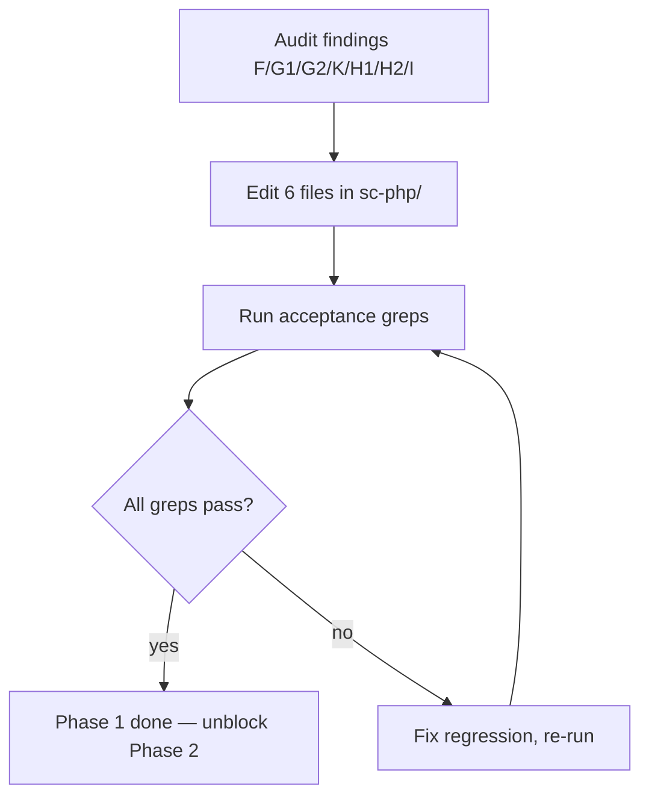

# Instruction: sc-php Phase 1 — Quick factual fixes

## Feature

- **Summary**: Seven findings, eight file edits on Markdown action/reference files; correct outdated facts and add missing examples surfaced by the audit (finding I touches 2 files).
- **Stack**: `Markdown only (no code)`
- **Branch name**: `chore/sc-php-audit-fixes/phase-1`
- **Parent Plan**: `2026_05_28-sc-php-audit-fixes-master.md`
- **Sequence**: `1 of 4`
- Confidence: 9.5/10
- Time to implement: ~1h

## Architecture projection

### Files to modify

- `plugins/sc-php/skills/legacy/actions/01-scan.md` - add explicit "assumed PHP 7.4" warning (F, line 18) + fix array unpacking note (G2, line 57) + add framework gaps example to Step 5 output (H1, lines 79-101)
- `plugins/sc-php/skills/legacy/actions/02-migrate.md` - add dry-run output variant block (H2, after line 150)
- `plugins/sc-php/skills/log-analysis/references/log-formats.md` - remove "Strict Standards" from severity list and parse regex (G1, lines 7,9)
- `plugins/sc-php/skills/log-analysis/SKILL.md` - extend anti-print rule to cover hostnames and tokens grepped from logs (I, around line 40)
- `plugins/sc-php/skills/log-analysis/references/environments.md` - mirror the extended anti-print rule (I, around line 56)
- `plugins/sc-php/skills/improve/actions/01-analyze.md` - add explicit mapping `focus` value → analysis category section (K, after line 8)

### Files to create

- none

### Files to delete

- none

## Applicable rules

| Tool | Name | Path | Why it applies |
|------|------|------|----------------|
| none | — | — | `list-rules.mjs` returned `[]` — meta-plugin repo has no installed rules surface |

## User Journey

## Risk register

| Risk | Impact | Mitigation |
|------|--------|------------|
| Removing "Strict Standards" breaks parsing of legacy PHP 5.x logs | Lost severity bucket | Add inline comment that severity was removed in PHP 7.0; users on PHP 5.x can re-add locally |
| "PHP 7.4 assumed" wording diverges from DEC-012 phrasing | Confusion for SmartLockers maintainers | Link DEC-012 in the warning text |
| Dry-run variant differs in shape from real output | User confusion when reading the doc | Keep both outputs structurally aligned (same headers) |

## Implementation phases

### Phase 1: Apply 7 deterministic edits

> Edit Markdown files in place. No new files, no decisions.

#### Tasks

1. **F**: in `legacy/01-scan.md:18`, replace "If still unknown: assume PHP 7.4 and note the assumption in output" with an explicit warning block: `⚠ PHP version not detected — assumed 7.4 (legacy default; see DEC-012 if applicable). Set 'target' explicitly if your server runs a different version.`
2. **G2**: in `legacy/01-scan.md:57`, remove the "Array unpacking with string keys | Not yet available — note as gap | 8.1" row (feature has been available since PHP 8.1).
3. **H1**: in `legacy/01-scan.md` Step 5 output block (lines 79-101), add a `Framework gaps` section with one Laravel and one Symfony example line (e.g. `Laravel 9 → 11: Route::resource()->only() deprecated, 3 usages`).
4. **H2**: in `legacy/02-migrate.md` after the Output block (line 150), add a `### Dry-run output` subsection showing the same shape with `[dry-run]` prefix and explicit "no files written" footer.
5. **G1**: in `log-analysis/references/log-formats.md:7`, remove `Strict Standards` from the severity list. In line 9, remove `|Strict Standards` from the parse regex. Add a one-line note: `(Strict Standards was removed in PHP 7.0; users on PHP 5.x can re-add locally.)`
6. **I**: in `log-analysis/SKILL.md` Transversal rules (around line 40), extend the credentials rule: replace "Never print or log SSH credentials, passwords, or key paths." with "Never print or log SSH credentials, passwords, key paths, hostnames, or tokens that may appear in grepped log lines."
7. **I**: in `log-analysis/references/environments.md:56-57`, mirror the same extended wording.
8. **K**: in `improve/actions/01-analyze.md` after line 8 (`focus` input), add a mapping section: `focus=solid → SOLID violations`, `focus=patterns → Missing patterns`, `focus=types → PHP type system gaps`, `focus=framework → Framework-specific issues`.

#### Acceptance criteria

- [x] `! grep -q "Strict Standards" plugins/sc-php/skills/log-analysis/references/log-formats.md`
- [x] `grep -q "assumed 7.4" plugins/sc-php/skills/legacy/actions/01-scan.md`
- [x] `! grep -q "Not yet available" plugins/sc-php/skills/legacy/actions/01-scan.md`
- [x] `grep -q "Dry-run output" plugins/sc-php/skills/legacy/actions/02-migrate.md`
- [x] `grep -q "Framework gaps" plugins/sc-php/skills/legacy/actions/01-scan.md`
- [x] `grep -q "hostnames, or tokens" plugins/sc-php/skills/log-analysis/SKILL.md`
- [x] `grep -q "hostnames, or tokens" plugins/sc-php/skills/log-analysis/references/environments.md`
- [x] `grep -q "focus=solid" plugins/sc-php/skills/improve/actions/01-analyze.md`

## Amendments

## Log

## Validation flow demonstration

1. Run each acceptance grep from the project root `/home/tnn/Projets/starters/aidd-overlay/`.
2. All must exit 0.
3. Manual review: read each modified file end-to-end; confirm no structural breakage in tables or fenced code blocks.
