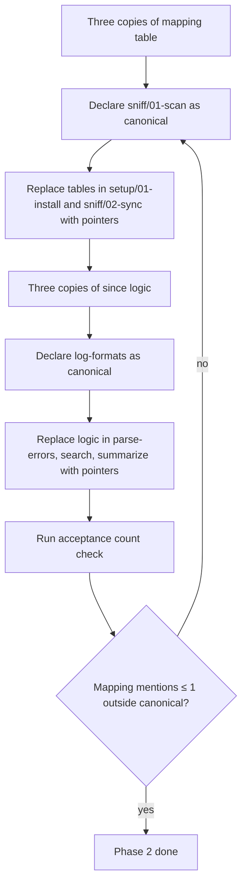

# Instruction: sc-php Phase 2 — Consolidate duplications

## Feature

- **Summary**: Declare `sniff/actions/01-scan.md` Step 5 as the canonical reference→target mapping source; replace the same table in `setup/01-install.md` and `sniff/02-sync.md` with pointers. Declare `log-analysis/references/log-formats.md` Timestamp filtering as the canonical `since` logic; replace the same selection logic in `parse-errors.md`, `search.md`, `summarize.md` with pointers.
- **Stack**: `Markdown only (no code)`
- **Branch name**: `chore/sc-php-audit-fixes/phase-2`
- **Parent Plan**: `2026_05_28-sc-php-audit-fixes-master.md`
- **Sequence**: `2 of 4`
- Confidence: 9/10
- Time to implement: ~1h

## Architecture projection

### Files to modify

- `plugins/sc-php/skills/sniff/actions/01-scan.md` - annotate Step 5 with a "Canonical mapping" header so other files can reference it
- `plugins/sc-php/skills/setup/actions/01-install.md` - remove duplicated mapping table (lines 11-23), replace with: "See canonical mapping in `../../sniff/actions/01-scan.md` Step 5"
- `plugins/sc-php/skills/sniff/actions/02-sync.md` - remove duplicated mapping table (lines 31-45), replace with same pointer
- `plugins/sc-php/skills/log-analysis/references/log-formats.md` - annotate Timestamp filtering section as "Canonical strategy selection"
- `plugins/sc-php/skills/log-analysis/actions/02-parse-errors.md` - replace strategy selection logic (lines 35-40) with pointer "See references/log-formats.md — Timestamp filtering"
- `plugins/sc-php/skills/log-analysis/actions/03-search.md` - replace strategy selection logic (line 41) with same pointer
- `plugins/sc-php/skills/log-analysis/actions/04-summarize.md` - replace strategy selection logic (lines 34-35) with same pointer

### Files to create

- none

### Files to delete

- none

## Applicable rules

| Tool | Name | Path | Why it applies |
|------|------|------|----------------|
| none | — | — | meta-plugin repo, no installed rules |

## User Journey

## Risk register

| Risk | Impact | Mitigation |
|------|--------|------------|
| A reader of `setup/01-install.md` no longer sees the mapping inline | Increased cognitive load (one extra file to open) | Use a relative path pointer that opens in any Markdown viewer; include a one-line summary "(6 entries: 4 perf pivots + 2 data pivots)" next to the pointer |
| A future contributor edits only the canonical mapping and forgets to verify usage | Stale wording in pointers | Add a HTML comment `<!-- Update sniff/01-scan.md Step 5 if you add a new pivot -->` next to each pointer |
| Removing strategy selection logic in 3 places leaves the action incomplete | Action becomes unreadable without context | Keep the 1-line action-level "what to do" sentence; only externalize the multi-line strategy table |

## Implementation phases

### Phase 2: Consolidate the two duplicated structures

> Edit Markdown to declare canonical sources and replace duplicates with pointers.

#### Tasks

1. **A.1**: in `sniff/01-scan.md` Step 5 (line 49), prepend a Markdown anchor and a "(Canonical mapping — referenced by `setup/01-install.md` and `sniff/02-sync.md`)" note.
2. **A.2**: in `setup/01-install.md`, replace the two mapping tables (lines 11-23) with a **two-part block**: (a) a compact inline mini-table listing the 6 target paths only (filename → `.claude/rules/07-quality/<name>`, no reference path column — that lives in 01-scan.md); (b) a pointer prose line "Full reference→target mapping with conditions: see `sniff/actions/01-scan.md` Step 5 (Canonical mapping)." This ensures an agent executing `01-install.md` in isolation still sees the target paths and can write files, while eliminating the full table duplication. Keep the surrounding Process and Output sections intact.
3. **A.3**: in `sniff/02-sync.md`, replace the Reference mapping section (lines 30-45) with the same pattern: a compact mini-table (source → target, 6 rows) + pointer line "For detection conditions, see `01-scan.md` Step 5 (Canonical mapping)." Rationale: `02-sync.md` is dispatched after `01-scan.md` emits the manifest, so the agent has context — but keeping target paths inline prevents breakage if the agent is invoked standalone.
4. **B.1**: in `log-analysis/references/log-formats.md` Timestamp filtering section (around line 50), prepend "(Canonical strategy selection — referenced by `02-parse-errors.md`, `03-search.md`, `04-summarize.md`)".
5. **B.2**: in `log-analysis/actions/02-parse-errors.md`, replace lines 35-40 with: `Fetch log content per source, applying \`since\` filter if provided. See [\`references/log-formats.md\` — Timestamp filtering](../references/log-formats.md) for the strategy selection table (docker logs --since vs Strategy A vs Strategy B).`
6. **B.3**: in `log-analysis/actions/03-search.md`, replace line 41 with the same pointer (adapt the grep prefix wording).
7. **B.4**: in `log-analysis/actions/04-summarize.md`, replace lines 34-35 with the same pointer.

#### Acceptance criteria

- [x] `! grep -E "perf-pivots-laravel\\.md.*\\.claude/rules" plugins/sc-php/skills/setup/actions/01-install.md` — duplicated table removed
- [x] `! grep -E "perf-pivots-laravel\\.md.*\\.claude/rules" plugins/sc-php/skills/sniff/actions/02-sync.md` — duplicated table removed
- [x] `grep -q "Canonical mapping" plugins/sc-php/skills/sniff/actions/01-scan.md`
- [x] `grep -q "Canonical strategy selection" plugins/sc-php/skills/log-analysis/references/log-formats.md`
- [x] `grep -q "Timestamp filtering" plugins/sc-php/skills/log-analysis/actions/02-parse-errors.md`
- [x] `grep -q "Timestamp filtering" plugins/sc-php/skills/log-analysis/actions/03-search.md`
- [x] `grep -q "Timestamp filtering" plugins/sc-php/skills/log-analysis/actions/04-summarize.md`
- [x] Manual: verified — mini-table retains target paths, full reference column removed

## Amendments

## Log

## Validation flow demonstration

1. From `/home/tnn/Projets/starters/aidd-overlay/`, run the 7 acceptance commands above.
2. All must pass.
3. Open `setup/01-install.md` in a Markdown viewer; click the canonical link; verify it lands on `sniff/01-scan.md` Step 5.
