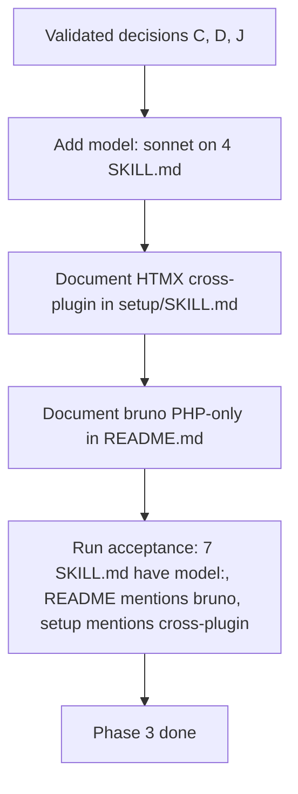

# Instruction: sc-php Phase 3 — Design decisions propagation

## Feature

- **Summary**: Six targeted edits encoding three design decisions validated during planning: four SKILL.md frontmatter additions (model: sonnet), one note in setup/SKILL.md (HTMX cross-plugin), one note in README.md (bruno PHP-only).
- **Stack**: `Markdown only`
- **Branch name**: `chore/sc-php-audit-fixes/phase-3`
- **Parent Plan**: `2026_05_28-sc-php-audit-fixes-master.md`
- **Sequence**: `3 of 4`
- Confidence: 9.5/10
- Time to implement: ~30min

## Architecture projection

### Files to modify

- `plugins/sc-php/skills/improve/SKILL.md` - add `model: sonnet` line in frontmatter (C)
- `plugins/sc-php/skills/legacy/SKILL.md` - add `model: sonnet` line in frontmatter (C)
- `plugins/sc-php/skills/log-analysis/SKILL.md` - add `model: sonnet` line in frontmatter (C)
- `plugins/sc-php/skills/teach/SKILL.md` - add `model: sonnet` line in frontmatter (C)
- `plugins/sc-php/skills/setup/SKILL.md` - add a "Cross-plugin note" section: `perf-pivots-htmx.md` is also consumed by `sc-python:web-optimize` (J)
- `README.md` (repo root, `/home/tnn/Projets/starters/aidd-overlay/README.md`) - add a one-line note in the sc-php section: "skill `bruno` is PHP-specific (depends on Apache HTTP_AUTHORIZATION quirk) — not propagated to sc-python/sc-rust" (D)

### Files to create

- none

### Files to delete

- none

## Applicable rules

| Tool | Name | Path | Why it applies |
|------|------|------|----------------|
| none | — | — | meta-plugin repo, no installed rules |

## User Journey

## Risk register

| Risk | Impact | Mitigation |
|------|--------|------------|
| Adding `model:` to a SKILL.md whose frontmatter is multi-line and uses `>-` description breaks YAML | Skill no longer loads | Add `model:` always before `description:` and validate by re-reading the file end-to-end |
| README edit conflicts with concurrent work | Merge conflict | Phase 3 runs after Phase 2 checkpoint; no other work expected on README in parallel |
| Note "consumed by sc-python" might become stale if sc-python ever drops the reference | Stale doc | Phrase as "may be consumed by sc-python:web-optimize when Django + HTMX are detected" (conditional, less brittle) |

## Implementation phases

### Phase 3: Apply 6 edits encoding design decisions

> Three SKILL.md frontmatter additions, two prose notes.

#### Tasks

1. **C.1**: in `plugins/sc-php/skills/improve/SKILL.md` frontmatter, insert `model: sonnet` after `name: improve` (line 2).
2. **C.2**: same in `plugins/sc-php/skills/legacy/SKILL.md` (after `name: legacy`).
3. **C.3**: same in `plugins/sc-php/skills/log-analysis/SKILL.md` (after `name: log-analysis`).
4. **C.4**: same in `plugins/sc-php/skills/teach/SKILL.md` (after `name: teach`).
5. **J**: in `plugins/sc-php/skills/setup/SKILL.md` after the "References" section, add a new section: `## Cross-plugin notes\n\n- \`references/07-perf-pivots-htmx.md\` may also be consumed by \`sc-python:web-optimize\` when Django + HTMX are detected. Edits to this file must remain framework-agnostic above the §1 anchor.`
6. **D**: in `README.md` (repo root), first read the file to locate whether a `sc-php` section exists; if it does, append the note to it; if not, add a new `## sc-php` section. Note text: `skill \`bruno\` is PHP-specific (depends on Apache stripping the Authorization header — see Apache pivot in references) and is intentionally not propagated to sc-python/sc-rust.`

#### Acceptance criteria

- [x] `test $(grep -lE "^model:" plugins/sc-php/skills/*/SKILL.md | wc -l) -eq 7`
- [x] `grep -q "consumed by sc-python" plugins/sc-php/skills/setup/SKILL.md` (or "consumed by \`sc-python")
- [x] `grep -qi "bruno.*php-specific" README.md` (case-insensitive — phrasing may vary)
- [x] Manual: YAML frontmatter verified on all 4 modified SKILL.md

## Amendments

## Log

## Validation flow demonstration

1. From `/home/tnn/Projets/starters/aidd-overlay/`, run the 3 acceptance commands.
2. Validate YAML manually for the 4 SKILL.md whose frontmatter was edited.
