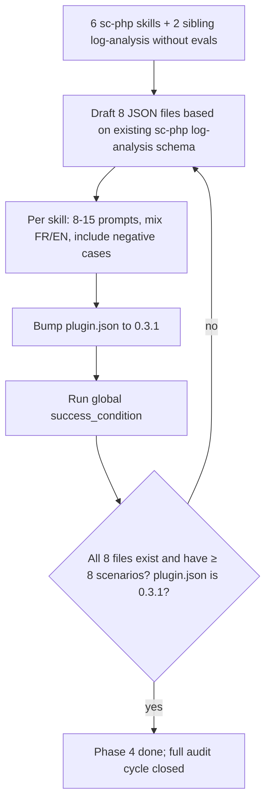

# Instruction: sc-php Phase 4 — Evals coverage + version bump

## Feature

- **Summary**: Add `evals/scenarios.json` to every skill currently missing routing coverage (6 in sc-php) and propagate the log-analysis evals to sibling plugins (sc-python, sc-rust). Bump sc-php to 0.3.1. Each new file follows the same prompt→expect_action shape as the existing `sc-php/skills/log-analysis/evals/scenarios.json`.
- **Stack**: `JSON + Markdown only`
- **Branch name**: `chore/sc-php-audit-fixes/phase-4`
- **Parent Plan**: `2026_05_28-sc-php-audit-fixes-master.md`
- **Sequence**: `4 of 4`
- Confidence: 8.5/10
- Time to implement: ~1h30

## Architecture projection

### Files to modify

- `plugins/sc-php/.claude-plugin/plugin.json` - bump `version` from `0.3.0` to `0.3.1`

### Files to create

- `plugins/sc-php/skills/bruno/evals/scenarios.json` - 8-12 scenarios mapping prompts to `test` action (bruno is single-action so all valid prompts route to "test"; include 2-3 negative cases expecting `null`)
- `plugins/sc-php/skills/improve/evals/scenarios.json` - 10-12 scenarios; entry action is always `analyze` (skill is sequential: `analyze` → `plan` is auto-chained, never dispatched directly); `expect_action` must always be `"analyze"` for valid prompts, `null` for out-of-scope
- `plugins/sc-php/skills/legacy/evals/scenarios.json` - 10-12 scenarios mapping prompts to `scan` or `migrate`; cover upgrade vs downgrade direction phrasing; negative cases for performance/debugging
- `plugins/sc-php/skills/setup/evals/scenarios.json` - 8-10 scenarios mapping prompts to `install`; negative cases pointing to `/sc-php:sniff` when project is already configured
- `plugins/sc-php/skills/sniff/evals/scenarios.json` - 10-12 scenarios mapping prompts to `scan` then `sync`; negative cases for non-PHP projects
- `plugins/sc-php/skills/teach/evals/scenarios.json` - 12-15 scenarios mapping prompts to `explain` or `practice`; cover bilingual FR/EN; negative cases for debugging/refactoring
- `plugins/sc-python/skills/log-analysis/evals/scenarios.json` - adapt the 17 sc-php log-analysis scenarios to Python phrasing (Django, uvicorn, traceback) — keep the 4 actions
- `plugins/sc-rust/skills/log-analysis/evals/scenarios.json` - adapt to Rust phrasing (Axum, tokio panics, journalctl)

### Files to delete

- none

## Applicable rules

| Tool | Name | Path | Why it applies |
|------|------|------|----------------|
| none | — | — | meta-plugin repo, no installed rules |

## User Journey

## Risk register

| Risk | Impact | Mitigation |
|------|--------|------------|
| JSON syntax errors break the eval files | Evals unrunnable | Validate each file with `jq . file.json` before commit |
| Scenarios don't match actual routing rules in SKILL.md descriptions | Evals pass but skill mis-routes in practice | Re-read each SKILL.md description triggers before writing scenarios; align verbs/phrases |
| Adapting log-analysis scenarios to Python/Rust loses bilingual coverage | Asymmetric eval quality | Keep the same FR/EN split as the original 17 scenarios |
| Single-action skills (bruno, setup) yield very thin evals | Low signal | Add edge cases like "run all my tests" → null (out of scope), "bru run my-folder" → test |

## Implementation phases

### Phase 4a: Generate the 6 sc-php evals

> One file per skill, mirroring the schema of `sc-php/skills/log-analysis/evals/scenarios.json`.

#### Tasks

1. **L.1**: write `plugins/sc-php/skills/bruno/evals/scenarios.json` — schema `[{"prompt": "…", "expect_action": "test"|null}]`. Include FR + EN, edge cases.
2. **L.2**: write `plugins/sc-php/skills/improve/evals/scenarios.json` — entry action is always `"analyze"` (sequential skill; `plan` is auto-chained, never a dispatch target — do NOT use `"expect_action": "plan"`). Negative cases (`null`) for perf optimization, debugging, version migrations, and line-by-line review.
3. **L.3**: write `plugins/sc-php/skills/legacy/evals/scenarios.json` — actions `scan`, `migrate`. Include upgrade/downgrade/modernize phrasings; negative cases for performance and Composer management.
4. **L.4**: write `plugins/sc-php/skills/setup/evals/scenarios.json` — action `install`. Include "start a new PHP project" → install; "my project is already set up" → null (suggest sniff).
5. **L.5**: write `plugins/sc-php/skills/sniff/evals/scenarios.json` — actions `scan`, `sync`. Include "this project has no composer.json" → null (abort).
6. **L.6**: write `plugins/sc-php/skills/teach/evals/scenarios.json` — actions `explain`, `practice`. Include FR + EN; negative cases for code review and debugging.

### Phase 4b: Propagate log-analysis evals to siblings

#### Tasks

7. **E.1**: before writing, read `plugins/sc-python/skills/log-analysis/SKILL.md` to confirm the 4 actions (tail, parse-errors, search, summarize) exist with the same names. Then create `plugins/sc-python/skills/log-analysis/evals/scenarios.json` adapting the 17 PHP scenarios: PHP errors → Python tracebacks, Apache/Nginx → uvicorn/gunicorn, blade.php → templates/*.html. Keep FR/EN balance.
8. **E.2**: read `plugins/sc-rust/skills/log-analysis/SKILL.md` first to verify action names. Then create `plugins/sc-rust/skills/log-analysis/evals/scenarios.json` adapting to Rust: tracebacks → panics, Apache/Nginx → axum/actix, php_errors.log → journalctl. Adjust negative cases accordingly.

### Phase 4c: Version bump

#### Tasks

9. **Bump**: edit `plugins/sc-php/.claude-plugin/plugin.json` line 4: `"version": "0.3.0"` → `"version": "0.3.1"`.

#### Acceptance criteria

- [x] all 8 `evals/scenarios.json` files exist
- [x] each has ≥ 8 scenarios with valid schema (`jq` pass)
- [x] `grep -q '"version": "0.3.1"' plugins/sc-php/.claude-plugin/plugin.json`
- [x] Manual: negative cases verified — null present in all files, `improve` never uses `"plan"` as expect_action

## Amendments

## Log

## Validation flow demonstration

1. From `/home/tnn/Projets/starters/aidd-overlay/`, run the four acceptance commands.
2. Spot-check: pick a single eval, e.g. `plugins/sc-php/skills/sniff/evals/scenarios.json`, ensure at least one prompt triggers `null` (non-PHP project) and one triggers `scan` (PHP project with composer.json).
3. Confirm `plugin.json` validates against its `$schema`.
