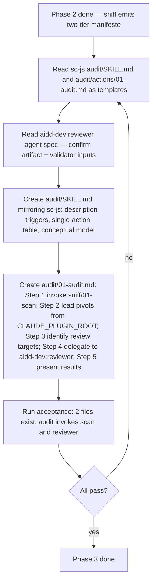

# Instruction: sc-php sniff v0.4.0 — Phase 3, audit skill

## Feature

- **Summary**: Create `skills/audit/` (2 files: SKILL.md + actions/01-audit.md) — a single-action skill that mirrors sc-js audit exactly. It invokes `sniff/01-scan` to detect the stack and obtain the pivot manifeste, loads applicable capability pivots from `${CLAUDE_PLUGIN_ROOT}/skills/sniff/references/capabilities/`, and delegates the structured code review to `aidd-dev:reviewer` with the pivots as the validator. Read-only — never installs anything.
- **Stack**: `Markdown only`
- **Branch name**: `feat/sc-php-sniff-v0.4.0/phase-3`
- **Parent Plan**: `2026_05_28-sc-php-sniff-v0.4.0-master.md`
- **Sequence**: `3 of 4`
- Confidence: 9/10
- Time to implement: ~1h (reduced — `03-clean` dropped per master design note; audit aligned to single-action sc-js model)

> **Note on brainstorm divergence**: The brainstorm approved a 2-action audit structure (`load-pivots` + `review`). On re-examination, `sc-js/skills/audit/` uses a single action `01-audit.md` (verified). Aligning to the same single-action model gives sc-php parity with sc-js and removes an artificial split — the load step is small enough to live inside the same action.

## Architecture projection

### Files to modify

- none

### Files to create

- `plugins/sc-php/skills/audit/SKILL.md` — skill manifest mirroring sc-js audit: description with trigger phrases, single-action table (`01 audit`), default flow (single action), conceptual model section, transversal rules
- `plugins/sc-php/skills/audit/actions/01-audit.md` — single action mirroring sc-js: invoke sniff/01-scan → load capability pivots from `${CLAUDE_PLUGIN_ROOT}` → delegate to `aidd-dev:reviewer` (artifact = project source files, validator = aggregated pivot criteria)

### Files to delete

- none

## Applicable rules

| Tool | Name | Path | Why it applies |
|------|------|------|----------------|
| none | — | — | meta-plugin repo, no installed rules |

## User Journey

## Risk register

| Risk | Impact | Mitigation |
|------|--------|------------|
| `aidd-dev:reviewer` agent signature confirmed as `artifact` + `validator` (verified by reading `~/.claude/plugins/cache/aidd-framework/aidd-dev/1.0.1/agents/reviewer.md`) — but sc-js audit uses `review_target` / `agreed_plan` informally | Naming drift between layers | Pass values via the Task prompt string; sc-js style is `review_target` + `agreed_plan` — keep parity |
| User invokes `/sc-php:audit` before sniff has run | audit fails | Per sc-js model, audit ALWAYS invokes sniff/01-scan as its Step 1; no conditional branch on pre-existing manifeste |
| `/sc-php:audit` may duplicate `aidd-dev:05-review` purpose | User confusion about which to use | audit/SKILL.md description explicitly states: `audit` reviews against PHP capability pivots; `aidd-dev:05-review` reviews against project rules. Different validators, both valid. |
| sc-js audit invokes only `01-scan` and never `02-install-pivots` or `03-clean` | Side effects from audit | Mirror sc-js: audit/SKILL.md and audit/01-audit.md transversal rules both state "audit is read-only, never invoke 02-install-pivots" |

## Implementation phases

### Phase 3: Create audit skill (single action, sc-js mirror)

> 2 new files. Read sc-js audit as structural template. Read aidd-dev:reviewer agent spec before writing 01-audit.md.

#### Tasks

1. Read `plugins/sc-js/skills/audit/SKILL.md` and `plugins/sc-js/skills/audit/actions/01-audit.md` (both confirmed to exist) as the structural reference for audit skill.
2. Read `~/.claude/plugins/cache/aidd-framework/aidd-dev/1.0.1/agents/reviewer.md` to confirm the `aidd-dev:reviewer` agent's input contract: receives `artifact` + `validator` (+ optional `context`); returns `items_reviewed` / `findings` / `completion_score` / `quality_score`.
3. Create `plugins/sc-php/skills/audit/SKILL.md` mirroring sc-js audit/SKILL.md:
   - YAML frontmatter: `name: audit`, `model: sonnet`, `description: >-` with PHP-specific trigger phrases (e.g. "audit PHP code", "check PHP best practices", "review my Laravel/Symfony code", "audit le projet PHP", "/sc-php:audit"), and explicit "Does not install any files to .claude/rules/" — adapted from sc-js wording
   - Body title: `# sc-php Audit`
   - Single-paragraph intro: "PHP code quality audit — detects applicable pivots via sniff and delegates to `aidd-dev:reviewer`."
   - Actions table: a single row `01 | audit | Detect stack → load pivots → spawn aidd-dev:reviewer | project path`
   - Default flow: "Single action: `audit`."
   - Conceptual model section: 3 bullets adapted from sc-js (read-only orchestrator; PHP knowledge lives in sniff/references/capabilities/; aidd-dev:reviewer is the analysis engine)
   - Transversal rules: never invoke `02-install-pivots`; never install to `.claude/rules/`; always invoke `01-scan` first
   - `## Actions` section with `@actions/01-audit.md` reference (sc-js style)
4. Create `plugins/sc-php/skills/audit/actions/01-audit.md` mirroring sc-js audit/01-audit.md verbatim in structure (5 Steps), adapted for PHP:
   - Title: `# Action 01 — audit`
   - Transversal rules: 3 bullets identical to sc-js (read-only; never invoke install-pivots; load from `${CLAUDE_PLUGIN_ROOT}/skills/sniff/references/capabilities/` at runtime)
   - **Step 1 — Detect stack**: invoke sniff `01-scan`. Abort if `composer.json` / `artisan` / `bin/console` / `wp-config.php` all absent.
   - **Step 2 — Load capability pivots**: for each pivot path in the manifeste, read `${CLAUDE_PLUGIN_ROOT}/skills/sniff/references/capabilities/<path>`. Aggregate into a criteria document with sections per pivot (e.g. `## PHP SOLID violations`, `## Bruno test conventions`, etc.)
   - **Step 3 — Identify review targets**: PHP-specific defaults — `app/Http/Controllers/`, `app/Models/`, `app/Services/`, `src/Controller/`, `src/Entity/`, etc. Exclude `vendor/`. Use composer.json `autoload.psr-4` to find source roots if non-standard.
   - **Step 4 — Delegate to aidd-dev:reviewer**: spawn Agent with `subagent_type: aidd-dev:reviewer`, passing in the prompt string the aggregated criteria document as `agreed_plan` (sc-js convention; maps to reviewer's `validator` parameter) and the PHP source files as `review_target` (maps to `artifact`). Receive structured report.
   - **Step 5 — Present results**: display reviewer's report; if `completion_score < 100`, note unverified criteria.
   - Output format example block: same style as sc-js — `🔍 sc-php audit — PHP code quality review`, stack detected, pivots loaded list, review scope, then `→ Delegating to aidd-dev:reviewer...` + `[reviewer report here]`.

#### Acceptance criteria

- [ ] `test -f plugins/sc-php/skills/audit/SKILL.md`
- [ ] `test -f plugins/sc-php/skills/audit/actions/01-audit.md`
- [ ] `! test -f plugins/sc-php/skills/audit/actions/02-review.md` — no second action (sc-js parity)
- [ ] `! test -f plugins/sc-php/skills/sniff/actions/03-clean.md` — clean dropped per master design note
- [ ] `grep -q "aidd-dev:reviewer" plugins/sc-php/skills/audit/actions/01-audit.md`
- [ ] `grep -q "CLAUDE_PLUGIN_ROOT" plugins/sc-php/skills/audit/actions/01-audit.md`
- [ ] `grep -qE "^model:" plugins/sc-php/skills/audit/SKILL.md`
- [ ] `grep -q "invoke.*01-scan\|sniff 01-scan\|sniff.*scan" plugins/sc-php/skills/audit/actions/01-audit.md` — always invokes scan (sc-js mirror)
- [ ] Manual: side-by-side diff of sc-js/audit/SKILL.md and sc-php/audit/SKILL.md — same 5 sections, PHP-adapted content

## Amendments

## Log

## Validation flow demonstration

1. Run the 9 acceptance commands.
2. Manual: read `audit/SKILL.md` end-to-end, confirm description triggers are clear and Do-NOT-use boundaries are explicit (no overlap with `/aidd-dev:05-review`).
3. Manual: open `sc-js/skills/audit/actions/01-audit.md` and `sc-php/skills/audit/actions/01-audit.md` side by side — confirm the 5 Steps are structurally identical, PHP-content only diverging.
4. Manual mental walkthrough: invoke `/sc-php:audit` in a Laravel project context, trace: sniff/01-scan invoked → manifeste lists `php/solid.md` (always) + `testing/bruno.md` (if bruno/ found) + perf/data pivots → 01-audit loads them via `${CLAUDE_PLUGIN_ROOT}` → spawns reviewer with aggregated criteria.
