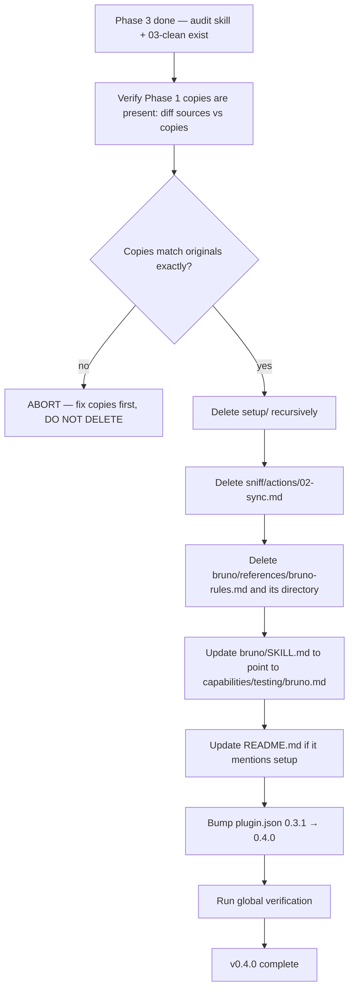

# Instruction: sc-php sniff v0.4.0 — Phase 4, cleanup + version bump

## Feature

- **Summary**: Final irreversible step. Delete `setup/` entirely (1 SKILL.md + 1 action + 6 references). Delete the `sniff/_deprecated/` directory left in place by Phase 2 (containing old 02-sync.md). Delete `bruno/references/bruno-rules.md` (already copied to capabilities/testing/bruno.md in Phase 1). Update `bruno/SKILL.md` to reference the new location. Update README.md if it mentions setup. Create CHANGELOG.md with v0.4.0 entry documenting breaking changes. Bump plugin.json to 0.4.0.
- **Stack**: `Markdown + JSON only`
- **Branch name**: `feat/sc-php-sniff-v0.4.0/phase-4`
- **Parent Plan**: `2026_05_28-sc-php-sniff-v0.4.0-master.md`
- **Sequence**: `4 of 4`
- Confidence: 9/10
- Time to implement: ~1h

## Architecture projection

### Files to modify

- `plugins/sc-php/skills/bruno/SKILL.md` — update the `External data` section to point to `${CLAUDE_PLUGIN_ROOT}/skills/sniff/references/capabilities/testing/bruno.md`
- `plugins/sc-php/.claude-plugin/plugin.json` — bump version `0.3.1` → `0.4.0`
- `README.md` (repo root) — read first to check for any mention of `setup`; if found, replace with `sniff` or remove

### Files to create

- `plugins/sc-php/CHANGELOG.md` — new file, prepend v0.4.0 entry documenting: breaking change "skill `setup` removed (use `/sc-php:sniff` instead)", breaking change "action `sync` renamed to `install-pivots`", feature "new `/sc-php:audit` skill", feature "two-tier pivot model (capability + perf/data)"

### Files to delete

- `plugins/sc-php/skills/setup/SKILL.md`
- `plugins/sc-php/skills/setup/actions/01-install.md`
- `plugins/sc-php/skills/setup/references/07-perf-pivots-laravel.md`
- `plugins/sc-php/skills/setup/references/07-perf-pivots-symfony.md`
- `plugins/sc-php/skills/setup/references/07-perf-pivots-wordpress.md`
- `plugins/sc-php/skills/setup/references/07-perf-pivots-htmx.md`
- `plugins/sc-php/skills/setup/references/08-data-pivots-eloquent.md`
- `plugins/sc-php/skills/setup/references/08-data-pivots-doctrine.md`
- `plugins/sc-php/skills/setup/actions/` (empty directory after deletion)
- `plugins/sc-php/skills/setup/references/` (empty directory after deletion)
- `plugins/sc-php/skills/setup/` (empty directory after deletion)
- `plugins/sc-php/skills/sniff/_deprecated/02-sync.md` (moved here in Phase 2)
- `plugins/sc-php/skills/sniff/_deprecated/` (empty directory after deletion)
- `plugins/sc-php/skills/bruno/references/bruno-rules.md`
- `plugins/sc-php/skills/bruno/references/` (empty directory after deletion)

## Applicable rules

| Tool | Name | Path | Why it applies |
|------|------|------|----------------|
| none | — | — | meta-plugin repo, no installed rules |

## User Journey



## Risk register

| Risk | Impact | Mitigation |
|------|--------|------------|
| Phase 1 copy was incomplete or differs from original | Permanent loss of content on delete | **Pre-delete guard**: run `diff` between each source and its copy; abort phase if any diff is non-empty. This is a hard prerequisite, not optional. |
| Some other skill (improve, legacy, log-analysis) references `setup/...` paths | Broken cross-skill references after delete | Grep entire repo for `setup/references` and `skills/setup` before deletion; fix any reference found |
| External users of v0.3.1 invoke `/sc-php:setup` — skill no longer exists | Runtime failure on user side | Document the breaking change in commit message and (if applicable) in a CHANGELOG entry; rely on `03-clean` for migration path |
| README has a sc-php section mentioning setup | Broken doc | Read README before edit; only replace if mention exists |
| plugin.json schema validation fails after edit | Plugin no longer loadable | Validate with `jq .` after edit; ensure $schema field intact |

## Implementation phases

### Phase 4a: Pre-delete guard (MANDATORY)

> Verify Phase 1 copies are byte-identical to their sources before deleting anything.

#### Tasks

1. Run: `diff plugins/sc-php/skills/setup/references/07-perf-pivots-laravel.md plugins/sc-php/skills/sniff/references/capabilities/perf/laravel.md` — must exit 0.
2. Same for `symfony`, `wordpress`, `htmx` (perf).
3. Same for `eloquent`, `doctrine` (data).
4. `diff plugins/sc-php/skills/bruno/references/bruno-rules.md plugins/sc-php/skills/sniff/references/capabilities/testing/bruno.md` — must exit 0.
5. If any diff returns non-zero, **STOP** the phase, fix the copy in Phase 1, then resume.

### Phase 4b: Repo-wide reference check

#### Tasks

6. Grep for any remaining references to setup in the repo (excluding `aidd_docs/`):
   ```bash
   grep -rln "skills/setup\|setup/references\|/sc-php:setup" plugins/ README.md 2>/dev/null
   ```
7. For each hit, decide: update to point to sniff or remove.

### Phase 4c: Deletions

#### Tasks

8. Delete the 8 files under `plugins/sc-php/skills/setup/` (6 references + 1 action + 1 SKILL.md).
9. Remove the empty directories: `actions/`, `references/`, and `setup/` itself.
10. Delete `plugins/sc-php/skills/sniff/_deprecated/` directory recursively (contains the 02-sync.md moved by Phase 2).
11. Delete `plugins/sc-php/skills/bruno/references/bruno-rules.md`.
12. Remove the empty `plugins/sc-php/skills/bruno/references/` directory.

### Phase 4d: Updates

#### Tasks

13. In `plugins/sc-php/skills/bruno/SKILL.md`, update the "External data" section. Current text references `.claude/rules/custom/04-bruno.md` — change to: `${CLAUDE_PLUGIN_ROOT}/skills/sniff/references/capabilities/testing/bruno.md — Bruno conventions (capability pivot, loaded at audit time)`.
14a. Read `README.md` end-to-end.
14b. If it mentions `setup` skill (case-insensitive `grep -i "setup"`), replace each occurrence with `sniff` or remove the sentence; if no mention, skip.
15. Create `plugins/sc-php/CHANGELOG.md` with the v0.4.0 entry. Suggested content:
   ```markdown
   # Changelog — sc-php

   ## v0.4.0 — 2026-05-28

   ### Breaking changes
   - Removed `setup` skill. Use `/sc-php:sniff` instead; it detects the stack and installs only the applicable pivots.
   - Renamed sniff action `sync` to `install-pivots` (aligns with sc-js v0.4.0).

   ### Added
   - New `/sc-php:audit` skill — delegates code review to `aidd-dev:reviewer` using PHP capability pivots as criteria.
   - Two-tier pivot model: capability pivots (`testing/bruno.md`, `php/solid.md`) loaded at audit time; perf/data pivots installed to `.claude/rules/07-quality/`.

   ### Changed
   - References resolved via `${CLAUDE_PLUGIN_ROOT}` at runtime (cross-plugin convention from sc-js).
   - `bruno` skill conventions moved into the sniff capability pivot store; `bruno/SKILL.md` updated to point to the new location.
   ```
16. Edit `plugins/sc-php/.claude-plugin/plugin.json`: change `"version": "0.3.1"` → `"version": "0.4.0"`. Validate JSON with `jq .` after edit.

### Phase 4e: Final verification

#### Tasks

17. Run all acceptance commands below.

#### Acceptance criteria

- [ ] `! test -d plugins/sc-php/skills/setup` — setup directory gone
- [ ] `! test -d plugins/sc-php/skills/sniff/_deprecated` — deprecated dir gone
- [ ] `! test -f plugins/sc-php/skills/bruno/references/bruno-rules.md` — original bruno rules gone
- [ ] `! test -d plugins/sc-php/skills/bruno/references` — empty dir cleaned up
- [ ] `grep -q "sniff/references/capabilities/testing/bruno.md" plugins/sc-php/skills/bruno/SKILL.md` — bruno SKILL points to new location
- [ ] `grep -q '"version": "0.4.0"' plugins/sc-php/.claude-plugin/plugin.json`
- [ ] `jq -e . plugins/sc-php/.claude-plugin/plugin.json > /dev/null` — JSON still valid
- [ ] `test -f plugins/sc-php/CHANGELOG.md` — CHANGELOG created
- [ ] `grep -q "0.4.0" plugins/sc-php/CHANGELOG.md` — v0.4.0 entry present
- [ ] `! grep -rln "skills/setup\|setup/references\|/sc-php:setup" plugins/sc-php/ 2>/dev/null` — no remaining references inside sc-php
- [ ] Manual: full `find plugins/sc-php -type f` listing, confirm 8 capability pivots present, no setup remnants, no _deprecated

## Amendments

## Log

## Validation flow demonstration

1. From `/home/tnn/Projets/starters/aidd-overlay/`, run the 8 acceptance commands.
2. Tree dump: `find plugins/sc-php -type f | sort` — visually confirm the new structure (sniff with 3 actions + capabilities tree + 6 SKILL.md; no setup).
3. Try `/sc-php:sniff` (manual mental walkthrough): can the agent resolve `${CLAUDE_PLUGIN_ROOT}/skills/sniff/references/capabilities/perf/laravel.md` from inside Phase 2's rewritten 01-scan.md?
4. Verify the version bump appears in git diff on plugin.json.
