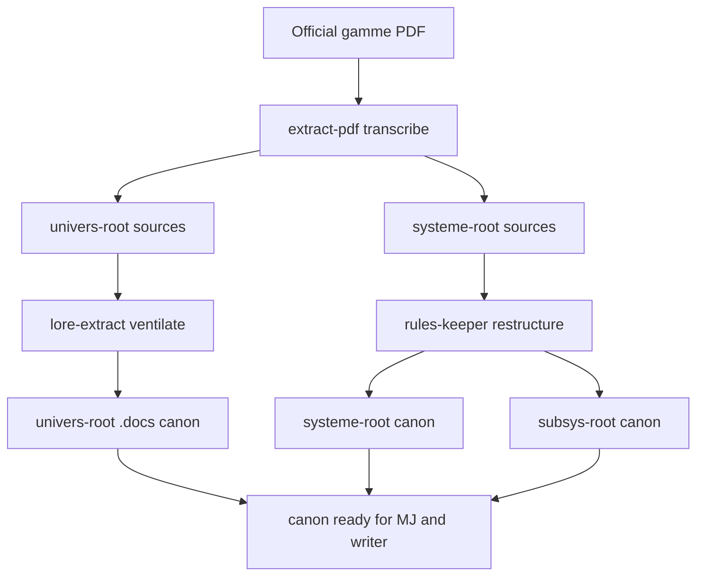

# Instruction: Canon producers migration

## Feature

- **Summary**: Wire the canon-creation pipeline correctly. extract-pdf transcribes official PDFs into reference documents under `sources/` (`<univers-root>/sources/<source>/` for lore, `<systeme-root>/sources/<source>/` for rules) - never final canon. lore-extract then ventilates those sources into `<univers-root>/.docs/canon/`, and rules-keeper into `<systeme-root>/canon/` (+ `<subsys-root>/canon/`). All reference the shared convention.
- **Stack**: `Markdown skill prompts`, `ripgrep (rg)`, `bank.yml (YAML)`
- **Branch name**: `refactor/rpg-writer-by-game/part-1-canon`
- **Parent Plan**: `2026_05_29-rpg-writer-by-game-migration-master.md`
- **Sequence**: `1 of 3`
- Confidence: 9/10
- Time to implement: 1 session

## Architecture projection

### Files to modify

- `plugins/rpg-writer/skills/extract-pdf/actions/03-distribute.md` - write reference docs to `<univers-root>/sources/<source>/` (lore/terminology) and `<systeme-root>/sources/<source>/` (rules); stop writing final `.docs/UNIVERS.md` / `docs/rules-files/`; fix `<univers-root>` resolution (no more parent-of-CWD).
- `plugins/rpg-writer/skills/extract-pdf/SKILL.md` - by-game path format; clarify role vs lore-extract (raw vs ventilation).
- `plugins/rpg-writer/skills/extract-pdf/actions/01-setup.md` - project path format `<projet-root>`.
- `plugins/rpg-writer/skills/extract-pdf/actions/02-process-chunk.md` - path format.
- `plugins/rpg-writer/skills/extract-pdf/actions/04-debug.md` - path format.
- `plugins/rpg-writer/skills/extract-pdf/prompts/extract-distribute.prompt.md` - `sources/` destinations.
- `plugins/rpg-writer/skills/extract-pdf/prompts/{extract,extract-chunk}.prompt.md` - verify/align path references.
- `plugins/rpg-writer/skills/extract-pdf/scripts/{extract-pdf.py,split-pdf.py,normalize-text.py}` - VERIFY they do not hardcode destinations or `<univers>/<projet>` resolution; edit only if they do (chunking/orchestration paths under `docs/extraction/` are fine).
- `plugins/rpg-writer/skills/lore-extract/actions/01-extract.md` - confirm `<univers-root>/.docs/canon/` target + variables.
- `plugins/rpg-writer/skills/rules-keeper/actions/01-restructure.md` - target `<systeme-root>/canon/` or `<subsys-root>/canon/`.
- `plugins/rpg-writer/skills/rules-keeper/actions/02-restructure-all.md` - same.
- `plugins/rpg-writer/skills/rules-keeper/actions/03-update.md` - same.
- `plugins/rpg-writer/skills/rules-keeper/actions/04-local.md` - resolve relative `.docs`/`.rules-files` via variables.

### Files to create

- `plugins/rpg-writer/skills/setup/references/vault-layout.md` - single source of truth: by-game layout + path-variable table + canon/mj rule; referenced by all rpg-writer skills.

### Files to delete

- none (edits only; remove obsolete in-file mentions).

## Applicable rules

| Tool | Name | Path | Why it applies |
| ---- | ---- | ---- | -------------- |
| none | -    | -    | rule inventory empty (`list-rules` returned []) |

## User Journey

## Risk register

| Risk | Impact | Mitigation |
| ---- | ------ | ---------- |
| Overlap extract-pdf vs lore-extract (both ventilate) | double source of truth for canon | RESOLVED boundary: extract-pdf writes only reference docs to `sources/`; lore-extract/rules-keeper ventilate `sources/` into canon. Documented in vault-layout.md. |
| extract-pdf git stash logic assumes univers = parent of project | wrong stash/commit targets in by-game tree | Re-derive `<univers-root>` from `<jeu>/univers/<document.univers>/`, not parent-of-CWD. |
| Breaking existing project bank.yml that points at flat docs | older projects stop resolving | Keep flat paths readable; the actual migrated bank.yml already point to canon/ (Part 3 finalizes schema). |

## Implementation phases

### Phase 1: Shared convention reference

> Create the single source of truth for paths.

#### Tasks
1. Create `setup/references/vault-layout.md` with the path-variable table, by-game layout, and canon/mj provenance rule.
2. Add a one-line pointer to it from each canon-producer SKILL.md (extract-pdf, lore-extract, rules-keeper).

#### Acceptance criteria
- [ ] `vault-layout.md` exists and defines `<jeu>`, `<univers-root>`, `<systeme-root>`, `<subsys-root>`, `<projet-root>`.
- [ ] The three SKILL.md reference it.

### Phase 2: Migrate extract-pdf to sources/

> The transcriber writes reference docs into sources/, never final canon.

#### Tasks
1. In `03-distribute.md`, change destinations: lore -> `<univers-root>/sources/<source>/`, terminology -> same source bundle, rules -> `<systeme-root>/sources/<source>/`. Remove writes to `.docs/UNIVERS.md` and `docs/rules-files/`. (style -> output-styles and structure -> .toc may stay as convenience artifacts.)
2. Fix `<univers-root>` resolution to `<jeu>/univers/<document.univers>/`; update git stash/commit paths accordingly.
3. Update SKILL.md + 01-setup/02-process-chunk/04-debug + the three prompts to the by-game path format; state the boundary "extract-pdf = reference sources, lore-extract/rules-keeper = ventilation to canon".
4. Verify the Python scripts (`extract-pdf.py`, `split-pdf.py`, `normalize-text.py`) do not hardcode final destinations nor parent-of-CWD universe resolution; edit only if they do.

#### Acceptance criteria
- [ ] `rg -qF 'sources/' 03-distribute.md` is true.
- [ ] No `.docs/UNIVERS.md`, no `docs/rules-files/`, no `parent du CWD` remain under `extract-pdf` (incl. scripts and prompts).

### Phase 3: Align lore-extract + rules-keeper to consume sources/ -> canon/

> Ventilation reads sources/ and writes canon.

#### Tasks
1. lore-extract `01-extract.md`: accepts `<univers-root>/sources/<source>/` as input; targets `<univers-root>/.docs/canon/` (and `mj/` via `--homemade`); uses variables.
2. rules-keeper `01..04`: accepts `<systeme-root>/sources/<source>/` (or `<subsys-root>/sources/`) as input; targets `<systeme-root>/{canon,mj}/` and `<subsys-root>/{canon,mj}/`; `04-local` resolves relative paths via variables.

#### Acceptance criteria
- [ ] lore-extract references `<univers-root>/sources/` (input) and `.docs/canon/` (output).
- [ ] rules-keeper references `<systeme-root>` / `<subsys-root>` (canon + sources); no flat unprefixed `<univers>/.docs/` remains.

## Amendments

## Log

### #1 - 2026-05-29
> Implemented all 3 phases via implementer agent (vault-layout.md + pointers; extract-pdf→sources/ incl. extract-pdf.py resolve_by_game_paths fix; lore-extract/rules-keeper consume sources/→canon).
= ✓ success_condition PASS (orchestrator-verified): sources/ in 03-distribute, no .docs/UNIVERS.md, no 'parent du CWD', canon in lore-extract/01-extract; no docs/rules-files/ in extract-pdf; vault-layout.md present.
→ Part 1 done. Proceed to Part 2.

## Validation flow demonstration

1. Pick a small official PDF for a test game.
2. Run extract-pdf setup -> process-chunk -> distribute; confirm reference docs land in `<jeu>/univers/<u>/sources/<source>/` (lore) and `<jeu>/systeme/sources/<source>/` (rules), with no flat `.docs/UNIVERS.md` write.
3. Run lore-extract on the universe sources -> confirm thematic files appear in `<jeu>/univers/<u>/.docs/canon/`; run rules-keeper on the system sources -> confirm `<jeu>/systeme/canon/`.
