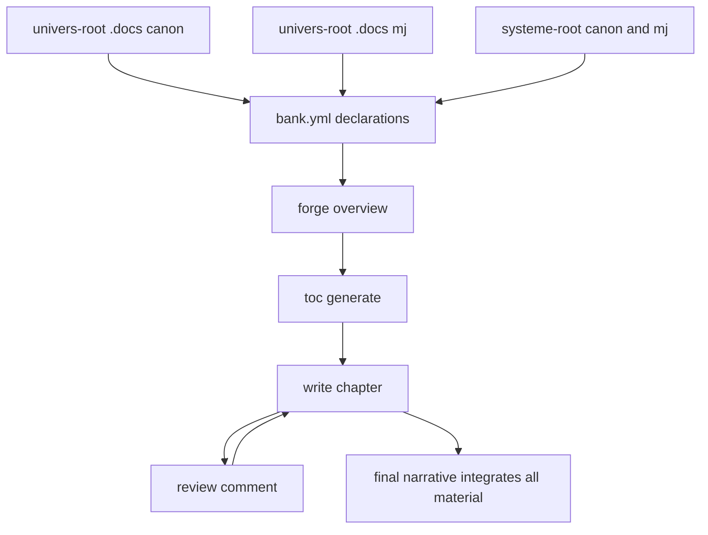

# Instruction: Writer consumption chain migration

## Feature

- **Summary**: Make the narrative-building skills read the full material. The writer stops hardcoding flat `UNIVERS.md`/`terminologie.md` and instead loads everything declared in bank.yml, where universe docs cover both `canon/` and `mj/`, and rules-files point at `systeme/`. Persona discovery and tone-finder paths align to the by-game layout.
- **Out of scope (by design)**: campaign prep (`<campagne-root>/scenarios`, `fronts.md`) and `pjs/<pj>/intention.md` are play-time artifacts (solo-mc / pc), NOT publishing inputs — the writer must not read them. The writer's material is canon/ + mj/ + systeme/ + subsystems/ only.
- **Stack**: `Markdown skill prompts`, `ripgrep (rg)`, `bank.yml (YAML)`
- **Branch name**: `refactor/rpg-writer-by-game/part-2-consumption`
- **Parent Plan**: `2026_05_29-rpg-writer-by-game-migration-master.md`
- **Sequence**: `2 of 3`
- Confidence: 9/10
- Time to implement: 1 session

## Architecture projection

### Files to modify

- `plugins/rpg-writer/skills/write/actions/02-write-roleplaying.md` - load universe docs via bank.yml (canon/ AND mj/); output-style + rules-files (systeme/); drop hardcoded filenames.
- `plugins/rpg-writer/skills/write/actions/01-write-novel.md` - same bank.yml-driven loading.
- `plugins/rpg-writer/skills/write/SKILL.md` - path variables; canon/+mj/ note.
- `plugins/rpg-writer/skills/forge/actions/01-forge.md` - docs via bank.yml incl. canon/+mj/; `<projet-root>` format.
- `plugins/rpg-writer/skills/toc/actions/01-generate-toc.md` - confirm bank.yml-driven; variables.
- `plugins/rpg-writer/skills/toc/actions/02-write-toc-chapter.md` - same.
- `plugins/rpg-writer/skills/review/actions/01-comment.md` - persona discovery order reconciled (projet -> univers -> shared `<vault>/_shared/personas/`).
- `plugins/rpg-writer/skills/tone-finder/actions/01-analyze.md` - universe paths via variables.
- `plugins/rpg-writer/skills/tone-finder/actions/02-improve.md` - resolve `.docs/output-style-changelog.md` to `<univers-root>`.
- `plugins/rpg-writer/skills/storyboard/actions/{01-extract,02-describe}.md` - VERIFY path references; align to `<projet-root>`/`<univers-root>` if any drift.

### Files to create

- none.

### Files to delete

- none.

## Applicable rules

| Tool | Name | Path | Why it applies |
| ---- | ---- | ---- | -------------- |
| none | -    | -    | rule inventory empty |

## User Journey

## Risk register

| Risk | Impact | Mitigation |
| ---- | ------ | ---------- |
| Writer reads canon/ but ignores mj/ | MJ universe development excluded from narrative | Require bank.yml docs to list both canon/ and mj/ files; writer loads all declared docs. |
| bank.yml docs not yet pointing at canon/ | writer loads nothing | Part 3 finalizes the schema; here, make the writer purely bank.yml-driven so it follows whatever bank.yml declares. |
| Hardcoded filenames reintroduced | regression to flat docs | success_condition greps for absence of `<univers>/.output-styles` and presence of canon/mj in write actions. |

## Implementation phases

### Phase 1: Writer is bank.yml-driven

> Remove hardcoded universe paths from write.

#### Tasks
1. In `02-write-roleplaying.md` and `01-write-novel.md`, replace hardcoded `UNIVERS.md`/`terminologie.md`/output-style paths with "load all docs and rules-files declared in bank.yml", noting docs include `canon/` and `mj/`.
2. Update `write/SKILL.md` with the path variables and the canon/+mj/ expectation.
3. Add a one-line pointer to `setup/references/vault-layout.md` from each SKILL.md migrated here (write, forge, toc, review, tone-finder, storyboard).

#### Acceptance criteria
- [ ] write actions reference `canon` and `mj/`.
- [ ] No `<univers>/.output-styles` literal remains under `write/`.

### Phase 2: forge + toc alignment

> Pre-writing skills consume the same declared material.

#### Tasks
1. forge `01-forge.md`: confirm bank.yml-driven doc loading incl. canon/+mj/; `<projet-root>` format.
2. toc `01`/`02`: confirm bank.yml-driven; replace any flat universe path with variables.

#### Acceptance criteria
- [ ] forge and toc reference bank.yml docs (canon/+mj/) and use `<projet-root>`/`<univers-root>`.

### Phase 3: review + tone-finder

> Evaluation and style skills follow the layout.

#### Tasks
1. review `01-comment.md`: persona discovery `<projet-root>/.templates/personas/ -> <univers-root>/.templates/personas/ -> <vault>/_shared/personas/`.
2. tone-finder `01`/`02`: universe paths via `<univers-root>`; changelog under `<univers-root>`.

#### Acceptance criteria
- [ ] review persona order references the three reconciled locations.
- [ ] tone-finder uses `<univers-root>` (no bare `.docs/` ambiguity).

## Amendments

## Log

### #1 - 2026-05-29
> Implemented all 3 phases via implementer agent (writer bank.yml-driven incl. canon/+mj/; forge/toc aligned; review persona waterfall → _shared/personas/; tone-finder via <univers-root>; storyboard verified clean; vault-layout pointers added).
= ✓ success_condition PASS (orchestrator-verified): canon + mj/ in write-roleplaying, no `<univers>/.output-styles` in write/; no `docs/templates/personas` in review/.
→ Part 2 done. Proceed to Part 3.

## Validation flow demonstration

1. On the migrated WoT project (`zombiology/ecrits/rouedutemps-adrenaline`), run `write-roleplaying` for one chapter.
2. Confirm it loads universe docs from `univers/wot/.docs/canon/` and any `mj/` files declared in bank.yml, plus rules from `systeme/`.
3. Confirm the produced chapter reflects canon + MJ additions.
