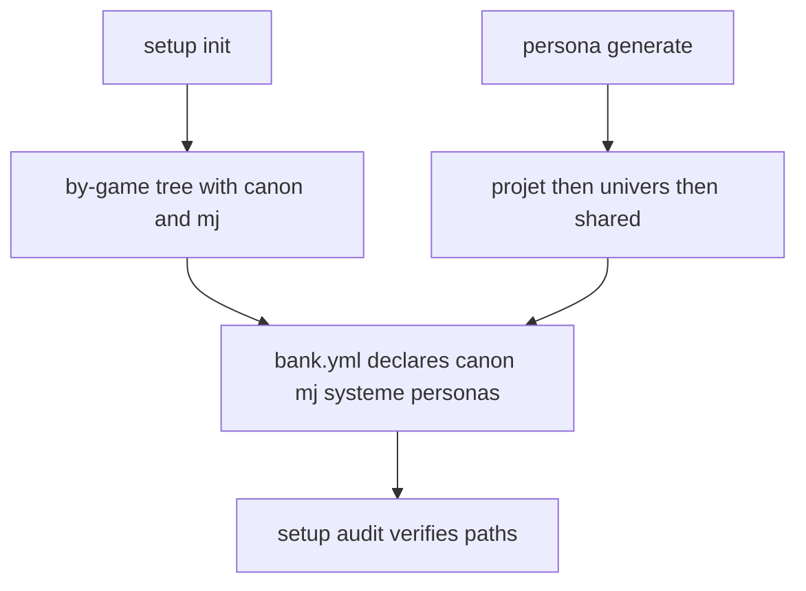

# Instruction: bank.yml contract + scaffolding migration

## Feature

- **Summary**: Bring the bank.yml schema, the project scaffolding (setup init/audit) and persona handling into the by-game canon/mj model. New projects created by `init` produce the correct tree; the schema doc matches the real migrated bank.yml; personas resolve via one documented waterfall.
- **Stack**: `Markdown skill prompts`, `ripgrep (rg)`, `bank.yml (YAML)`
- **Branch name**: `refactor/rpg-writer-by-game/part-3-contract`
- **Parent Plan**: `2026_05_29-rpg-writer-by-game-migration-master.md`
- **Sequence**: `3 of 3`
- Confidence: 9/10
- Time to implement: 1 session

## Architecture projection

### Files to modify

- `plugins/rpg-writer/skills/setup/references/bank-yml.md` - docs paths -> `.docs/canon/` (+ optional `mj/`); personas reconciled; rules-files -> `<systeme-root>/canon/` and `<subsys-root>/`; location `<projet-root>`.
- `plugins/rpg-writer/skills/setup/actions/01-init.md` - scaffold `<jeu>/univers/<u>/.docs/{canon,mj}/`, `<jeu>/ecrits/<projet>/`, `.templates/personas/`; validate `<projet-root>` format.
- `plugins/rpg-writer/skills/setup/actions/02-audit.md` - path format + check canon/ paths.
- `plugins/rpg-writer/skills/persona/actions/01-generate.md` - target resolution projet -> univers -> `<vault>/_shared/personas/`.
- `plugins/rpg-writer/skills/persona/SKILL.md` - same reconciled waterfall.
- `plugins/rpg-writer/skills/research/actions/01-research.md` - validated findings feed `<univers-root>/.docs/canon/` (research IS a canon producer, per decision: canon = official extract-pdf material + verified research); working report stays under `<projet-root>/research/`.
- `plugins/rpg-writer/skills/research/actions/02-extract-terminology.md` - target `<univers-root>/.docs/canon/terminologie.md`; note it is the terminology-focused complement of `lore-extract` (both write canon/; lore-extract remains the primary thematic ventilator).
- `plugins/rpg-writer/skills/tabula-rasa/actions/01-reset.md` - paths via variables.
- `plugins/rpg-writer/skills/upgrade/actions/01-upgrade.md` - VERIFY/align: an upgrade must know the by-game layout to migrate older projects into `<jeu>/ecrits/<projet>/` + `<univers-root>`.

### Files to create

- `<vault>/_shared/personas/` - shared home for agnostic personas (data dir in the vault; created on first use). Not plugin code.

### Files to delete

- none.

## Applicable rules

| Tool | Name | Path | Why it applies |
| ---- | ---- | ---- | -------------- |
| none | -    | -    | rule inventory empty |

## User Journey

## Risk register

| Risk | Impact | Mitigation |
| ---- | ------ | ---------- |
| Schema doc and real bank.yml drift again | audit false positives | Make bank-yml.md the canonical schema and align the three migrated bank.yml to it in the same pass. |
| Agnostic personas duplicated per universe | maintenance burden | Introduce `<vault>/_shared/personas/` as the shared tier; per-universe only for universe-specific personas. |
| init scaffolds old flat tree | new projects diverge | Rewrite init output block + creation steps to the by-game tree with canon/mj. |

## Implementation phases

### Phase 1: bank.yml schema

> Schema matches the migrated reality.

#### Tasks
1. Update `bank-yml.md`: docs.univers/terminologie -> `.docs/canon/...`; allow `docs.projet` to list `mj/` files; rules-files -> `<systeme-root>/canon/` + `<subsys-root>/`; personas tiers (projet/univers/shared `_shared/personas/`) declared at top level (reconcile the `personas`-nested-under-`docs` quirk seen in shattered-paris bank.yml); location `<projet-root>`.
2. Re-check the three real bank.yml (rouedutemps-adrenaline, au-service-des-tenebres, shattered-paris) against the updated schema; note any remaining drift.
3. Add a one-line pointer to `setup/references/vault-layout.md` from each SKILL.md migrated here (setup, persona, research, tabula-rasa, upgrade).

#### Acceptance criteria
- [ ] `rg -qF '.docs/canon/' bank-yml.md` is true.
- [ ] No `docs/templates/personas` literal remains in bank-yml.md.

### Phase 2: setup init + audit

> New projects are born by-game.

#### Tasks
1. Rewrite `01-init.md` output + creation steps to scaffold `<jeu>/univers/<u>/.docs/{canon,mj}/`, `<projet-root>`, `.templates/personas/`; validate the deeper path.
2. Make `01-init.md` assemble the generated `bank.yml` with `docs` entries pointing at BOTH `canon/` and `mj/` by default (guarantees the writer ingests MJ content out of the box, closing audit finding F3 for every new project).
3. Update `02-audit.md` path format and canon/ checks.

#### Acceptance criteria
- [ ] `rg -qF 'canon' 01-init.md` is true.
- [ ] init scaffolds `.docs/canon/` and `.docs/mj/`, and the generated bank.yml references both canon/ and mj/ docs.

### Phase 3: persona + research + tabula-rasa

> Single persona waterfall; ancillary skills aligned.

#### Tasks
1. persona `01-generate.md` + SKILL.md: target projet -> univers -> `<vault>/_shared/personas/`.
2. research `01`: validated findings -> `<univers-root>/.docs/canon/`, working report -> `<projet-root>/research/`. extract-terminology `02`: -> `<univers-root>/.docs/canon/terminologie.md` (complement of lore-extract).
3. tabula-rasa `01-reset.md`: paths via variables.

#### Acceptance criteria
- [ ] No `docs/templates/personas` literal remains under `persona/` and `setup/` (the full cross-skill sweep, incl. review/, is the master's final checkpoint).
- [ ] persona generate documents the three-tier waterfall.
- [ ] research/extract-terminology reference `<univers-root>/.docs/canon/`.

## Amendments

## Log

### #1 - 2026-05-29
> Implemented all 3 phases via implementer agent (bank-yml.md schema → canon/ + top-level persona tiers + systeme/ rules-files; setup init scaffolds canon/+mj/ and bank.yml defaults to both; setup audit canon checks; persona/research/extract-terminology/tabula-rasa/upgrade migrated; vault-layout pointers).
= ✓ success_condition PASS (orchestrator-verified) + MASTER FINAL SWEEP PASS: no `docs/templates/personas`, no `<univers>/<projet>`, no `docs/rules-files/`, no `parent du CWD` anywhere in plugins/rpg-writer/skills.
→ Part 3 done. Migration complete.
🤖 Drift noted in the 3 real vault bank.yml (out of plugin scope, not edited): personas not yet in tier schema; rules-files point to project-local `.rules-files/` not `systeme/canon/`; shattered-paris nests personas under `docs`. Docs paths already use canon/. Follow-up if desired.

## Validation flow demonstration

1. Run `setup init <jeu>/ecrits/<nouveau-projet>` on a test game.
2. Confirm it creates `<jeu>/univers/<u>/.docs/{canon,mj}/`, `<projet-root>` with bank.yml using canon/ paths.
3. Run `setup audit` and confirm declared canon/ paths resolve.
4. Run `persona generate "..."` without a universe and confirm it targets `<vault>/_shared/personas/`.
