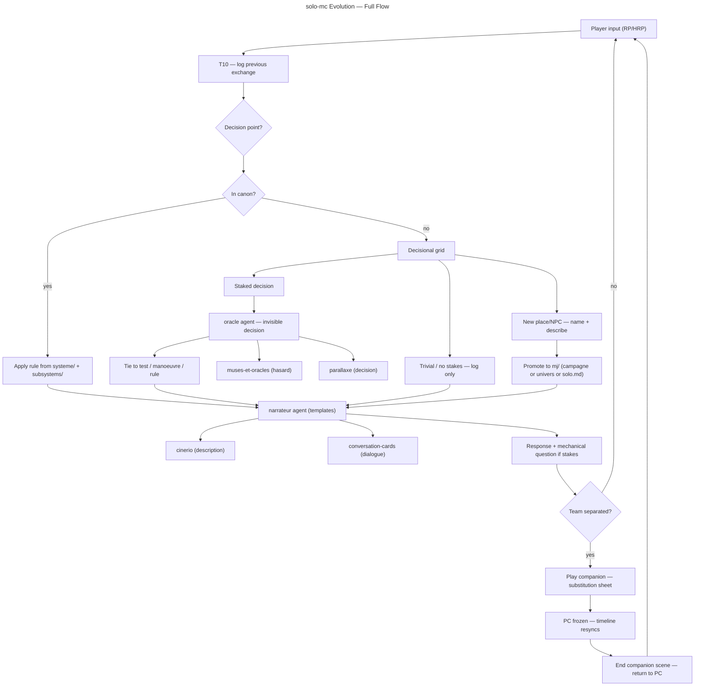

# Master Plan: solo-mc Evolution — Anti-linearity, Dual Agents, Companion Play

## Overview

- **Goal**: Refactor `solo-mc` into a single canonical skill backed by two agnostic agents (`oracle` / `narrateur`), a decisional grid that forces rule-grounded play, and a companion substitution mode for split-party scenes.
- **Risk Score**: 7/10
- **Branch**: `feat/solo-mc-evolution/`

## Child Plans

| #   | Plan                              | File                                        | Status   | Validated |
| --- | --------------------------------- | ------------------------------------------- | -------- | --------- |
| 1   | Skill unification                 | `./2026_06_01-solo-mc-evolution-part-1.md`  | pending  | [ ]       |
| 2   | Vault convention                  | `./2026_06_01-solo-mc-evolution-part-2.md`  | blocked  | [ ]       |
| 3   | Agent refactor (oracle/narrateur) | `./2026_06_01-solo-mc-evolution-part-3.md`  | blocked  | [ ]       |
| 4   | Decisional grid                   | `./2026_06_01-solo-mc-evolution-part-4.md`  | blocked  | [ ]       |
| 5   | Companion substitution            | `./2026_06_01-solo-mc-evolution-part-5.md`  | blocked  | [ ]       |

## Validation Protocol

1. Complete Part 1, verify SKILL.md is self-contained and SKILL-remote.md is gone.
2. [ ] Checkpoint 1: user confirms Part 1.
3. Complete Part 2, verify vault-layout.md documents `campagnes/<campagne>/mj/`.
4. [ ] Checkpoint 2: user confirms Part 2.
5. Complete Part 3, verify agents are agnostic, templates exist.
6. [ ] Checkpoint 3: user confirms Part 3.
7. Complete Part 4, verify decisional grid rule is in SKILL.md and wired to scene/oracle actions.
8. [ ] Checkpoint 4: user confirms Part 4.
9. Complete Part 5, verify companion substitution logic is in SKILL.md and scene action.
10. [ ] Final: spot-check full SKILL.md coherence.

## User Journey

## Estimations

- **Confidence**: 9/10
- **Duration**: 5 independent sessions, each ~30 min
