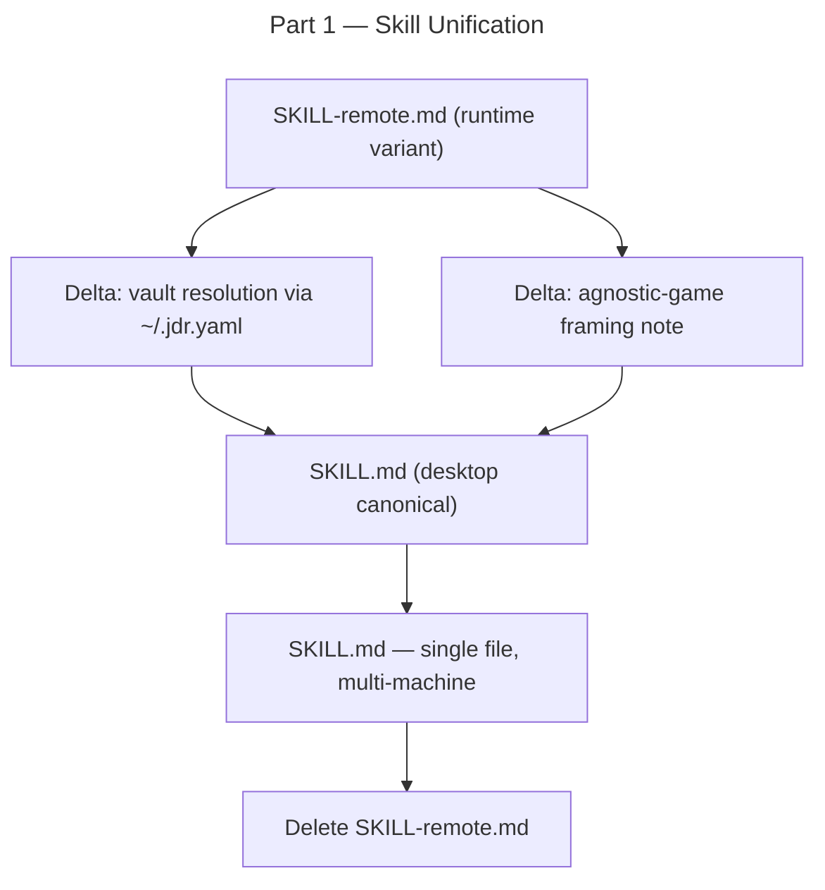

# Part 1 — Skill Unification

## Feature

- **Summary**: Merge the remaining runtime-only content from SKILL-remote.md into SKILL.md, making SKILL.md the single multi-machine source of truth, then delete SKILL-remote.md.
- **Stack**: `Markdown`
- **Branch name**: `feat/solo-mc-evolution/part-1-skill-unification`
- **Parent Plan**: `./2026_06_01-solo-mc-evolution-master.md`
- **Sequence**: `1 of 5`
- Confidence: 9/10
- Time to implement: ~20 min

## Architecture projection

### Files to modify

- `plugins/hermes/skills/solo-mc/SKILL.md` — add vault resolution via `~/.jdr.yaml` to T0; add agnostic-game framing note; align action table to 11 actions (no pc/rpg actions); already has T8–T12

### Files to create

- none

### Files to delete

- `plugins/hermes/skills/solo-mc/SKILL-remote.md` — fully merged; non-versioned; no longer needed

## Applicable rules

| Tool | Name | Path | Why it applies |
| ---- | ---- | ---- | -------------- |
| none | —    | —    | inventory empty |

## User Journey

## Risk register

| Risk | Impact | Mitigation |
| ---- | ------ | ---------- |
| Runtime-only content lost on delete | SKILL.md missing vault-resolution logic | Diff both files before delete; confirm each delta is present in SKILL.md |
| Windows path hard-coded leaks in | SKILL.md becomes machine-specific | Replace any absolute path with `<vault>` variable resolved via T0 |

## Implementation phases

### Phase 1: Port remaining SKILL-remote.md deltas into SKILL.md

> Add vault resolution (`~/.jdr.yaml`) to T0 and insert the agnostic-game framing note (currently only in SKILL-remote.md description/intro).

#### Tasks

1. Read SKILL-remote.md fully; identify every line absent from SKILL.md.
2. In SKILL.md T0, extend the vault-root bullet: resolve `<vault>` from `~/.jdr.yaml › vault`; fallback defaults (Windows / Linux); git remote URL for fresh-clone.
3. In SKILL.md frontmatter description / intro paragraph, add the agnostic-game note (game-specific guidance lives in `systeme/{canon,mj}/` — the skill stays game-agnostic).
4. Verify action table lists exactly 11 actions (01-play … 11-create-character); no pc/rpg rows.

### Phase 2: Delete SKILL-remote.md

> Remove the now-redundant file.

#### Tasks

1. Confirm every material line from SKILL-remote.md is present in SKILL.md (manual diff).
2. Delete `plugins/hermes/skills/solo-mc/SKILL-remote.md` via `git rm`.

## Acceptance criteria

- [ ] SKILL.md T0 resolves `<vault>` via `~/.jdr.yaml` (path + git remote documented).
- [ ] SKILL.md intro/description contains the agnostic-game framing note.
- [ ] SKILL.md action table has exactly 12 rows (01-play through 12-journal-pdf); no pc-*, campaign, scenario, npc, faction, review actions.
- [ ] SKILL-remote.md does not exist in the repo (`git status` shows it deleted or never tracked).
- [ ] No absolute Windows or Linux path remains hard-coded in SKILL.md (all replaced by `<vault>`).

## Amendments

## Log

## Validation flow demonstration

1. Open `plugins/hermes/skills/solo-mc/SKILL.md` — T0 section shows `~/.jdr.yaml` resolution.
2. Run `Test-Path plugins/hermes/skills/solo-mc/SKILL-remote.md` → returns `False`.
3. Count action table rows → 11.
