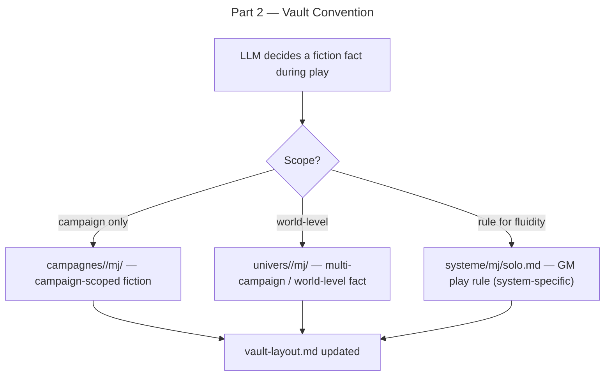

# Part 2 — Vault Convention

## Feature

- **Summary**: Extend the rpg-writer vault-layout reference to document the `campagnes/<campagne>/mj/` branch as the home for campaign-scoped fiction (distinct from `univers/<univers>/mj/` for multi-campaign facts, and `systeme/mj/solo.md` for GM-defined play rules).
- **Stack**: `Markdown`
- **Branch name**: `feat/solo-mc-evolution/part-2-vault-convention`
- **Parent Plan**: `./2026_06_01-solo-mc-evolution-master.md`
- **Sequence**: `2 of 5`
- Confidence: 10/10
- Time to implement: ~10 min

## Architecture projection

### Files to modify

- `plugins/rpg-writer/skills/setup/references/vault-layout.md` — add `mj/` under `campagnes/<campagne>/` in the tree; add routing note (campaign fiction vs multi-campaign vs rule); update interoperability section

### Files to create

- none

### Files to delete

- none

## Applicable rules

| Tool | Name | Path | Why it applies |
| ---- | ---- | ---- | -------------- |
| none | —    | —    | inventory empty |

## User Journey

## Risk register

| Risk | Impact | Mitigation |
| ---- | ------ | ---------- |
| Routing ambiguity (campaign vs world) | LLM writes fiction in wrong mj/ | Add explicit routing decision table in vault-layout.md |

## Implementation phases

### Phase 1: Add campagnes/<campagne>/mj/ to vault-layout.md

> Insert the new branch in the ASCII tree and add the three-way routing note.

#### Tasks

1. In the ASCII arborescence, add `mj/` under `campagnes/<campagne>/` with comment `← fiction décidée en partie (solo-mc)`.
2. Add a routing decision table below the tree:

   | Destination | What goes here |
   |---|---|
   | `campagnes/<campagne>/mj/` | Fiction fact decided during play, specific to this campaign |
   | `univers/<univers>/mj/` | World-level fact reusable across campaigns |
   | `systeme/mj/solo.md` | GM play rule defined during play to smooth the system |
   | Session log only | Trivial / zero-stakes detail (no promotion needed) |

3. Update the Interoperability section: add `campagnes/<campagne>/mj/` as written by `hermes:solo-mc` during play.
4. Update the versioning table: add `campagnes/<campagne>/mj/` row → versioned.

## Acceptance criteria

- [ ] ASCII tree in vault-layout.md contains `mj/` under `campagnes/<campagne>/`.
- [ ] Routing decision table present with 4 rows.
- [ ] Interoperability section references `campagnes/<campagne>/mj/` as a `hermes:solo-mc` write target.
- [ ] Versioning table has a row for `campagnes/<campagne>/mj/` marked versioned.

## Amendments

## Log

## Validation flow demonstration

1. Open `plugins/rpg-writer/skills/setup/references/vault-layout.md`.
2. Search for `campagnes/<campagne>/mj` — appears in tree, routing table, interop section, and versioning table.
