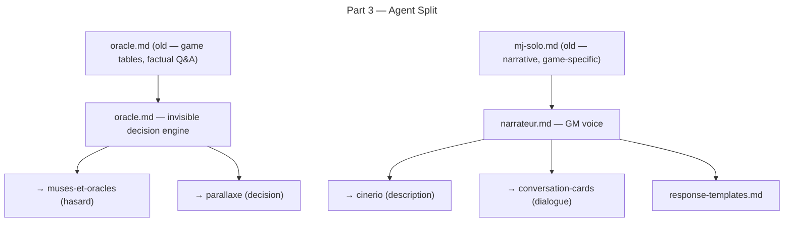

# Part 3 — Agent Refactor (oracle / narrateur)

## Feature

- **Summary**: Rewrite `oracle.md` as the invisible decision engine orchestrating muses-et-oracles and parallaxe; rename `mj-solo.md` to `narrateur.md` and rewrite it as the GM voice orchestrating cinerio and conversation-cards with response templates; purge all hard-coded game-specific content from both agents.
- **Stack**: `Markdown`
- **Branch name**: `feat/solo-mc-evolution/part-3-agent-refactor`
- **Parent Plan**: `./2026_06_01-solo-mc-evolution-master.md`
- **Sequence**: `3 of 5`
- Confidence: 9/10
- Time to implement: ~40 min

## Architecture projection

### Files to modify

- `plugins/hermes/agents/oracle.md` — full rewrite: invisible decision engine, routes hasard→muses-et-oracles / decision→parallaxe; agnostic; graceful degrade when subsystem files absent; purge game tables (Demon Slayer, etc.)
- `plugins/hermes/skills/solo-mc/SKILL.md` — update T2: oracle + narrateur; remove mj-solo reference

### Files to create

- `plugins/hermes/agents/narrateur.md` — rewrite of mj-solo: GM voice, routes description→cinerio / dialogue→conversation-cards; response templates; HRP/RP conventions; Q/R mechanics; style rules; agnostic; graceful degrade when subsystem files absent
- `plugins/hermes/skills/solo-mc/references/response-templates.md` — templates consumed by narrateur: scene block, HRP/RP zones, mechanical Q block, dialogue block

### Files to delete

- `plugins/hermes/agents/mj-solo.md` — replaced by narrateur.md (git mv then rewrite)

## Applicable rules

| Tool | Name | Path | Why it applies |
| ---- | ---- | ---- | -------------- |
| none | —    | —    | inventory empty |

## User Journey

## Risk register

| Risk | Impact | Mitigation |
| ---- | ------ | ---------- |
| Subsystem vault files absent (A1) | Agent cannot route to subsystem | Add explicit graceful-degrade: if `subsystems/<nom>/canon/` absent, fall back to system rules + note `[HRP] subsystem not installed` |
| Game-specific content loss | Useful oracle tables gone | Tables belong in vault (`subsystems/<nom>/canon/`) — document this in agent; purge from agent file |
| narrateur loses logging pause logic | Session log quality drops | Port pause-logging prompts to narrateur from mj-solo (they are good UX, not game-specific) |

## Implementation phases

### Phase 1: Rewrite oracle.md

> Invisible decision engine: routes hasard and decision to the right subsystem; reads subsystem files from vault; degrades gracefully.

#### Tasks

1. Strip all hard-coded game universe tables (Demon Slayer, Roue du Temps, Vampire V5, etc.) — they belong in `<vault>/subsystems/muses-et-oracles/canon/`.
2. Rewrite role section: oracle = invisible tool the LLM uses to break linear cause→effect; never surfaces as a visible prompt to the player unless a die result is shown.
3. Add subsystem routing table:
   - `hasard` (dice, random word, concept) → read `<vault>/subsystems/muses-et-oracles/canon/`
   - `decision` (what does the world decide?) → read `<vault>/subsystems/parallaxe/canon/`
4. Add graceful-degrade rule: if subsystem `canon/` absent → fall back to system-appropriate dice + note `[HRP] subsystem <nom> not installed — using system default`.
5. Retain: Facteur Chaos logic, yes/no/yes-but answer spectrum, system-adaptive dice (read from `systeme/canon/`).
6. Remove: Workflow Obligatoire / "Prochaine Question MJ" (that is narrateur's job); format with emoji headers; game-specific examples.

### Phase 2: Create narrateur.md (from mj-solo.md)

> GM voice: narration + dialogue + HRP/RP conventions + Q/R mechanics + style, cadred by templates.

#### Tasks

1. `git mv plugins/hermes/agents/mj-solo.md plugins/hermes/agents/narrateur.md`.
2. Rewrite frontmatter: name=narrateur, description focused on GM voice + HRP/RP + templates.
3. Strip all hard-coded game content (Demon Slayer tone/elements, etc.) — tone/style comes from `config.yaml` + `systeme/canon/`.
4. Rewrite subsystem routing:
   - `description` → read `<vault>/subsystems/cinerio/canon/`
   - `dialogue` → read `<vault>/subsystems/conversation-cards/canon/`
   - graceful-degrade same pattern as oracle.
5. Port and consolidate HRP/RP rules (from SKILL.md T9 — narrateur applies them at render time).
6. Port micro-scene interactive workflow (establish 2-3 sentences → question → resolve → narrate → loop) — this is agnostic and valuable.
7. Port pause-logging prompts (agnostic, good UX).
8. Add reference: `@references/response-templates.md` — narrateur MUST use the templates when rendering.
9. Remove: collaboration section referencing oracle by old role; game-specific tone sections; absolute-path references.

### Phase 3: Create response-templates.md

> Canonical templates consumed by narrateur for consistent, parseable LLM output.

#### Tasks

1. Create directory `plugins/hermes/skills/solo-mc/references/` (does not exist yet — confirmed by Test-Path).
2. Create `plugins/hermes/skills/solo-mc/references/response-templates.md`.
3. Define 4 templates:
   - **Scene block**: context (where/when) → what's happening → NPC present → stakes → obstacles → opportunities → optional surprise element.
   - **HRP/RP zones**: `[HRP] ... [/HRP]` wrapper for mechanical content; `[RP]` narrative block; never mixed.
   - **Mechanical Q block**: used when a staked decision needs player input after oracle resolves.
   - **Dialogue block**: NPC name + voice tic + line; used by conversation-cards routing.
4. Each template includes: name, when to use, format, example (generic, no game-specific content).

### Phase 4: Update SKILL.md T2

> Point T2 at the two new agents.

#### Tasks

1. In SKILL.md T2, replace `mj-solo-agent` with `narrateur-agent` and update description.
2. Confirm oracle description in T2 matches new role (invisible decision engine, not factual Q/A).

## Acceptance criteria

- [ ] `plugins/hermes/agents/mj-solo.md` does not exist.
- [ ] `plugins/hermes/agents/narrateur.md` exists; frontmatter `name: narrateur`; no game-specific universe content; references `response-templates.md`.
- [ ] `plugins/hermes/agents/oracle.md` contains subsystem routing table (hasard/decision); no game universe tables; graceful-degrade rule present.
- [ ] `plugins/hermes/skills/solo-mc/references/response-templates.md` exists with 4 templates.
- [ ] SKILL.md T2 references `narrateur-agent` and updated `oracle-agent` description.
- [ ] Both agents read subsystem files from `<vault>/subsystems/<nom>/canon/` (no hard-coded paths).

## Amendments

- 🤖 2026-06-01 — Subsystem path corrected from `subsystems/<nom>/canon/` to `subsystems/<nom>/systeme/canon/`. Rationale: mid-implementation the user revised the vault so a subsystem is "structured as a game" (`subsystems/<nom>/systeme/{canon,mj}/` + `ecrits/`), and updated vault-layout.md (the source of truth) accordingly. oracle.md and narrateur.md routing paths were realigned. `cinerio` kept as a forward-looking slug — the tool is in crowdfunding (cineriojdr.com); narrateur graceful-degrades until it ships.
- 🤖 2026-06-01 — Narrateur rename propagated to action files (01-play, 02-scene, 11-play-resume): `mj-solo-agent` → `narrateur-agent`. These references were outside Part 3's stated scope (T2 only) but were stale after the rename.

## Log

## Validation flow demonstration

1. Open `plugins/hermes/agents/oracle.md` — subsystem routing table visible; no Demon Slayer table.
2. Open `plugins/hermes/agents/narrateur.md` — HRP/RP rules visible; no Vampire V5 section.
3. Open `plugins/hermes/skills/solo-mc/references/response-templates.md` — 4 templates visible.
4. Run success_condition → `mj-solo.md` absent, both new files present.
