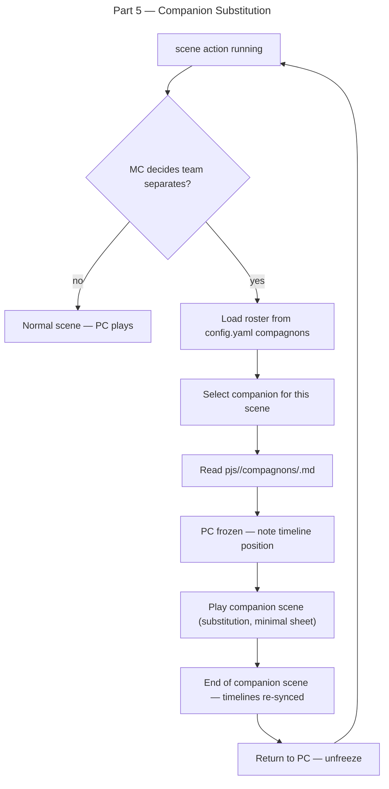

# Part 5 — Companion Substitution (Split-Party Play)

## Feature

- **Summary**: Add companion substitution logic to SKILL.md (T14) and wire it into the scene action: when the MC decides the team splits, the LLM plays one companion for one scene using the companion sheet (`pjs/<pj>/compagnons/<slug>.md` + campaign roster `config.yaml › compagnons:`), the PC is frozen, the scene re-syncs the timelines, then play returns to the PC.
- **Stack**: `Markdown`
- **Branch name**: `feat/solo-mc-evolution/part-5-companion-substitution`
- **Parent Plan**: `./2026_06_01-solo-mc-evolution-master.md`
- **Sequence**: `5 of 5`
- Confidence: 9/10
- Time to implement: ~20 min

## Architecture projection

### Files to modify

- `plugins/hermes/skills/solo-mc/SKILL.md` — add T14 (companion substitution transversal rule)
- `plugins/hermes/skills/solo-mc/actions/02-scene.md` — add companion-mode branch triggered by MC decision on split
- `plugins/hermes/skills/solo-mc/actions/01-play.md` — document that companion roster is loaded from `config.yaml › compagnons:` at session start

### Files to create

- none

### Files to delete

- none

## Applicable rules

| Tool | Name | Path | Why it applies |
| ---- | ---- | ---- | -------------- |
| none | —    | —    | inventory empty |

## User Journey

## Risk register

| Risk | Impact | Mitigation |
| ---- | ------ | ---------- |
| Companion sheet not found | LLM cannot load sheet | Graceful-degrade: if `compagnons/<slug>.md` absent, ask player to run `/obsidian:pc companion create <name>` before the scene |
| Timeline drift — what happened to PC meanwhile? | Narrative inconsistency | T14 rule: PC is frozen at the exact narrative moment of separation; companion scene bridges to the same moment; no time passes for the PC |
| session-state.yaml doesn't track active character | LLM forgets who is active | Add `active_character` field to session-state tracking note in T14; reset to PC on companion scene end |

## Implementation phases

### Phase 1: Write T14 in SKILL.md

> Transversal rule for companion substitution.

#### Tasks

1. After T13, add `T14 — Substitution de compagnon (équipe séparée)`.
2. T14 content:
   - **Trigger**: MC decides the party splits during a scene. This is a MC narrative decision, not a player command. Concrete signals: a scene opens on a location where only the companion is present; the fiction creates a fork where two characters must act simultaneously in different places; the player's last action sends the PC one way while the companion is elsewhere.
   - **Loading**: read `config.yaml › compagnons:` to get the active roster; select the companion relevant to the split; load `<vault>/<jeu>/pjs/<pj>/compagnons/<slug>.md`.
   - **Freeze**: note the PC's exact narrative position in `.session-state.yaml` (`active_character: <companion-slug>`, `pc_frozen_at: <narrative-beat>`).
   - **Play**: run one scene as the companion using their minimal sheet (role, voice/tics, 3-5 mechanical tags, current state). Apply T13 (decisional grid) normally during companion scene.
   - **Timeline**: the companion scene bridges to the same temporal moment as the PC. The PC was already ahead; the companion scene catches the team up.
   - **Return**: on companion scene end, reset `active_character` to PC in session state; unfreeze PC narrative thread.
   - **Graceful-degrade**: if companion sheet absent → `[HRP] Companion sheet for <name> not found. Run /obsidian:pc companion create <name> first.`

### Phase 2: Wire scene action (02-scene.md)

> Add companion-mode branch.

#### Tasks

1. In `02-scene.md` Process, after Step 1 (T13 grid), add Step 1b:
   - "If the MC narrative logic dictates the party separates: enter companion mode (T14). Load roster from `config.yaml`, select companion, load their sheet, note PC freeze position in session-state, play the companion scene, resync timelines, return to PC."
2. Add note: companion scene is still subject to T13 (decisional grid applies normally).

### Phase 3: Wire play action (01-play.md)

> Load companion roster at session start.

#### Tasks

1. In `01-play.md` Process, at Step 2 (read config.yaml): add "if `compagnons:` key present, load the active companion roster — names, roles, sheet paths — into session context for potential companion substitution."
2. In `01-play.md` Process, at Step 8 (create session log header): add `active_character: <pj-slug>` to the session header so the field exists before any companion swap; the swap (T14) updates it to `<companion-slug>` and the return resets it to `<pj-slug>`.

## Acceptance criteria

- [ ] SKILL.md contains T14 with trigger, loading, freeze, play, timeline, return, and graceful-degrade.
- [ ] T14 references `config.yaml › compagnons:` and `pjs/<pj>/compagnons/<slug>.md`.
- [ ] `02-scene.md` Step 1b documents companion-mode branch.
- [ ] `01-play.md` Step 2 loads companion roster.
- [ ] `grep -c 'T14' plugins/hermes/skills/solo-mc/SKILL.md` returns ≥ 1.

## Amendments

## Log

## Validation flow demonstration

1. Open SKILL.md — T14 section visible after T13.
2. Open `actions/02-scene.md` — Step 1b present.
3. Open `actions/01-play.md` — companion roster loading in Step 2.
4. Run success_condition → returns ≥ 1.
