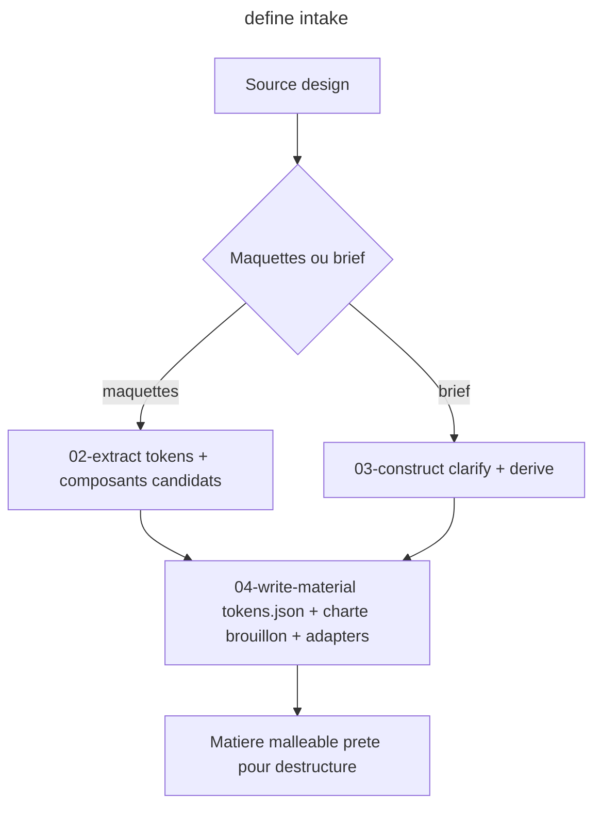

# Instruction: define (verbe 1 de l'entonnoir)

## Feature

- **Summary**: Skill `define` - porte d'entree unique du contrat de design. Soit extrait d'un jeu de maquettes existantes, soit construit depuis un brief/user story. Produit la matiere de design encore malleable: tokens de travail, inventaire de composants candidats, charte brouillon. Aucun figeage ici.
- **Stack**: `Claude Code plugin (SKILL.md + actions/*.md markdown), W3C DTCG tokens.json, generated CSS/Tailwind adapters`
- **Branch name**: `refactor/design-funnel` (branche unique du master ; cette part = phase 1)
- **Parent Plan**: `2026_06_10-design-funnel-refactor-master.md`
- **Sequence**: `1 of 7`
- Confidence: 9/10
- Time to implement: ~1 session

## Architecture projection

### Files to create

- `plugins/design/skills/define/SKILL.md` - declare le verbe, ses actions, ses references (reuse design-system-contract.md)
- `plugins/design/skills/define/actions/01-intake.md` - detecte la source (maquettes vs brief), route
- `plugins/design/skills/define/actions/02-extract.md` - chemin maquettes: derive tokens + composants candidats (fusionne ex-from-reference/02-extract + image-extract-details)
- `plugins/design/skills/define/actions/03-construct.md` - chemin brief: clarify attributs + derive tokens (fusionne ex-from-brief/01-clarify + 02-derive)
- `plugins/design/skills/define/actions/04-write-material.md` - ecrit tokens.json + design-system.md (charte brouillon) + adapters (reuse ex-write-system)
- `plugins/design/skills/define/references/intake-questions.md` - questions d'attribut (reuse ex-from-brief/attribute-questions.md)
- `plugins/design/skills/define/evals/scenarios.json` - evals (parite avec les skills actuelles)
- `plugins/design/skills/define/references/profile-mobile-first.md` - profil OPTIONNEL injectable (rapatrie les 7 references de ex-setup: mobile-first, enrichissement, mobile-only, a11y, no-emoji, iconographie). Cree ici tant que setup/ existe encore (supprime en part 6).

### Files to modify

- `plugins/design/references/write-system-procedure.md` - reference existante de la procedure d'ecriture du systeme ; relier/realigner sur `04-write-material.md` pour qu'elle ne devienne pas une reference zombie (sinon la supprimer en part 6). Le contrat 2-couches existant suffit a define ; la 3e couche arrive en part 3.

### Files to delete

- none ici (suppression groupee en part 6)

## Applicable rules

| Tool | Name | Path | Why it applies |
| ---- | ---- | ---- | -------------- |
| none | -    | -    | aucun .claude/rules dans le projet |

## User Journey

## Risk register

| Risk | Impact | Mitigation |
| ---- | ------ | ---------- |
| Confusion entre matiere malleable et contrat fige | define produirait un manifeste premature | SKILL.md interdit explicitement d'ecrire un manifeste; le manifeste est un output de adjust (part 3) |
| Duplication avec ex-from-brief/from-reference | code redondant | reutiliser le contenu des actions existantes par copie+fusion avant suppression en part 6 |

## Implementation phases

### Phase 1: Structure du skill define

> Poser SKILL.md + le routage intake.

#### Tasks

1. Ecrire `define/SKILL.md` (frontmatter name `design:define`, description trigger, tableau des 4 actions, references au contrat).
2. Ecrire `actions/01-intake.md` (detecte maquettes vs brief, route vers 02 ou 03).

#### Acceptance criteria

- [ ] `define/SKILL.md` existe, frontmatter valide (name + description)
- [ ] `01-intake.md` route explicitement vers extract OU construct

### Phase 2: Les deux chemins + ecriture

> Fusionner extract (maquettes) et construct (brief), puis ecrire la matiere.

#### Tasks

1. Ecrire `02-extract.md` en reutilisant ex-from-reference/02-extract + logique image-extract-details.
2. Ecrire `03-construct.md` en reutilisant ex-from-brief/01-clarify + 02-derive.
3. Ecrire `04-write-material.md` (tokens.json + design-system.md brouillon + adapters) en reutilisant ex-write-system ; referencer ou absorber `references/write-system-procedure.md` (pas de reference orpheline).
4. Ecrire `references/intake-questions.md`.
5. Ecrire `references/profile-mobile-first.md` depuis les 7 references de ex-setup ; SKILL.md le declare comme injection OPTIONNELLE.

#### Acceptance criteria

- [ ] Les 4 actions referencees dans SKILL.md existent sur disque
- [ ] `04-write-material.md` ecrit tokens.json + design-system.md, jamais de manifeste (components.json)
- [ ] L'inventaire de composants est ecrit en PROSE candidate dans la section "Component inventory" de design-system.md (malleable) ; il est explicitement distinct du manifeste JSON ferme produit par adjust
- [ ] La charte produite est marquee "brouillon / non figee"
- [ ] `references/write-system-procedure.md` est soit reference par `04-write-material.md`, soit marque pour suppression en part 6 (aucune reference orpheline)
- [ ] `profile-mobile-first.md` existe et est declare comme injection optionnelle dans define/SKILL.md (philo plus imposee d'office)

## Validation flow demonstration

1. Invoquer `/design:define` sur un brief court -> verifier que design/tokens.json + design/design-system.md (brouillon) sont produits, sans manifeste.
2. Invoquer `/design:define` sur une maquette -> meme contrat, tokens derives de l'image.

## Log

## Amendments
