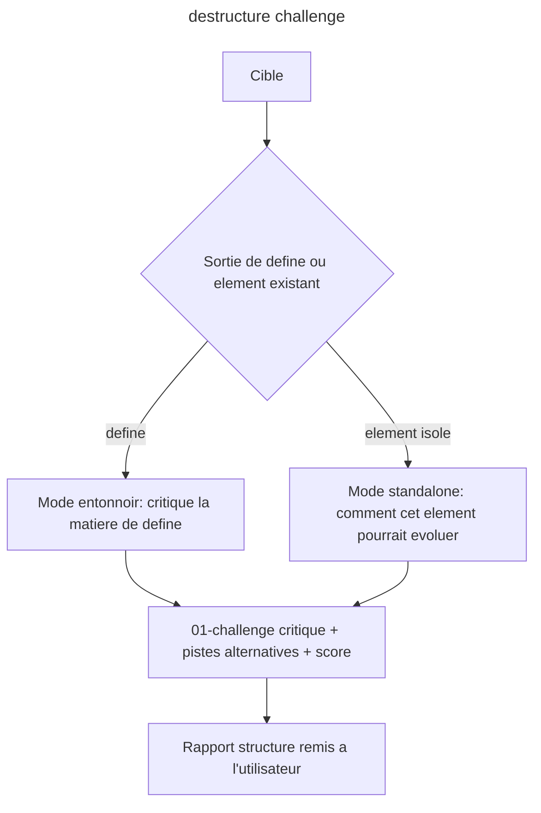

# Instruction: destructure (verbe 2 - challenge design)

## Feature

- **Summary**: Skill `destructure` - pendant design de aidd-refine:02-challenge. Deconstruit le "plausible generique", critique la direction, propose inspirations et pistes alternatives. Double usage: phase divergente de l'entonnoir (sur la sortie de define) ET outil standalone sur un element existant isole ("comment ca pourrait evoluer ?"). Sortie = rapport structure (critique + pistes d'evolution) avec score.
- **Stack**: `Claude Code plugin (SKILL.md + actions/*.md), lit design/ ou un element cible`
- **Branch name**: `refactor/design-funnel` (branche unique du master ; cette part = phase 2)
- **Parent Plan**: `2026_06_10-design-funnel-refactor-master.md`
- **Sequence**: `2 of 7`
- Confidence: 9/10
- Time to implement: ~1 session

## Architecture projection

### Files to create

- `plugins/design/skills/destructure/SKILL.md` - declare le verbe, son double usage, son action
- `plugins/design/skills/destructure/actions/01-challenge.md` - critique + genere les pistes d'evolution, classe les trouvailles, score
- `plugins/design/skills/destructure/references/critique-lenses.md` - lentilles de critique (generique vs distinctif, coherence, accessibilite, tendances, divergence d'inspiration)
- `plugins/design/skills/destructure/evals/scenarios.json` - evals (parite)

### Files to modify

- none

### Files to delete

- none ici (ex-diagnose absorbe ici, supprime en part 6)

## Applicable rules

| Tool | Name | Path | Why it applies |
| ---- | ---- | ---- | -------------- |
| none | -    | -    | aucun .claude/rules dans le projet |

## User Journey

## Risk register

| Risk | Impact | Mitigation |
| ---- | ------ | ---------- |
| destructure ecrit dans le contrat | corrompt la matiere de define | lecture seule; ne propose que des pistes, n'applique rien (l'application est adjust) |
| Critique vague ("ameliore le contraste") | inutile pour l'utilisateur | references/critique-lenses.md impose des lentilles concretes + chaque piste doit etre actionnable |

## Implementation phases

### Phase 1: Skill + action de challenge

> Poser SKILL.md (double usage) + l'action de critique.

#### Tasks

1. Ecrire `destructure/SKILL.md` (frontmatter name `design:destructure`, description avec triggers standalone + entonnoir, reference a aidd-refine:02-challenge comme parente conceptuelle).
2. Ecrire `actions/01-challenge.md` (entree polymorphe: define output OU element isole; sortie critique + pistes d'evolution classees + score). En standalone sur un projet deja fige, l'action LIT le manifeste (components.json) + la charte s'ils existent, pour situer ses pistes contre le vocabulaire ferme en vigueur.
3. Ecrire `references/critique-lenses.md`.

#### Acceptance criteria

- [ ] `destructure/SKILL.md` existe, frontmatter valide
- [ ] L'action accepte explicitement les deux entrees (sortie define ET element existant)
- [ ] En standalone, l'action lit le manifeste/charte figes s'ils existent
- [ ] L'action est lecture seule (n'ecrit jamais dans design/)
- [ ] La sortie inclut des pistes d'evolution actionnables + un score

## Validation flow demonstration

1. `/design:destructure` apres un define -> rapport critiquant la matiere + 2-3 pistes alternatives.
2. `/design:destructure design/components/card.md` (standalone) -> pistes d'evolution de ce composant precis.

## Log

## Amendments
