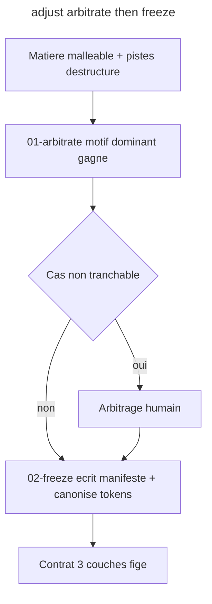

# Instruction: adjust (verbe 3 - arbitrage + figeage du contrat)

## Feature

- **Summary**: Skill `adjust` - le pivot de l'entonnoir. Arbitre les incoherences (entre maquettes, ou entre pistes issues de destructure): le motif dominant gagne (comptage d'occurrences), arbitrage humain sur les cas non tranchables. Puis FIGE: promeut la matiere malleable en contrat ferme - introduit le manifeste (3e couche, vocabulaire ferme: classes canoniques, BEM, variantes, fonds autorises), rend les tokens canoniques. C'est ici que "le socle du contrat" se definit. Etend aussi la doc de contrat a 3 couches.
- **Stack**: `Claude Code plugin (SKILL.md + actions/*.md), JSON manifest (design/components.json), W3C tokens.json`
- **Branch name**: `refactor/design-funnel` (branche unique du master ; cette part = phase 3)
- **Parent Plan**: `2026_06_10-design-funnel-refactor-master.md`
- **Sequence**: `3 of 7`
- Confidence: 9/10
- Time to implement: ~1 session

## Architecture projection

### Files to create

- `plugins/design/skills/adjust/SKILL.md` - declare le verbe (arbitrage + figeage)
- `plugins/design/skills/adjust/actions/01-arbitrate.md` - tranche les incoherences (motif dominant; humain sur cas durs)
- `plugins/design/skills/adjust/actions/02-freeze.md` - ecrit le manifeste, canonise les tokens, marque la charte comme figee + bump version
- `plugins/design/skills/adjust/references/manifest-schema.md` - le schema du manifeste (la 3e couche)
- `plugins/design/skills/adjust/evals/scenarios.json` - evals (parite)

### Files to modify

- `plugins/design/references/design-system-contract.md` - ajouter la 3e couche (manifeste) au layout + regles de consommation
- `plugins/design/references/token-schema.md` - lier tokens canoniques <-> manifeste

### Files to delete

- none ici

## Applicable rules

| Tool | Name | Path | Why it applies |
| ---- | ---- | ---- | -------------- |
| none | -    | -    | aucun .claude/rules dans le projet |

## User Journey

## Risk register

| Risk | Impact | Mitigation |
| ---- | ------ | ---------- |
| Manifeste et charte divergent | vocabulaire ferme incoherent | un check de concordance manifeste<->charte est specifie dans manifest-schema.md (repris par enforce en part 4) |
| Figeage premature | bloque l'iteration design | adjust est explicitement rejouable; un re-figeage rebump la version et declenche la reconciliation (enforce) |
| Schema du manifeste mal pose | enforce (part 4) construit sur du sable | manifest-schema.md est la dependance dure de part 4; valider le schema avant de cloturer cette part |

## Implementation phases

### Phase 1: Le schema du manifeste + extension du contrat

> Definir la 3e couche AVANT d'ecrire le skill qui la produit.

#### Tasks

1. Ecrire `references/manifest-schema.md` (structure JSON: par composant canonique -> elements BEM, variants, backgrounds autorises; regle de concordance avec la charte). Preciser: le manifeste JSON ferme PROMEUT l'inventaire prose candidat de design-system.md (ecrit par define) ; ce sont deux artefacts distincts, le manifeste est la source fermee verifiable.
2. Modifier `design-system-contract.md`: ajouter `design/components.json` au layout + regle "une valeur vit dans une seule couche".
3. Modifier `token-schema.md`: relier tokens canoniques et entrees du manifeste.

#### Acceptance criteria

- [ ] `manifest-schema.md` definit un schema JSON complet et exemplifie
- [ ] Le contrat documente explicitement 3 couches (tokens / manifeste / charte)

### Phase 2: Le skill adjust

> Arbitrage puis figeage.

#### Tasks

1. Ecrire `adjust/SKILL.md`.
2. Ecrire `01-arbitrate.md` (motif dominant gagne, gate humain sur cas durs).
3. Ecrire `02-freeze.md` (ecrit design/components.json conforme au schema, canonise tokens, version bump, charte marquee figee).

#### Acceptance criteria

- [ ] `adjust/SKILL.md` + 2 actions existent
- [ ] `02-freeze.md` produit un `design/components.json` valide contre `manifest-schema.md`
- [ ] Le figeage bump la version du design-system.md

## Validation flow demonstration

1. Apres define+destructure, `/design:adjust` -> arbitre les pistes, ecrit design/components.json, marque la charte figee v-bump.
2. Verifier que components.json valide contre le schema.

## Log

## Amendments
