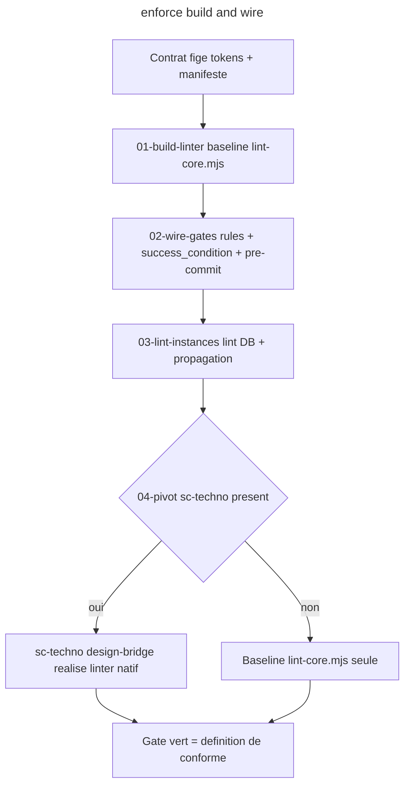

# Instruction: enforce (verbe 4 - linter hybride baseline + pivot sc-<techno>)

## Feature

- **Summary**: Skill `enforce` - transforme le contrat fige en gate verifiable, en HYBRIDE. (1) BASELINE: lint-core.mjs portable (livre par le plugin) qui derive ses ensembles valides de tokens.json + manifeste (aucune liste codee en dur), 2 severites (erreur exit 1 / warning exit 0 reporte). (2) PIVOT: quand un sc-<techno> est present pour le langage du projet, enforce emet un spec d'enforcement agnostique (via le contrat de pivot partage) et relaie la realisation NATIVE idiomatique du linter + son wiring au sc-<techno> (cf part 7). Cable les 3 points: rules de generation, success_condition des plans, pre-commit auto-arme (core.hooksPath + postinstall). Porte le lint-instances/DB + boucle corriger->propager->re-lint (reconciliation, migration legacy). Le design garde le QUOI; le sc-<techno> fait le COMMENT.
- **Stack**: `Node.js (baseline lint-core.mjs), git hooks (core.hooksPath), pivot vers sc-php/sc-js (realisation native)`
- **Branch name**: `refactor/design-funnel` (branche unique du master ; cette part = phase 4)
- **Parent Plan**: `2026_06_10-design-funnel-refactor-master.md`
- **Sequence**: `4 of 7`
- Confidence: 8/10
- Time to implement: ~1-2 sessions

## Architecture projection

### Files to create

- `plugins/design/skills/enforce/SKILL.md` - declare le verbe + son triple cablage
- `plugins/design/skills/enforce/actions/01-build-linter.md` - installe la baseline lint-core.mjs + sa config projet
- `plugins/design/skills/enforce/actions/02-wire-gates.md` - cable rules + success_condition + pre-commit
- `plugins/design/skills/enforce/actions/03-lint-instances.md` - lint DB/instances + boucle corriger->propager->re-lint
- `plugins/design/skills/enforce/actions/04-pivot.md` - detecte le langage du projet ; si sc-<techno> present, emet le spec d'enforcement (contrat de pivot) et relaie a sc-<techno>:design-bridge (part 7) ; sinon reste sur la baseline
- `plugins/design/references/sc-pivot-contract.md` - INTERFACE du pivot (partagee design <-> sc-*): format du spec d'enforcement emis par enforce + du spec de rendu emis par diffuse, et ce que le receptacle sc-<techno> doit renvoyer. Consomme par part 5 et part 7.
- `plugins/design/skills/enforce/adapters/lint-core.mjs` - coeur portable (derive valid sets de tokens.json + components.json, 2 severites)
- `plugins/design/skills/enforce/adapters/wordpress.md` - module lint WP (lint DB via wp post get) ; consomme le pieges WP partage
- `plugins/design/skills/enforce/references/gate-wiring.md` - les 3 points de cablage detailles
- `plugins/design/skills/enforce/fixtures/` - fixture de test (tokens.json + components.json + clean.html + dirty.html), reutilisee par part 5
- `plugins/design/references/wordpress-pitfalls.md` - pieges WP PARTAGES (classes appariees has-background/has-text-color, nav posts ref:ID, eval-file deprecated, NFC/NFD) ; reference par enforce ET diffuse pour eviter la derive
- `plugins/design/skills/enforce/evals/scenarios.json` - evals (parite)

### Files to modify

- none

### Files to delete

- none ici (ex-audit absorbe ici, supprime en part 6)

## Applicable rules

| Tool | Name | Path | Why it applies |
| ---- | ---- | ---- | -------------- |
| none | -    | -    | aucun .claude/rules dans le projet |

## User Journey

## Risk register

| Risk | Impact | Mitigation |
| ---- | ------ | ---------- |
| Linter trop bavard (faux positifs) | ignore par l'equipe | 2 severites; calibrer sur vrais positifs; ne jamais interdire style= sur blocs natifs FSE |
| Listes codees en dur | linter ne suit pas le contrat | lint-core.mjs DOIT lire tokens.json + components.json a l'execution |
| Pre-commit non versionne | gate non partage | core.hooksPath versionne + auto-arme en postinstall |
| Lint fichiers != lint DB | site non conforme malgre lib conforme | 03-lint-instances lit le contenu reel des pages (wp post get sous le CLI du conteneur) |
| sc-<techno> absent | pivot impossible | 04-pivot retombe sur la baseline lint-core.mjs (degradation gracieuse, jamais bloquant) |
| Spec de pivot ambigu | sc-<techno> realise un linter divergent du contrat | sc-pivot-contract.md fige le format du spec + ce que le receptacle doit renvoyer ; le contrat reste l'autorite, sc-* la realisation |

## Implementation phases

### Phase 1: Le coeur du linter

> Linter portable qui derive ses ensembles du contrat.

#### Tasks

1. Ecrire `adapters/lint-core.mjs` (charge tokens.json + components.json, verifie tokens/structure/vocabulaire, 2 severites, exit code).
2. Creer une fixture de test `skills/enforce/fixtures/` : tokens.json + components.json minimaux + un fichier `clean.html` (conforme) + un fichier `dirty.html` (token inexistant + classe hors manifeste). Reutilisee par part 5.
3. Ecrire `01-build-linter.md` (installe le core + config projet: chemins, prefixe).

#### Acceptance criteria

- [ ] La fixture `skills/enforce/fixtures/` existe (clean.html + dirty.html + tokens.json + components.json)
- [ ] `node plugins/design/skills/enforce/adapters/lint-core.mjs plugins/design/skills/enforce/fixtures/clean.html` exit 0 (chemin repo-root, identique au success_condition)
- [ ] `node plugins/design/skills/enforce/adapters/lint-core.mjs plugins/design/skills/enforce/fixtures/dirty.html` exit 1
- [ ] Aucune liste de tokens/classes codee en dur dans lint-core.mjs

### Phase 2: Cablage des 3 gates

> Generation, verification, barriere dure.

#### Tasks

1. Ecrire `02-wire-gates.md` (rules de generation, success_condition, pre-commit core.hooksPath + postinstall).
2. Ecrire `references/gate-wiring.md`.

#### Acceptance criteria

- [ ] Les 3 points de cablage sont decrits et reproductibles
- [ ] Le hook pre-commit refuse un commit si le linter est rouge

### Phase 3: Lint instances + propagation

> Le piege n1: les compositions sont des copies.

#### Tasks

1. Ecrire `03-lint-instances.md` (lint DB, boucle corriger->propager->re-lint).
2. Ecrire `adapters/wordpress.md` (classes appariees, lint DB via le CLI du conteneur).

#### Acceptance criteria

- [ ] La boucle corriger->reimporter->lint DB est documentee
- [ ] L'adaptateur WP impose le CLI du conteneur (jamais wp-cli local)

### Phase 4: Le pivot technique vers sc-<techno>

> Hybride: relayer la realisation native quand un sc-<techno> est present, sinon baseline.

#### Tasks

1. Ecrire `references/sc-pivot-contract.md` (format du spec d'enforcement emis + contrat de retour du receptacle ; reutilise l'idiome de relais existant type sc-tiers:setup help).
2. Ecrire `04-pivot.md` (detecte le langage ; mappe -> sc-php/sc-js ; si present, emet le spec et appelle sc-<techno>:design-bridge ; sinon, baseline et le signale).

#### Acceptance criteria

- [ ] sc-pivot-contract.md fige un format de spec d'enforcement non ambigu
- [ ] 04-pivot retombe explicitement sur la baseline si aucun sc-<techno> ne couvre le langage (degradation gracieuse)
- [ ] Le contrat (tokens+manifeste) reste l'autorite ; le spec en derive, il ne le redefinit pas

## Validation flow demonstration

1. Sur un projet fixture: figer un contrat, `/design:enforce` -> baseline installee, gates cables, fixture propre verte.
2. Forger une violation -> pre-commit bloque + success_condition rouge.
3. Sur un projet PHP/JS avec sc-php/sc-js: `/design:enforce` -> pivot, spec emis, sc-<techno>:design-bridge realise le linter natif ; sur un projet sans sc-<techno> -> baseline, signale.

## Log

## Amendments
