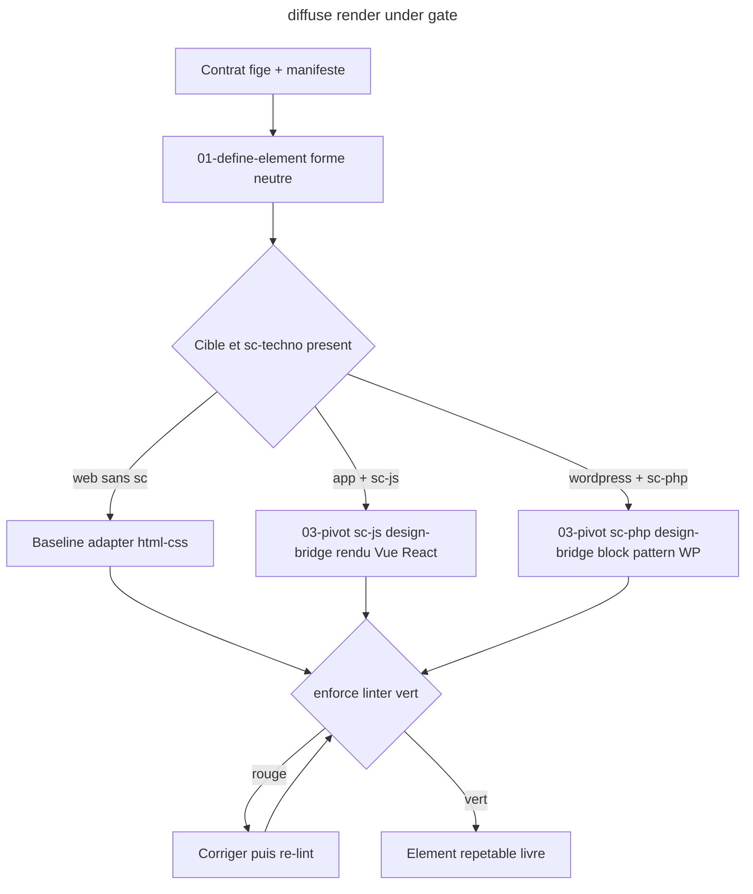

# Instruction: diffuse (verbe 5 - production sous gate)

## Feature

- **Summary**: Skill `diffuse` - produit les elements de design repetables que le LLM reutilise sans refaire la creation graphique. Une definition canonique en forme NEUTRE (consomme le manifeste) -> rendue en HYBRIDE: (1) BASELINE adaptateurs internes (HTML+CSS) ; (2) PIVOT technique vers sc-<techno> quand present, pour un rendu/wiring NATIF idiomatique (block pattern WP via sc-php, composant Vue/React via sc-js) au lieu de reimplementer la technique dans design. Chaque rendu passe sous le gate de enforce (lint vert obligatoire avant cloture). Absorbe ex-wireframe (rendu HTML baseline), ex-component et ex-export-wordpress (desormais via pivot sc-*).
- **Stack**: `Claude Code plugin (SKILL.md + actions/*.md), neutral element spec, baseline adapter HTML+CSS, pivot vers sc-php/sc-js (rendu natif)`
- **Branch name**: `refactor/design-funnel` (branche unique du master ; cette part = phase 5)
- **Parent Plan**: `2026_06_10-design-funnel-refactor-master.md`
- **Sequence**: `5 of 7`
- Confidence: 8/10
- Time to implement: ~1-2 sessions

## Architecture projection

### Files to create

- `plugins/design/skills/diffuse/SKILL.md` - declare le verbe + le rendu multi-stack sous gate
- `plugins/design/skills/diffuse/actions/01-define-element.md` - element repetable en forme neutre (consomme le manifeste)
- `plugins/design/skills/diffuse/actions/02-render.md` - choisit baseline OU pivot selon la cible ; lint vert (enforce) obligatoire avant cloture
- `plugins/design/skills/diffuse/adapters/html-css.md` - BASELINE rendu HTML+CSS interne (reuse ex-wireframe/render) ; universel, sans pivot
- `plugins/design/skills/diffuse/actions/03-pivot.md` - PIVOT: emet le spec de rendu (sc-pivot-contract) ; relaie a sc-<techno>:design-bridge pour le rendu natif (Vue/React via sc-js, block pattern WP via sc-php) ; consomme `references/wordpress-pitfalls.md` pour le cas WP
- `plugins/design/skills/diffuse/evals/scenarios.json` - evals (parite)

### Files to modify

- none

### Files to delete

- none ici (ex-wireframe + ex-component + ex-export-wordpress absorbes ici, supprimes en part 6)

## Applicable rules

| Tool | Name | Path | Why it applies |
| ---- | ---- | ---- | -------------- |
| none | -    | -    | aucun .claude/rules dans le projet |

## User Journey

## Risk register

| Risk | Impact | Mitigation |
| ---- | ------ | ---------- |
| Element neutre intraduisible par un adaptateur/pivot | rendu casse | la forme neutre ne reference que des entrees du manifeste (vocabulaire ferme) |
| Production sans gate | derive silencieuse | 02-render impose le lint vert (enforce) avant cloture |
| WP: pattern copie en DB non propage | site non conforme | 02-render delegue la propagation a enforce/03-lint-instances |
| sc-<techno> absent pour la cible | pivot impossible | 03-pivot retombe sur la baseline html-css ; signale que le rendu natif demande le sc-<techno> |
| Spec de rendu divergent du contrat | rendu non conforme | sc-pivot-contract.md fige le format du spec de rendu ; le manifeste reste l'autorite |

## Implementation phases

### Phase 1: Element neutre + rendu sous gate

> Une definition, plusieurs cibles, toujours sous gate.

#### Tasks

1. Ecrire `diffuse/SKILL.md`.
2. Ecrire `01-define-element.md` (forme neutre consommant le manifeste).
3. Ecrire `02-render.md` (selection d'adaptateur + lint vert obligatoire).

#### Acceptance criteria

- [ ] `diffuse/SKILL.md` + 01-define-element + 02-render existent
- [ ] L'element neutre ne reference que des entrees du manifeste
- [ ] 02-render refuse de cloturer si le linter enforce est rouge

### Phase 2: Baseline html-css + pivot sc-<techno>

> Un rendu universel garanti + un pivot natif quand sc-<techno> est present.

#### Tasks

1. Ecrire `adapters/html-css.md` (baseline, reuse ex-wireframe/render).
2. Ecrire `03-pivot.md` (emet le spec de rendu via sc-pivot-contract ; relaie a sc-js:design-bridge pour Vue/React, sc-php:design-bridge pour block pattern WP ; sinon baseline).

#### Acceptance criteria

- [ ] La baseline html-css rend depuis l'element neutre, sans pivot
- [ ] 03-pivot retombe sur la baseline si aucun sc-<techno> ne couvre la cible
- [ ] Sur une fixture, le rendu baseline passe le linter (exit 0)

## Validation flow demonstration

1. Contrat fige + enforce installe -> `/design:diffuse` un composant -> element neutre + rendu HTML baseline qui passe le gate.
2. Sur un projet WP avec sc-php -> pivot, sc-php:design-bridge rend le block pattern ; meme structure, lint vert.
3. Sur un projet sans sc-<techno> -> baseline html-css, signale.

## Log

## Amendments
