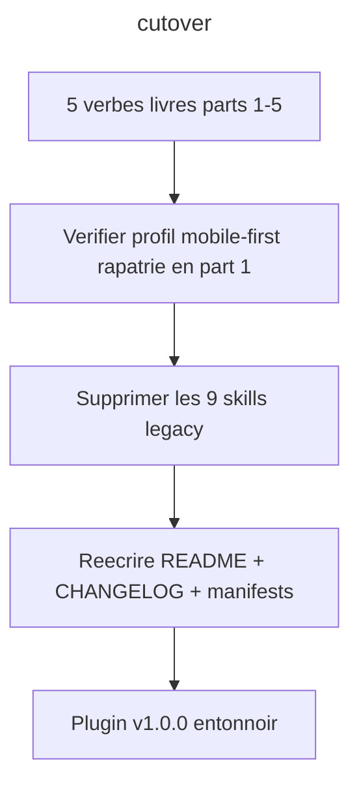

# Instruction: Bascule + documentation (part 6)

## Feature

- **Summary**: Derniere part - on bascule. Supprimer les 9 skills legacy (maintenant absorbees par les 5 verbes), reecrire la doc du plugin (README workflow entonnoir, CHANGELOG v1.0.0, plugin.json, marketplace.json). Le profil mobile-first optionnel a deja ete rapatrie en part 1 (tant que setup/ existait) ; ici on se contente de supprimer setup/. Faite en dernier pour ne rien casser tant que les 5 verbes ne sont pas livres.
- **Stack**: `Claude Code plugin manifests (plugin.json, marketplace.json), markdown docs, optional rules profile`
- **Branch name**: `refactor/design-funnel` (branche unique du master ; cette part = phase 6)
- **Parent Plan**: `2026_06_10-design-funnel-refactor-master.md`
- **Sequence**: `7 of 7` (executee en DERNIER : apres les 5 verbes design ET le receptacle sc-* de part 7)
- Confidence: 9/10
- Time to implement: ~1 session

## Architecture projection

### Files to modify

- `plugins/design/.claude-plugin/plugin.json` - version 1.0.0, description entonnoir, (les skills sont auto-decouverts)
- `plugins/design/README.md` - nouveau workflow define->destructure->adjust->enforce->diffuse, nouveau tableau skills
- `plugins/design/CHANGELOG.md` - entree v1.0.0 (refonte entonnoir, breaking)
- `.claude-plugin/marketplace.json` - description + version du plugin design

### Files to create

- none (le profil mobile-first optionnel est cree en part 1, tant que setup/ existe encore)

### Files to delete

- `plugins/design/skills/setup/` - philo rapatriee en profil optionnel
- `plugins/design/skills/from-reference/` - absorbe par define
- `plugins/design/skills/from-brief/` - absorbe par define
- `plugins/design/skills/wireframe/` - absorbe par diffuse (adapter html-css)
- `plugins/design/skills/component/` - absorbe par diffuse (adapter component-framework)
- `plugins/design/skills/audit/` - absorbe par enforce
- `plugins/design/skills/diagnose/` - absorbe par destructure
- `plugins/design/skills/refactor/` - absorbe par enforce (lint-instances + propagation)
- `plugins/design/skills/export-wordpress/` - absorbe par diffuse (adapter wordpress)

## Applicable rules

| Tool | Name | Path | Why it applies |
| ---- | ---- | ---- | -------------- |
| none | -    | -    | aucun .claude/rules dans le projet |

## User Journey

## Risk register

| Risk | Impact | Mitigation |
| ---- | ------ | ---------- |
| Suppression avant absorption complete | perte de logique utile | parts 1-5 doivent etre done (cochees) avant cette part; chaque suppression cible une logique deja reutilisee |
| Manifests invalides | plugin non chargeable | valider plugin.json + marketplace.json en JSON apres edition |
| Breaking non signale | utilisateurs surpris | CHANGELOG marque v1.0.0 comme breaking (triggers remplaces) |

## Implementation phases

### Phase 1: Suppression du legacy

> Supprimer les 9 skills, leur logique etant absorbee (profil mobile-first deja rapatrie en part 1).

#### Tasks

1. Verifier que profile-mobile-first.md (part 1) contient bien la philo des 7 references de setup AVANT suppression.
2. Supprimer les 9 dossiers de skills legacy.

#### Acceptance criteria

- [ ] Avant suppression, profile-mobile-first.md couvre les 7 themes de ex-setup
- [ ] Les 9 dossiers legacy sont absents; seuls les 5 verbes subsistent

### Phase 2: Documentation + manifests

> Reecrire la vitrine.

#### Tasks

1. Reecrire README.md (workflow entonnoir, tableau des 5 skills, artefacts dont components.json).
2. Ajouter l'entree CHANGELOG v1.0.0 (breaking).
3. Bumper plugin.json (1.0.0 + description) et marketplace.json.

#### Acceptance criteria

- [ ] plugin.json + marketplace.json parsent en JSON (via node -e JSON.parse) et portent v1.0.0 + description entonnoir
- [ ] README decrit les 5 verbes et le contrat 3 couches
- [ ] CHANGELOG signale le breaking

## Validation flow demonstration

1. `ls plugins/design/skills/` -> exactement define, destructure, adjust, enforce, diffuse.
2. `node -e "['plugins/design/.claude-plugin/plugin.json','.claude-plugin/marketplace.json'].forEach(p=>JSON.parse(require('fs').readFileSync(p,'utf8')))"` -> exit 0 ; verifier version 1.0.0.

## Log

## Amendments
