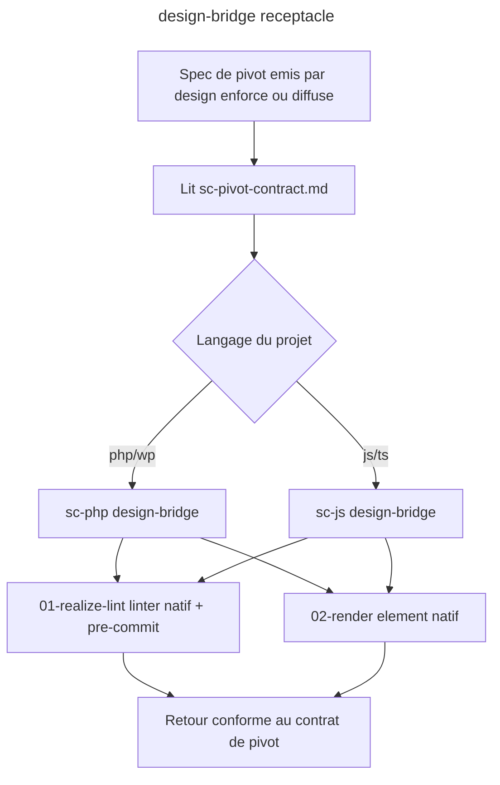

# Instruction: design-bridge (receptacle du pivot dans sc-php + sc-js)

## Feature

- **Summary**: Cote sc-<techno>, on ajoute le RECEPTACLE du pivot technique emis par design (enforce + diffuse). Nouvelle skill `design-bridge` dans sc-php et sc-js (les deux stacks prioritaires: WP + web). Elle recoit le spec du contrat de pivot partage (design/references/sc-pivot-contract.md) et REALISE nativement: (1) cote enforce -> materialise le linter idiomatique du langage (eslint plugin / phpcs sniff / script node) + wiring pre-commit ; (2) cote diffuse -> rend l'element neutre dans l'idiome du stack (composant Vue/React ; block pattern WP + theme.json). Le design garde le QUOI (contrat = autorite), sc-* fait le COMMENT (realisation). Reutilise l'idiome de relais existant (cf sc-tiers:setup help: une skill appelee par une autre pour produire du concret).
- **Stack**: `Claude Code plugins sc-php (0.4.8) + sc-js (0.6.8), skills markdown, realisation native (ESLint/Biome, PHPCS, theme.json/block patterns)`
- **Branch name**: `refactor/design-funnel` (branche unique du master ; cette part = phase 7, executee apres part 5, avant part 6)
- **Parent Plan**: `2026_06_10-design-funnel-refactor-master.md`
- **Sequence**: `6 of 7` (ordre d'execution 1,2,3,4,5,7,6)
- Confidence: 8/10
- Time to implement: ~1-2 sessions

## Architecture projection

### Files to create

- `plugins/sc-php/skills/design-bridge/SKILL.md` - declare le receptacle (recoit le contrat de pivot design)
- `plugins/sc-php/skills/design-bridge/actions/01-realize-lint.md` - materialise le linter PHP/WP idiomatique (PHPCS sniff ou script) + wiring pre-commit, depuis le spec d'enforcement
- `plugins/sc-php/skills/design-bridge/actions/02-render.md` - rend l'element neutre en block pattern WP + theme.json (reuse l'expertise ex-export-wordpress, cote sc-php)
- `plugins/sc-js/skills/design-bridge/SKILL.md` - idem cote JS
- `plugins/sc-js/skills/design-bridge/actions/01-realize-lint.md` - materialise le linter JS idiomatique (regle ESLint/Biome, cf references existantes eslint.md/biome.md) + wiring pre-commit
- `plugins/sc-js/skills/design-bridge/actions/02-render.md` - rend l'element neutre en composant Vue/React idiomatique
- `plugins/sc-js/skills/design-bridge/evals/scenarios.json` - evals (parite avec la convention sc-js, dont les skills portent un dossier evals/ ; sc-php n'en a pas, on respecte chaque convention locale)

### Files to modify

- `plugins/sc-php/.claude-plugin/plugin.json` - bump version + mention design-bridge dans la description
- `plugins/sc-js/.claude-plugin/plugin.json` - bump version + mention design-bridge
- `.claude-plugin/marketplace.json` - descriptions sc-php + sc-js mises a jour
- `plugins/design/skills/enforce/actions/04-pivot.md` - confirmer le nom/contrat d'appel reel de sc-<techno>:design-bridge (boucle de coherence avec part 4)
- `plugins/design/skills/diffuse/actions/03-pivot.md` - idem cote diffuse (coherence avec part 5)

### Files to delete

- none

## Applicable rules

| Tool | Name | Path | Why it applies |
| ---- | ---- | ---- | -------------- |
| none | -    | -    | aucun .claude/rules dans le projet |

## User Journey

## Risk register

| Risk | Impact | Mitigation |
| ---- | ------ | ---------- |
| Le linter natif diverge du contrat design | conformite faussee | design-bridge DERIVE strictement du spec (tokens+manifeste passes par le contrat de pivot) ; il ne reinvente pas de regles |
| Contrat de pivot pas encore fige (part 4) | receptacle construit a l'aveugle | part 7 depend de part 4 (sc-pivot-contract.md doit exister) ; ordre d'execution 4->5->7 |
| Asymetrie sc-php vs sc-js | comportements divergents | meme contrat de pivot pour les deux ; les 2 actions ont la meme signature, seule la realisation differe |
| Rupture de la convention 5-skills des sc-* | incoherence du depot | design-bridge est une skill additionnelle assumee ; documentee dans la description plugin |

## Implementation phases

### Phase 1: design-bridge cote sc-php (WP)

> Le stack exemplaire du brief en premier.

#### Tasks

1. Ecrire `sc-php/skills/design-bridge/SKILL.md` (recoit le contrat de pivot).
2. Ecrire `01-realize-lint.md` (linter PHP/WP natif + pre-commit depuis le spec d'enforcement).
3. Ecrire `02-render.md` (block pattern WP + theme.json depuis l'element neutre).
4. Boucler avec design: aligner enforce/04-pivot + diffuse/03-pivot sur le nom d'appel reel.

#### Acceptance criteria

- [ ] `sc-php/skills/design-bridge/SKILL.md` + 2 actions existent et consomment sc-pivot-contract.md
- [ ] 01-realize-lint produit un linter PHP/WP + un wiring pre-commit
- [ ] enforce/04-pivot et diffuse/03-pivot referencent le bon nom d'appel sc-php:design-bridge

### Phase 2: design-bridge cote sc-js (web) + manifests

> Symetrie web, puis versions.

#### Tasks

1. Ecrire `sc-js/skills/design-bridge/` (SKILL + 01-realize-lint utilisant eslint.md/biome.md + 02-render Vue/React + evals/scenarios.json, parite convention sc-js).
2. Bumper plugin.json de sc-php + sc-js + marketplace.json (descriptions).

#### Acceptance criteria

- [ ] `sc-js/skills/design-bridge/SKILL.md` + 2 actions + evals/scenarios.json existent et consomment sc-pivot-contract.md
- [ ] Les deux receptacles ont la meme signature d'entree (contrat de pivot)
- [ ] plugin.json sc-php + sc-js parsent en JSON et mentionnent design-bridge

## Validation flow demonstration

1. Projet WP fige + `/design:enforce` -> pivot -> sc-php:design-bridge realise un PHPCS/script + pre-commit ; le gate refuse une violation.
2. Projet Vue fige + `/design:diffuse` un composant -> pivot -> sc-js:design-bridge rend un composant Vue idiomatique passant le gate.

## Log

## Amendments
