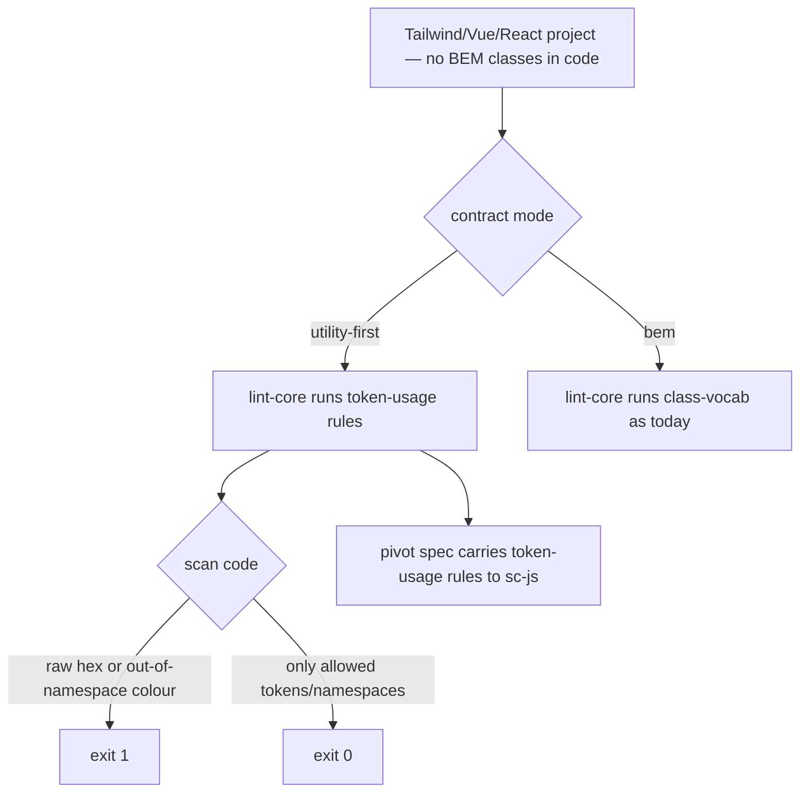

# Instruction: utility-first mode first-class in the baseline (#2)

## Feature

- **Summary**: The layer-2 contract (`adjust/references/manifest-schema.md`) and the baseline linter (`enforce/adapters/lint-core.mjs:89-100`) assume BEM / hand-written HTML. On a utility-first project (Tailwind/Vue/React) the manifest's BEM classes never appear in the code, so the layer-2↔code concordance is fictional and the `lint-core` baseline is near-vacuous (proven: 0 `class-vocab` hits on real code before the auditor hand-built a pivot). The useful enforcement (token usage, raw hex) exists **only** in that ad-hoc pivot. Make it first-class: layer-2 can encode **token-usage rules** (allowed colour namespaces, raw hex forbidden, state = colour + icon) delivered **in the design baseline**, not rebuilt per-user in `sc-js`.
- **Stack**: `Markdown contract` · `JSON manifest` · `Node.js >= 18 (lint-core.mjs)` · Tailwind/Vue/React (target) · `sc-js:design-bridge` (native realization)
- **Branch name**: `design/contract-utility-first-theme`
- **Parent Plan**: `2026_07_05-design-contract-utility-first-theme-master.md`
- **Sequence**: `2 of 7`
- Confidence: 8/10 (structure); rule scope gated by A4–A6
- Time to implement: L

## Phase 0 — Arbitration (resolve before editing any file)

- **A4 rule scope in the baseline**: which token-usage rules land in the portable `lint-core.mjs` (a **regex string-scanner — no CSS/AST parse**) vs stay in the pivot. Feasible-in-baseline candidates:
  - **raw-hex forbidden** — flag `#[0-9a-fA-F]{3,8}` in `style="…"`/inline that is not inside a generated adapter file. Cheap, high value, low false-positive.
  - **allowed colour namespaces** — Tailwind colour utilities (`bg-`, `text-`, `border-`, `ring-`, …) whose colour segment must belong to a declared namespace derived from `color.*` token groups. Feasible but framework-flavoured (Tailwind class grammar) → decide whether this rule is baseline (Tailwind-aware regex) or pivot-only (idiomatic, ESLint).
  - **state = colour + icon** — a semantic/co-occurrence rule (a status must pair a colour token with an icon); hard for a string-scanner without structure → likely **pivot-only**, but the **contract intent** (the rule exists) lives in layer-2 regardless of where it is enforced.
  - Decision rule: baseline enforces what a string-scanner can do without false positives; layer-2 **declares** every rule so the pivot has a spec to realize idiomatically.
- **A5 layer-2 shape**: add a `usage` / `rules` block inside `components.json` (per-project or global) **vs** a sibling manifest. And how utility-first rules **coexist** with the existing BEM vocabulary: are the two modes mutually exclusive per project, or additive (a project can have both a BEM manifest and token-usage rules)? Recommendation: additive `usage` block in `components.json`, BEM `components` map optional in utility-first mode.
- **A6 mode detection**: auto-detect utility-first (no `.base` classes present in code / Tailwind config present) vs an explicit `mode: "utility-first" | "bem"` field in the contract. Recommendation: explicit field, defaulted by detection, so the linter knows which rule set to run and does not falsely apply BEM class-vocab to a Tailwind codebase.

Record A4/A5/A6 in Amendments before proceeding.

## Architecture projection

### Files to modify

- `plugins/design/skills/adjust/references/manifest-schema.md` — add the layer-2 `usage`/`rules` schema (per A5): declare token-usage rules (colour namespaces allowed, raw-hex forbidden, state=colour+icon), and the `mode` field (per A6). Document that in utility-first mode the BEM `components` map is optional and the closed-vocabulary invariant shifts from class names to token usage.
- `plugins/design/skills/enforce/adapters/lint-core.mjs` — implement the baseline-feasible rules (per A4): raw-hex scan, allowed-namespace check; gate the existing BEM class-vocab rule behind `mode` (per A6) so it is not run (and does not report vacuously) on utility-first projects. Keep "derive everything from the contract, no hard-coded lists".
- `plugins/design/skills/enforce/SKILL.md` — describe the two enforcement modes (vocabulary/BEM vs token-usage/utility-first) in the baseline, so the value is documented as first-class, not pivot-only.
- `plugins/design/skills/enforce/actions/01-build-linter.md` + `03-lint-instances.md` — `.lintrc.json` gains rule toggles/severities for the new rules; lint targets for utility-first (`**/*.{vue,jsx,tsx,html}`) not only HTML wireframes.
- `plugins/design/references/sc-pivot-contract.md` — the enforcement spec must carry the **token-usage rules** (not only class sets + token paths), so `sc-js:design-bridge` realizes the same rules idiomatically instead of the user re-inventing them. This is the "delivered in the baseline, mirrored (not re-invented) in the pivot" contract.
- `plugins/design/skills/adjust/actions/02-freeze.md` — freeze audits the `usage` block and bumps `$version`.
- `plugins/design/CHANGELOG.md` + `plugins/design/.claude-plugin/plugin.json` — minor bump + entry.

### Files to create

- `plugins/design/skills/enforce/fixtures/utility/tokens.json` + `components.json` — a utility-first contract fixture: `mode: utility-first`, a `usage` block (allowed colour namespaces, raw-hex forbidden), minimal/absent BEM map.
- `plugins/design/skills/enforce/fixtures/utility-clean.html` — Tailwind-style markup using only allowed namespaces, no raw hex → exit 0.
- `plugins/design/skills/enforce/fixtures/utility-dirty.html` — a raw hex inline + an out-of-namespace colour utility → exit 1.

### Files to delete

- none.

## Applicable rules

| Tool   | Name                | Path                                     | Why it applies |
| ------ | ------------------- | ---------------------------------------- | -------------- |
| claude | plugins-marketplace | `~/.claude/rules/plugins-marketplace.md` | Edit source, never cache; re-install to activate. |
| claude | CLAUDE.md (RTK/pnpm)| `~/.claude/CLAUDE.md`                     | `rtk`/`pnpm` for validation runs. |

## User Journey

## Risk register

| Risk | Impact | Mitigation |
| ---- | ------ | ---------- |
| lint-core is a string-scanner, not a parser | Structural rules (state=colour+icon) can't be enforced reliably → false positives/negatives | A4 keeps only scanner-feasible rules in the baseline; declare the rest in layer-2 for the pivot to realize via AST (ESLint). |
| Namespace rule is Tailwind-flavoured | Baking Tailwind class grammar into a "portable" linter couples it to one framework | Derive the namespace set from `color.*` token groups; keep the utility-prefix list configurable in `.lintrc.json`; if too framework-specific, route it to the pivot and keep only raw-hex in baseline. |
| BEM class-vocab firing vacuously on utility code | Green lint that proves nothing (the current bug) | A6 `mode` gate: never run class-vocab on a utility-first contract; document it explicitly. |
| Pivot divergence | sc-js re-invents rules instead of mirroring | sc-pivot spec carries the rule set verbatim; pivot confirms rules derive from the spec (existing "no hard-coded values" clause). |
| Overlap with Part 1 colour namespaces | Namespace list must match the theme-aware colour model | Sequenced after Part 1; namespaces derive from the same `color.*` groups (incl. theme overlays). |

## Implementation phases

### Phase 1: Layer-2 schema — token-usage rules + mode

> Give the contract a place to declare usage rules and the enforcement mode.

#### Tasks

1. Add the `usage`/`rules` schema and `mode` field to `manifest-schema.md` (per A5/A6).
2. Document the shifted invariant: in utility-first mode the closed vocabulary is **token usage**, not BEM class names; BEM map optional.
3. Add a worked utility-first manifest example.

#### Acceptance criteria

- [ ] manifest-schema.md documents `usage` rules + `mode`, with an example.
- [ ] Backward compat stated: existing BEM manifests unchanged, default mode = bem/detected.

### Phase 2: Baseline linter — implement feasible rules

> Make the baseline actually enforce something on utility-first code.

#### Tasks

1. Gate the existing class-vocab rule behind `mode` (per A6).
2. Implement raw-hex scan and (per A4) allowed-namespace check, deriving allowed sets from the contract.
3. Build the `utility/` fixture contract + `utility-clean.html` + `utility-dirty.html`.
4. Run `success_condition` and confirm existing BEM fixtures (`clean`/`dirty`, `themed-*`) still pass.

#### Acceptance criteria

- [ ] `utility-clean.html` → exit 0; `utility-dirty.html` → exit 1 (raw hex + out-of-namespace colour both caught).
- [ ] class-vocab does not fire on the utility-first fixture; existing fixtures unchanged.

### Phase 3: Enforce docs + pivot spec

> Document the mode as first-class and carry the rules to the pivot.

#### Tasks

1. Update `enforce/SKILL.md`, `01-build-linter.md`, `03-lint-instances.md` for the two modes, `.lintrc.json` rule toggles, and utility-first lint targets.
2. Extend the sc-pivot enforcement spec to include the token-usage rule set.
3. (No sc-js edit required by this plan, but note the receptacle must mirror — flag as a follow-up ticket for `sc-js:design-bridge` if desired.)

#### Acceptance criteria

- [ ] SKILL/actions describe token-usage enforcement as a baseline feature.
- [ ] sc-pivot-contract.md enforcement spec lists the usage rules.

### Phase 4: Freeze + versioning + changelog

#### Tasks

1. `02-freeze.md` audits the `usage` block; bump `$version`.
2. Bump plugin.json; CHANGELOG entry.

#### Acceptance criteria

- [ ] Freeze audits usage; versions in phase; CHANGELOG updated.

## Amendments

<!-- Record A4/A5/A6 here before Phase 1. -->

## Log

<!-- APPEND ONLY. -->

## Validation flow demonstration

1. Freeze a utility-first contract (`mode: utility-first`, `usage` rules).
2. Run lint-core on a clean Tailwind snippet → exit 0; on a snippet with `#ff0000` inline and an out-of-namespace `bg-` utility → exit 1.
3. Confirm the pivot spec emitted by `enforce/04-pivot` now carries the usage rules.
