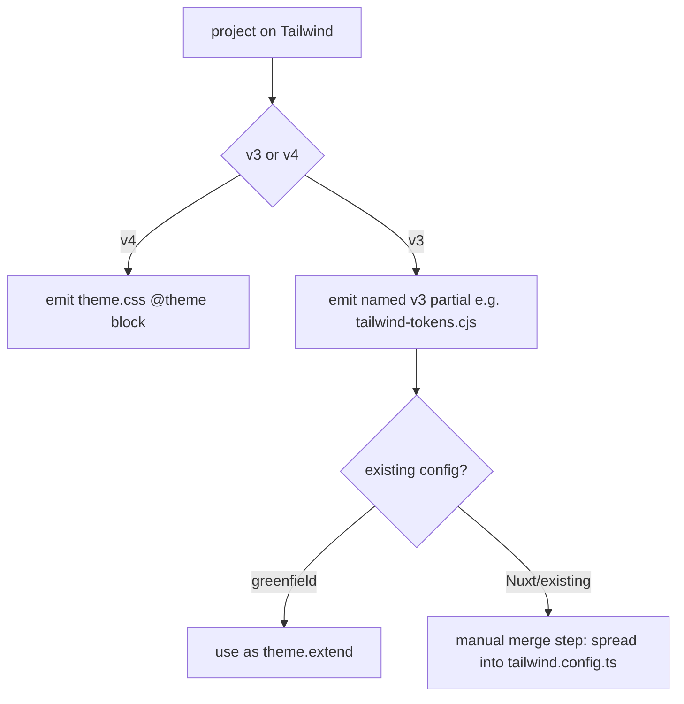

# Instruction: explicit Tailwind v3 adapter artifact contract (#6)

## Feature

- **Summary**: `token-schema.md:96-98` is Tailwind-v4-biased (`@theme`). v3 only gets "emit a tailwind.config.js extend", but the contract's **named** artifact is `adapters/theme.css` — unsuitable for a JS config. The auditor had to invent `adapters/tailwind-theme.js` **off-contract**, and its values must be **hand-merged** into `tailwind.config.ts` (the adapter is not auto-consumed). Define the v3 adapter artifact explicitly (name + wiring) and signal the merge step for projects with an existing config (Nuxt).
- **Stack**: `Markdown contract` · Tailwind v3 (`tailwind.config.{js,cjs,ts}`) · Tailwind v4 (`@theme`) · Nuxt (existing-config case)
- **Branch name**: `design/contract-utility-first-theme`
- **Parent Plan**: `2026_07_05-design-contract-utility-first-theme-master.md`
- **Sequence**: `3 of 7`
- Confidence: 9/10; artifact name gated by A7
- Time to implement: M

## Phase 0 — Arbitration (resolve before editing)

- **A7 v3 adapter artifact**:
  1. **Canonical filename**: `design/adapters/tailwind.config.cjs` (a full drop-in config) **vs** `design/adapters/tailwind-theme.cjs` (a `theme.extend` **partial** meant to be spread into the project's config). Recommendation: a **partial** exporting a `theme.extend` object — a full config would collide with the project's own `content`/`plugins`. Name it explicitly (e.g. `tailwind-tokens.cjs`) and never call it `theme.css`.
  2. **Wiring**: greenfield → the partial can be the config's `theme.extend`; existing config (Nuxt) → spread/merge the partial into `tailwind.config.ts` (`theme: { extend: { ...designTokens } }`), documented as a required **manual merge step** (the adapter is not auto-consumed by Tailwind).
  3. **Theme overlays (from Part 1)**: v3 dark/`data-theme` typically via `darkMode: 'class'` + CSS `.dark` block or config variants — state how the v3 artifact carries the theme overlays delivered in Part 1.

Record A7 in Amendments before editing.

## Architecture projection

### Files to modify

- `plugins/design/references/token-schema.md` (§ Adapter `theme.css`, lines ~96-108) — split the section into **v4** (`@theme` in `theme.css`, unchanged) and **v3** (the named artifact per A7). Give the v3 artifact a canonical filename, an example export, and the wiring instruction. Add the **merge step** for existing configs (Nuxt) explicitly. State how theme overlays are carried in v3.
- `plugins/design/skills/diffuse/adapters/html-css.md` and/or `plugins/design/skills/diffuse/SKILL.md` — if either references the adapter artifact names, align them.
- `plugins/design/references/sc-pivot-contract.md` — if the render spec references adapter consumption, note v3 vs v4 artifact so the pivot wires the correct file.
- `plugins/design/CHANGELOG.md` + `plugins/design/.claude-plugin/plugin.json` — patch/minor bump + entry.

### Files to create

- none (documentation-only change; no fixture needed — success is doc-consistency + no linter regression).

### Files to delete

- none.

## Applicable rules

| Tool   | Name                | Path                                     | Why it applies |
| ------ | ------------------- | ---------------------------------------- | -------------- |
| claude | plugins-marketplace | `~/.claude/rules/plugins-marketplace.md` | Edit source, never cache. |

## User Journey

## Risk register

| Risk | Impact | Mitigation |
| ---- | ------ | ---------- |
| Naming the artifact wrong again | Another off-contract invention | A7 fixes one canonical name in the contract; diffuse + pivot reference it. |
| Auto-consumption illusion | Users assume Tailwind reads the adapter automatically | Document the merge step as **required and manual** for existing configs. |
| Theme overlay wiring differs v3/v4 | Dark mode silently absent on v3 | State the v3 mechanism (`darkMode:'class'` + overlay) alongside the artifact. |

## Implementation phases

### Phase 1: Split the adapter section v3 vs v4

#### Tasks

1. Restructure token-schema.md § adapters into a v4 subsection (unchanged) and a v3 subsection.
2. Name the v3 artifact per A7; add an export example.

#### Acceptance criteria

- [ ] token-schema.md names a v3 adapter artifact that is not `theme.css`.
- [ ] v4 `@theme`/`theme.css` path preserved.

### Phase 2: Wiring + merge step + theme overlays

#### Tasks

1. Document greenfield wiring and the manual merge step for existing configs (Nuxt) with a concrete `theme.extend` spread example.
2. State how Part 1 theme overlays are emitted in v3.
3. Align diffuse/pivot references to the artifact name.

#### Acceptance criteria

- [ ] A merge step for existing configs is documented with an example.
- [ ] diffuse + sc-pivot reference the same artifact name (no drift).

### Phase 3: Versioning + changelog

#### Tasks

1. Bump plugin.json; CHANGELOG entry.

#### Acceptance criteria

- [ ] Versions in phase; CHANGELOG updated; `clean.html` fixture still exit 0 (no linter regression).

## Amendments

<!-- Record A7 here before Phase 1. -->

## Log

<!-- APPEND ONLY. -->

## Validation flow demonstration

1. Read token-schema.md § adapters → v3 and v4 subsections, a named v3 artifact, a merge step.
2. Grep diffuse + sc-pivot for the old `theme.css`-only assumption → none remain for v3.
3. Run the `success_condition`.
