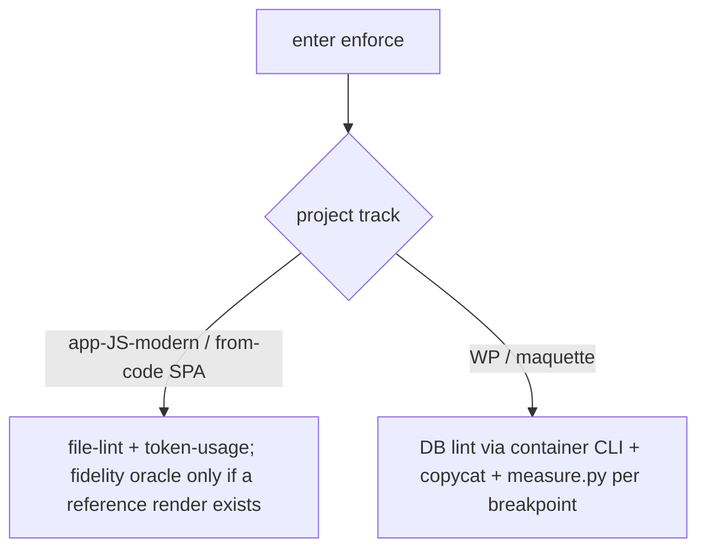

# Instruction: factor app-JS-modern vs WP/maquette tracks (#8) + document the brief-path fidelity limit (2nd-audit #3)

## Feature

- **Summary**: WordPress/maquette ADN is omnipresent across `enforce/actions/03-lint-instances.md`, `05-fidelity-gate.md`, `agents/copycat.md`, `references/wordpress-pitfalls.md` (`wp post get`, `measure.py` oracle per breakpoint, copycat, BEM). It is correctly skippable but dominates the skill surface and **masks the SPA / from-code path**. Factor a "modern JS app" track vs a "WP/maquette" track so each flow reads cleanly. Pure doc/architecture refactor — no behaviour change.
- **Also (2nd-audit #3) — brief-path fidelity limit**: `05-fidelity-gate.md` measures fidelity against a **resolved mockup** via the Python oracle (`getComputedStyle` per breakpoint). There is **no equivalent** for the `define/03-construct` path (construction from a written brief, no reference visual) — with no mockup, there is nothing to measure. Projects built from a brief therefore have only the vocabulary gate (`lint-core.mjs`), never a fidelity gate. This may be acceptable *by nature* (no external reference = nothing to compare), but it is **documented nowhere as an assumed contract limit**. This is a natural extension of the track factoring — the from-code/brief track's gate profile — so it is folded here rather than re-touching `05-fidelity-gate.md` in a separate part.
- **Stack**: `Markdown contract` · (no code change beyond doc structure)
- **Branch name**: `design/contract-utility-first-theme`
- **Parent Plan**: `2026_07_05-design-contract-utility-first-theme-master.md`
- **Sequence**: `4 of 7`
- **Depends on**: Part 3 (#6) — conservative default (strict linear order); no true dependency on Part 3's content (pure doc/architecture refactor, orthogonal to the adapter-artifact contract).
- Confidence: 9/10; factoring shape gated by A8, brief-path fidelity limit gated by A9
- Time to implement: M

## Phase 0 — Arbitration (resolve before editing)

- **A8 factoring shape**: choose one, consistently applied:
  1. **Per-action Track markers/sections** — each action file gets a short routing preamble ("Track: app-JS-modern / Track: WP-maquette") and splits stack-specific steps under a `## Track: …` heading. Lightest touch, keeps files together. **Recommended.**
  2. **Two parallel track docs** — a `references/tracks/app-js.md` + `references/tracks/wp.md`, with the action files delegating. Cleaner separation but more indirection and risk of drift.
  3. **Routing preamble in each SKILL** — SKILL.md routes to the track; actions stay mixed. Least invasive but least effective at unmasking the SPA path.
- Sub-decision: do WP references move under `references/tracks/wp/` or stay in place, referenced conditionally from the WP track? Recommendation: keep files in place (avoid churn), add the track markers and a routing note that the WP idioms are WP-track-only.

- **A9 brief-path fidelity limit** (2nd-audit #3): how is the absence of a fidelity gate on the `define/03-construct` (from-brief, no reference visual) path resolved?
  1. **Accepted limit, documented** — state in `05-fidelity-gate.md` that when no external reference render exists (brief-built projects), the fidelity oracle **does not apply** by nature; the gate profile for that case is vocabulary (`lint-core.mjs`) + visual best-practice only. **Recommended** — matches the reality the finding describes; the value is making the limit explicit and assumed, not silent.
  2. **Substitute gate** — introduce a self-consistency / best-practice checklist gate for brief-built projects (contrast pairs, responsive reductions, state coverage) as a *soft* fidelity proxy. Heavier; only if the user wants a positive gate on the brief path.
  Recommendation: **A9 = option 1** (document the assumed limit + cross-reference `define/03-construct`); note option 2 as a possible follow-up, not built here. Whichever is chosen, the from-brief case must be **named** in `05-fidelity-gate.md`, not left implicit.

Record A8 and A9 in Amendments before editing.

## Architecture projection

### Files to modify

- `plugins/design/skills/enforce/actions/03-lint-instances.md` — currently "WordPress (stack principale)" leads; add a track preamble and put the `wp post get` DB-lint flow under a WP track, the `find … | xargs lint-core` file-lint flow under the app-JS track, so the SPA/from-code reader is served first-class.
- `plugins/design/skills/enforce/actions/05-fidelity-gate.md` — the fidelity oracle is inherently maquette-vs-render (WP-flavoured examples throughout); mark it as primarily the WP/maquette track and add a short note on the app-JS-modern / from-code case (no external mockup → vocabulary + visual best-practice, when the fidelity oracle applies vs not). **Per A9 (2nd-audit #3)**: add an explicit **"Chemin construction-depuis-brief — pas de gate de fidélité"** subsection stating that when no reference render exists (`define/03-construct` output), the oracle does not apply *by nature*, the gate profile is vocabulary + best-practice, and this is an **assumed contract limit** — cross-reference `${CLAUDE_PLUGIN_ROOT}/skills/define/actions/03-construct.md`. The existing "the oracle applies whenever a reference render exists (any stack)" note (track factoring) and this brief-path limit are two sides of the same rule: fidelity requires a reference; brief-built projects have none.
- `plugins/design/skills/define/actions/03-construct.md` — add a one-line downstream note: a from-brief construction has no reference visual, so no fidelity gate applies downstream (only vocabulary + best-practice); point to `05-fidelity-gate.md` for the stated limit. (Documentation cross-link only — no behaviour change.)
- `plugins/design/agents/copycat.md` — copycat is a mockup→contract reconciler (maquette track by nature); add a boundary note that it is the WP/maquette track operator and does not apply to a pure from-code SPA extraction, so its omnipresence stops implying it is always required.
- `plugins/design/skills/enforce/SKILL.md` — add the two-track routing at the top of the execution flow (which of 03/05 apply per track).
- `plugins/design/references/wordpress-pitfalls.md` — add a one-line header scoping it to the WP track (already WP-named; just make the track membership explicit and referenced from the WP track only).
- `plugins/design/CHANGELOG.md` + `plugins/design/.claude-plugin/plugin.json` — patch bump + entry.

### Files to create

- Conditional on A8 option 2 only: `plugins/design/references/tracks/app-js.md`, `plugins/design/references/tracks/wp.md`. Not created under the recommended option 1.

### Files to delete

- none.

## Applicable rules

| Tool   | Name                | Path                                     | Why it applies |
| ------ | ------------------- | ---------------------------------------- | -------------- |
| claude | plugins-marketplace | `~/.claude/rules/plugins-marketplace.md` | Edit source, never cache. |

## User Journey

## Risk register

| Risk | Impact | Mitigation |
| ---- | ------ | ---------- |
| Splitting introduces doc drift | Two tracks diverge over time | Prefer option 1 (in-place markers) — one file, two clearly-scoped sections, no duplication. |
| Over-factoring removes shared steps | Common steps (correct-at-source, re-lint loop) get duplicated or lost | Keep shared steps track-agnostic at the top; only stack-specific idioms go under a track heading. |
| Fidelity oracle framed as WP-only | Teams think it never applies to SPA | Note: the oracle applies whenever a reference render exists (any stack); it is WP-flavoured only in its examples. |

## Implementation phases

### Phase 1: Routing + track markers in enforce

#### Tasks

1. Add two-track routing to `enforce/SKILL.md` (which actions apply per track).
2. Add track preamble + `## Track:` sections to `03-lint-instances.md` (app-JS file-lint first, WP DB-lint under WP track).
3. Scope `05-fidelity-gate.md` and `copycat.md` to the WP/maquette track with an app-JS note.
4. **(A9 / 2nd-audit #3)** Add the "construction-depuis-brief — pas de gate de fidélité" subsection to `05-fidelity-gate.md` (assumed limit, gate profile = vocabulary + best-practice, cross-ref `define/03-construct`), and the reciprocal one-line note in `define/03-construct.md`.

#### Acceptance criteria

- [ ] Each of 03/05/copycat states its track; the app-JS/from-code path is readable without wading through WP idioms.
- [ ] No behaviour removed — WP flow intact under its track.
- [ ] `05-fidelity-gate.md` explicitly documents the brief-path (no-reference) fidelity limit as assumed, cross-referencing `define/03-construct`; `define/03-construct.md` carries the reciprocal downstream note.

### Phase 2: Scope the WP reference + versioning

#### Tasks

1. Add a track-scope header to `wordpress-pitfalls.md`; reference it only from the WP track.
2. Bump plugin.json; CHANGELOG entry.

#### Acceptance criteria

- [ ] wordpress-pitfalls.md is explicitly WP-track-scoped.
- [ ] Versions in phase; CHANGELOG updated; `clean.html` fixture still exit 0.

## Amendments

<!-- Record A8 and A9 here before Phase 1. -->

## Log

<!-- APPEND ONLY. -->

## Validation flow demonstration

1. Read enforce SKILL → two-track routing visible.
2. Read 03-lint-instances as an SPA dev → the file-lint/token-usage flow is first-class, WP DB-lint clearly WP-track.
3. Run the `success_condition`.
