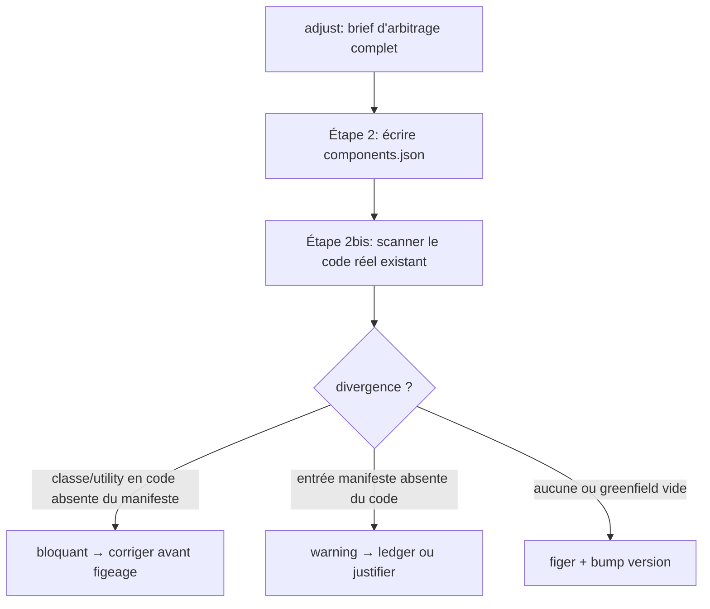

# Instruction: reconcile manifest ↔ real code before freeze (retrofit) — 2nd-audit #1

## Feature

- **Summary**: `adjust/02-freeze.md` reconciles `components.json` (layer 2) with the prose inventory of `design-system.md` (layer 3) — the "Concordance avec la couche 3" rule (line ~62) and the validity test (line ~118). It **never** reconciles with the classes/token-usage **actually present in the already-written markup/code** of the consumer project. On a **retrofit** project (HTML/components exist *before* freeze — a frequent case), the manifest can be perfectly coherent with the charter while diverging from the real code. That drift is only surfaced far later, when `enforce/03-lint-instances` runs — after the contract is already frozen, and after downstream work has been built on it. Add a reconciliation step against real code to the freeze path so the drift is caught at freeze time.
- **Stack**: `Markdown contract` · `JSON manifest` · `Node.js >= 18 (lint-core.mjs, reused as the code-scan oracle)` · consumer markup (`**/*.{html,vue,jsx,tsx}`)
- **Branch name**: `design/contract-utility-first-theme`
- **Parent Plan**: `2026_07_05-design-contract-utility-first-theme-master.md`
- **Sequence**: `5 of 7`
- **Depends on**: Part 2 (#2) — the enforcement **mode** (`bem` vs `utility-first`) determines *what* is reconciled against code: BEM class-vocabulary, or token-usage rules. Do not start before Part 2's `mode` field lands.
- Confidence: 8/10 (structure); reconciliation policy gated by A10
- Time to implement: L (M/L)

## Phase 0 — Arbitration (resolve before editing any file)

- **A10 retrofit reconciliation at freeze**:
  1. **Does freeze scan the consumer codebase?** yes, add a reconciliation sub-step to `02-freeze` **vs** no, keep freeze charter-only and document the limit. Recommendation: **yes** — reuse `lint-core.mjs` as the scan oracle against the existing code so no new scanner is written; the finding is precisely that this scan is missing.
  2. **Scope of the scan** (mode-aware, per Part 2): in `bem` mode, scan class attributes in `**/*.{html,vue,jsx,tsx}` against the manifest `components`/`elements`/`modifiers` vocabulary; in `utility-first` mode, scan colour utilities / raw-hex against the declared `usage` namespaces. Recommendation: derive the glob set and the rule set from the contract `mode`, never a hard-coded list.
  3. **Divergence policy + direction**. Two directions exist:
     - **code → manifest**: a class/utility present in real code that is **absent** from the frozen manifest (dead reference the linter would later reject).
     - **manifest → code**: a component/element declared in the manifest that **never appears** in the real code (a manifest entry that describes nothing that exists — the "fictional concordance" of #2, now at freeze granularity).
     Policy per direction — **blocking error** (must resolve before freeze) vs **warning** vs **deviation-ledger entry** (`DEV-NNN`, sanctioned) vs **auto-propose manifest additions**. Recommendation: code→manifest divergence is **blocking** (a freeze that ships a manifest already contradicted by shipped code is invalid); manifest→code divergence is a **warning + ledger option** (a component may be legitimately declared ahead of its first use). Never auto-mutate the manifest silently.
  4. **Retrofit detection**: always-on (harmless on greenfield — no pre-existing code means nothing to reconcile, scan returns empty) **vs** gated behind a `retrofit` flag / detected pre-existing markup. Recommendation: **always-on**, self-neutralizing on greenfield; no flag to forget.

Record A10 (all four sub-decisions) in Amendments before proceeding.

## Architecture projection

### Files to modify

- `plugins/design/skills/adjust/actions/02-freeze.md` — add **Étape 2bis — Réconciliation avec le code réel (retrofit)** between the manifest write (Étape 2) and the version bump: scan the consumer codebase (mode-aware glob + rule set per A10.2) using `lint-core.mjs` as oracle, classify divergences by direction (A10.3), apply the policy (blocking code→manifest, warning/ledger manifest→code), and forbid freezing while a blocking divergence stands. Extend the **Test de validité** checklist with a reconciliation line. State the always-on / greenfield-neutral behaviour (A10.4).
- `plugins/design/skills/adjust/references/manifest-schema.md` — document that on a retrofit project the layer-2 ↔ **code** concordance is a freeze precondition (companion to the existing layer-2 ↔ layer-3 concordance), and that it is mode-aware.
- `plugins/design/skills/enforce/adapters/lint-core.mjs` — no rule change; add only a documenting comment that the same scanner is invoked by the freeze reconciliation step (single source of truth for "code vs contract"), so the two never drift. If A10.3 needs the **manifest→code** direction (unused-entry detection) and the scanner cannot express it as-is, add a minimal `--report-unused` mode that lists manifest entries with zero code occurrences (additive flag, default off, existing fixtures unaffected).
- `plugins/design/CHANGELOG.md` + `plugins/design/.claude-plugin/plugin.json` — minor bump + entry.

### Files to create

- `plugins/design/skills/enforce/fixtures/retrofit/tokens.json` + `components.json` — a manifest fixture representing a just-frozen contract for a project that already has markup.
- `plugins/design/skills/enforce/fixtures/retrofit-clean.html` — pre-existing markup whose every class/utility ∈ the frozen manifest → reconciliation passes → exit 0.
- `plugins/design/skills/enforce/fixtures/retrofit-dirty.html` — pre-existing markup carrying a class/utility **absent** from the manifest (the retrofit drift a freeze must catch) → exit 1.

### Files to delete

- none.

## Applicable rules

| Tool   | Name                | Path                                     | Why it applies |
| ------ | ------------------- | ---------------------------------------- | -------------- |
| claude | plugins-marketplace | `~/.claude/rules/plugins-marketplace.md` | Edit source under `plugins/design/…`, never the cache; re-install to activate. |
| claude | CLAUDE.md (RTK/pnpm)| `~/.claude/CLAUDE.md`                     | `rtk`/`pnpm` for validation runs. |

## User Journey

## Risk register

| Risk | Impact | Mitigation |
| ---- | ------ | ---------- |
| Reconciliation duplicates a scanner | A second, drifting code-scan next to lint-core | Reuse `lint-core.mjs` verbatim as the freeze oracle; single source of truth for "code vs contract". |
| manifest→code direction is unenforceable by a string-scanner | Unused-entry detection gives false positives (a class built dynamically) | Keep manifest→code as **warning + ledger**, never blocking; scope the `--report-unused` flag to literal-string occurrences and document its heuristic limit. |
| Blocking freeze on retrofit noise | A large legacy codebase floods the gate and freeze never completes | Divergence is reported grouped by file (lint-core already groups); allow ledgering known-legacy zones; policy is per A10, decided up front. |
| Greenfield false alarm | Scan fires on a project with no code yet | Always-on step is self-neutralizing: empty scan → no divergence → freeze proceeds. |
| Coupling to Part 2 mode | Wrong rule set scanned if mode absent | Sequenced after Part 2; the scan reads the contract `mode` and refuses to guess. |

## Implementation phases

### Phase 1: Freeze reconciliation step

> Add the pre-freeze code reconciliation to the contract.

#### Tasks

1. Add **Étape 2bis** to `02-freeze.md` per A10: mode-aware scan, both divergence directions, the policy, and the always-on/greenfield-neutral note.
2. Forbid completing the freeze while a blocking (code→manifest) divergence stands; route manifest→code divergences to a warning + optional ledger entry.
3. Extend the **Test de validité** checklist with the reconciliation assertion.

#### Acceptance criteria

- [ ] `02-freeze.md` documents an Étape 2bis reconciling the manifest against real code, mode-aware, with the A10 policy.
- [ ] The freeze is stated as invalid while a blocking divergence stands; greenfield behaviour (empty scan → proceed) is documented.

### Phase 2: Scanner reuse + fixtures

> Prove the reconciliation with a runnable gate.

#### Tasks

1. Add the documenting comment (and, if A10.3 requires it, the additive `--report-unused` flag) to `lint-core.mjs`; keep existing fixtures green.
2. Build the `retrofit/` contract fixture + `retrofit-clean.html` + `retrofit-dirty.html`.
3. Run the `success_condition` and confirm `clean`/`dirty`/`themed-*`/`utility-*` fixtures unchanged.

#### Acceptance criteria

- [ ] `retrofit-clean.html` → exit 0; `retrofit-dirty.html` → exit 1.
- [ ] All pre-existing fixtures still pass; `--report-unused` (if added) defaults off and does not affect them.

### Phase 3: Schema note + versioning + changelog

#### Tasks

1. Add the retrofit concordance note to `manifest-schema.md`.
2. Bump `plugin.json`; CHANGELOG entry.

#### Acceptance criteria

- [ ] `manifest-schema.md` states the layer-2 ↔ code concordance as a freeze precondition (mode-aware).
- [ ] Versions in phase; CHANGELOG updated.

## Amendments

<!-- Record A10 (4 sub-decisions) here before Phase 1. -->

## Log

<!-- APPEND ONLY. -->

## Validation flow demonstration

1. Freeze a manifest on a project whose markup already contains a class not in the manifest → reconciliation blocks (exit 1 on `retrofit-dirty.html`).
2. Fix the manifest (or ledger the divergence), re-run → `retrofit-clean.html` exit 0, freeze proceeds.
3. Confirm greenfield (no code) freezes with an empty, non-blocking scan.
