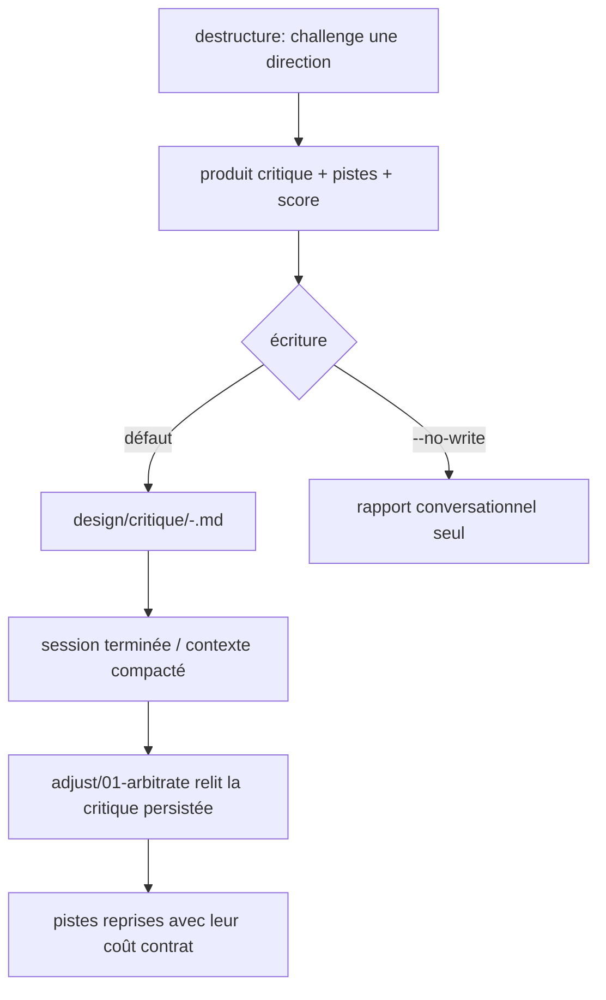

# Instruction: persist the destructure critique (survivable trace) — 2nd-audit #2

## Feature

- **Summary**: `destructure/SKILL.md` + `actions/01-challenge.md` make the skill strictly read-only: it produces a conversational report (multi-lens critique + alternative pistes + distinction score) that is **never written to disk** — persistence is only `si demandé` (01-challenge line ~31: "ou sauvé en `design/destructure-report.md` si demandé"). If the session ends or the context is compacted, the critique and the divergent pistes are lost: **no trace survives** to inform a later `adjust`, a re-freeze, or a future re-read. The divergent phase of the funnel (the whole point of `destructure`) leaves nothing behind. Make persistence a **default, canonical artifact** — while keeping `destructure` read-only on the *contract* (it must still never edit `tokens.json` / `components.json` / `design-system.md`).
- **Stack**: `Markdown contract` · report file (Markdown) · consumed by `adjust`
- **Branch name**: `design/contract-utility-first-theme`
- **Parent Plan**: `2026_07_05-design-contract-utility-first-theme-master.md`
- **Sequence**: `6 of 7`
- **Depends on**: nothing — fully orthogonal to Parts 1–5, 7. May be executed at any time.
- Confidence: 9/10 (structure); persistence shape gated by A11
- Time to implement: M

## Phase 0 — Arbitration (resolve before editing any file)

- **A11 critique persistence**:
  1. **Canonical location + naming**: `design/destructure-report.md` (single file, overwrite-per-run) **vs** `design/critique/<yyyy_mm_dd>-<target>.md` (history, one file per run) **vs** an append-only `design/destructure-log.md`. Recommendation: **`design/critique/<yyyy_mm_dd>-<target>.md`** — history is the value (a critique is a moment-in-time divergence; overwriting destroys the trace the finding is about). Keep the legacy `design/destructure-report.md` path as an accepted alias for backward compatibility.
  2. **Default-on vs opt-in**: current = opt-in (`si demandé`). Recommendation: **default-on** — writing the report is the default terminal step; an explicit `--no-write` / "ne sauvegarde pas" opts out. The finding is that the default (ephemeral) loses the artifact.
  3. **Read-only reconciliation**: writing a critique report is **not** editing the contract. State an explicit carve-out in the "lecture seule absolue" invariant: destructure never edits contract artifacts (`tokens.json`, `components.json`, `design-system.md`) nor source code, but MAY write its own report under a dedicated critique path. Reconcile SKILL.md line ~45 and 01-challenge Outputs/Test accordingly.
  4. **Consumption by adjust**: the trace must actually feed downstream. Recommendation: `adjust/01-arbitrate` reads the latest critique report (if present) as **optional input** to the arbitrage brief — each retained piste is tagged "rentre dans le contrat / demande un re-figeage" (a distinction `destructure` already emits), so `adjust` can pick it up. Non-blocking (absence is fine).

Record A11 (4 sub-decisions) in Amendments before proceeding.

## Architecture projection

### Files to modify

- `plugins/design/skills/destructure/actions/01-challenge.md` — change the Outputs section: the report is written **by default** to the canonical path (per A11.1), with an explicit opt-out; document the filename convention; add the write to the Process (terminal step) and to the Test. Keep the report content structure (score + lenses + pistes + verdict) unchanged.
- `plugins/design/skills/destructure/SKILL.md` — reconcile the **Transversal rules** "Lecture seule absolue" bullet (line ~45): read-only means *never edits the contract or source code*; add the carve-out that destructure persists its own critique report to the critique path (per A11.3). Update the skill description's "n'applique RIEN / produit un rapport" wording to say the rapport is persisted.
- `plugins/design/skills/adjust/actions/01-arbitrate.md` — add a step: if a destructure critique report exists, read the latest as optional input to the arbitrage brief; carry forward each retained piste with its contract-cost tag (per A11.4). Non-blocking.
- `plugins/design/references/design-system-contract.md` — if it enumerates the `design/` artifacts, register the critique report path as a **non-contract** artifact (informational, not versioned with `$version`), so it is not mistaken for a frozen contract file.
- `plugins/design/CHANGELOG.md` + `plugins/design/.claude-plugin/plugin.json` — minor bump + entry.

### Files to create

- `plugins/design/skills/destructure/references/critique-report-template.md` — the canonical report skeleton (score de distinction, cible & mode, mesures, critique par lentille, pistes avec coût contrat, verdict) so every persisted critique is uniformly structured and machine-locatable by `adjust`.

### Files to delete

- none.

## Applicable rules

| Tool   | Name                | Path                                     | Why it applies |
| ------ | ------------------- | ---------------------------------------- | -------------- |
| claude | plugins-marketplace | `~/.claude/rules/plugins-marketplace.md` | Edit source, never cache. |

## User Journey

## Risk register

| Risk | Impact | Mitigation |
| ---- | ------ | ---------- |
| Persisting appears to break "lecture seule" | Contradiction with destructure's core invariant | A11.3 carve-out: read-only = never edits the *contract* or source; the report is a separate, non-contract artifact — stated explicitly in both SKILL.md and 01-challenge. |
| Report mistaken for a contract file | Someone treats a critique as frozen truth | Register it in design-system-contract.md as non-contract, unversioned; store it under `design/critique/`, not alongside `tokens.json`/`components.json`. |
| Stale critiques accumulate | Directory clutter, `adjust` reads an outdated critique | History path is dated; `adjust` reads the **latest**; absence is non-blocking. |
| Consumption coupling to adjust | adjust breaks if the report format shifts | Fixed template (created here); adjust reads it as optional input, tolerant of absence. |

## Implementation phases

### Phase 1: Persist by default + template

> Make the critique survive.

#### Tasks

1. Create `critique-report-template.md` (report skeleton).
2. Update `01-challenge.md` Outputs/Process/Test: default-on write to the canonical dated path, explicit opt-out, filename convention.
3. Reconcile the read-only invariant in `SKILL.md` (carve-out) and the skill description wording.

#### Acceptance criteria

- [ ] `01-challenge.md` writes the report by default to a canonical path, with an opt-out documented.
- [ ] `SKILL.md` reconciles "lecture seule" with the critique-report carve-out (contract/source still never edited).

### Phase 2: Consumption by adjust + registration + versioning

> Close the loop so the trace informs figeage.

#### Tasks

1. Add the optional "read latest critique" input step to `adjust/01-arbitrate.md`, carrying each piste's contract-cost tag.
2. Register the critique path as a non-contract artifact in `design-system-contract.md`.
3. Bump `plugin.json`; CHANGELOG entry.

#### Acceptance criteria

- [ ] `adjust/01-arbitrate.md` reads the persisted critique as optional (non-blocking) input.
- [ ] Critique path registered as non-contract; versions in phase; CHANGELOG updated.

## Amendments

<!-- Record A11 (4 sub-decisions) here before Phase 1. -->

## Log

<!-- APPEND ONLY. -->

## Validation flow demonstration

1. Run `destructure` on a direction → a dated critique file appears under `design/critique/`.
2. Simulate a fresh session → `adjust/01-arbitrate` reads that file and surfaces the retained pistes with their contract-cost tags.
3. Run with the opt-out → no file written, conversational report only (backward-compatible behaviour).
