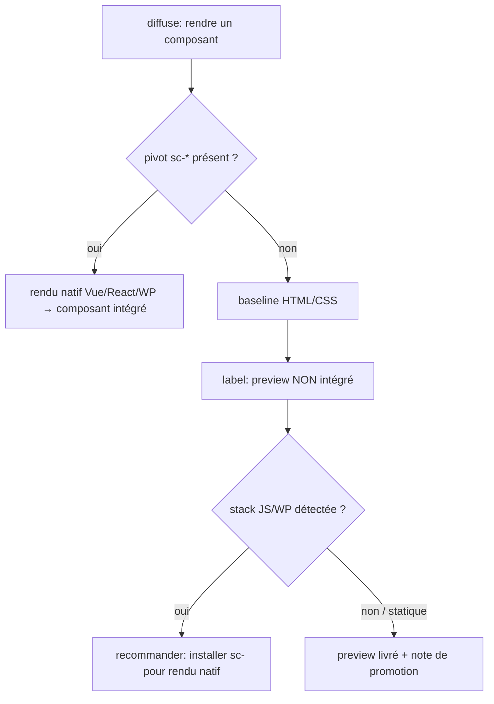

# Instruction: no orphan wireframes from the diffuse baseline renderer — 2nd-audit #4

## Feature

- **Summary**: `diffuse/SKILL.md` + `adapters/html-css.md` + `actions/02-render.md`: the hybrid render falls back to the **baseline HTML/CSS renderer** whenever no `sc-*:design-bridge` pivot is detected (`02-render.md` Étape 1: "Aucun sc-* disponible OU stack non identifiée → adapters/html-css.md"). That baseline renderer can leave **orphan previews** — a standalone HTML file with **no integration path** into a real Vue/React (or WP) component of the app. The native pivot exists only if an `sc-js`/`sc-php` is present; otherwise the HTML/CSS output is an isolated artifact nobody reconnects to the real app, yet it passes the enforce gate (lint-vert) and is announced as "livré". Frame the baseline output so its status is explicit and a hand-off path is always stated.
- **Stack**: `Markdown contract` · baseline HTML/CSS renderer · `sc-js:design-bridge` / `sc-php:design-bridge` (native pivots)
- **Branch name**: `design/contract-utility-first-theme`
- **Parent Plan**: `2026_07_05-design-contract-utility-first-theme-master.md`
- **Sequence**: `7 of 7`
- **Depends on**: Part 3 (#6) — shares the diffuse surface (`SKILL.md`, `adapters/html-css.md`); sequencing after Part 3 avoids touching those files twice. Orthogonal to Parts 1/2/5/6.
- Confidence: 9/10 (structure); output-status contract gated by A12
- Time to implement: M

## Phase 0 — Arbitration (resolve before editing)

- **A12 baseline output status + orphan hand-off**:
  1. **Status of the baseline output when no pivot is present**: a **disposable preview/wireframe**, explicitly labelled as such (not an app deliverable) **vs** a first-class deliverable that MUST carry an integration path. Recommendation: **disposable preview by default**, explicitly labelled — with a mandatory hand-off note (below). The baseline renderer's own doc already calls its output a demo wrapper (`diffuse-demo`); make the "preview, not integrated" status contractual, not implied.
  2. **Hand-off content**: does `02-render` emit an explicit "how to wire this into a real component" note, and — when a JS/WP app **is** detected but no pivot is installed — recommend installing `sc-js`/`sc-php` so the native pivot path becomes available? Recommendation: **yes to both** — the livraison message (Étape 5) states (a) this is a non-integrated preview, (b) the promotion path (which real component/file it would become), (c) if a JS/WP stack is detected, "install `sc-<techno>` for a native `design-bridge` render".
  3. **Where the orphan-boundary is surfaced**: livraison message (`02-render` Étape 5) only **vs** also in `SKILL.md` (the "Ce que diffuse produit" table / architecture) and the adapter doc (`html-css.md`). Recommendation: **all three**, consistently — the table marks the baseline render as "preview (non intégré)", the adapter doc states the boundary, the render step emits the hand-off.
  4. **Does the orphan status change the enforce gate?** No — lint-vert stays a *necessary* condition; the hand-off is an *additional* delivery obligation, not a lint rule. State that a green lint does not imply an integrated artifact.

Record A12 (4 sub-decisions) in Amendments before editing.

## Architecture projection

### Files to modify

- `plugins/design/skills/diffuse/actions/02-render.md` — Étape 1 (adapter selection): when the baseline branch is taken, mark the output as a **non-integrated preview** and, if a JS/WP stack is detected without a pivot, surface the "install `sc-<techno>` for native render" recommendation. Étape 5 (Livraison): the delivery message states the preview status + the promotion/hand-off path (which real component/file it would become). Add an explicit line that lint-vert ≠ integrated.
- `plugins/design/skills/diffuse/adapters/html-css.md` — add a short "Statut de la sortie" section at the top: baseline output is a self-contained **preview** (`diffuse-demo` wrapper), not an app component; state the boundary and point to the pivot path for a native artifact.
- `plugins/design/skills/diffuse/SKILL.md` — in "Ce que diffuse produit", relabel the **Rendu baseline** row as "preview HTML/CSS **non intégré** (aucun pivot)"; in the hybrid architecture note, state the orphan-boundary and the hand-off obligation. Keep it aligned with Part 3's adapter-name references (no drift).
- `plugins/design/references/sc-pivot-contract.md` — note the fallback boundary: absence of a pivot yields a preview, not a native artifact; the render spec's consumer (the pivot) is what produces the integrated component. (Only if it references the baseline fallback; align, do not duplicate.)
- `plugins/design/CHANGELOG.md` + `plugins/design/.claude-plugin/plugin.json` — patch/minor bump + entry.

### Files to create

- none (documentation/contract-framing change; no fixture — success is doc-consistency + no linter regression on `clean.html`).

### Files to delete

- none.

## Applicable rules

| Tool   | Name                | Path                                     | Why it applies |
| ------ | ------------------- | ---------------------------------------- | -------------- |
| claude | plugins-marketplace | `~/.claude/rules/plugins-marketplace.md` | Edit source, never cache. |

## User Journey

## Risk register

| Risk | Impact | Mitigation |
| ---- | ------ | ---------- |
| Baseline output silently treated as deliverable | Orphan wireframe nobody wires into the app (the finding) | A12: contractual "preview, non-integrated" label + mandatory hand-off note in the delivery message. |
| Recommending a pivot install where none is wanted | Noise on genuinely static/HTML projects | Recommendation is **conditional** on a JS/WP stack being detected; a pure static target just gets the preview + promotion note, no pivot nudge. |
| Weakening the enforce gate | Someone reads "preview" as "lint optional" | A12.4: lint-vert stays necessary; the hand-off is an *additional* obligation, never a relaxation. |
| Double-touch of diffuse files with Part 3 | Merge churn / drift on `SKILL.md` + `html-css.md` | Sequenced after Part 3; align to the adapter names Part 3 settles rather than re-deciding them. |

## Implementation phases

### Phase 1: Frame the baseline output status + hand-off

#### Tasks

1. Add the "Statut de la sortie" boundary to `adapters/html-css.md`.
2. Update `02-render.md` Étape 1 + Étape 5: preview label, promotion/hand-off path, conditional pivot-install recommendation, lint-vert ≠ integrated.
3. Relabel the baseline row + add the orphan-boundary note in `SKILL.md`.

#### Acceptance criteria

- [ ] `02-render.md`, `html-css.md`, `SKILL.md` all state the baseline output is a non-integrated preview with a hand-off path.
- [ ] The pivot-install recommendation is conditional on a detected JS/WP stack; static targets are unaffected.

### Phase 2: Pivot-contract alignment + versioning

#### Tasks

1. Align `sc-pivot-contract.md` on the fallback boundary (if referenced); no duplication.
2. Bump `plugin.json`; CHANGELOG entry.

#### Acceptance criteria

- [ ] No drift between diffuse and sc-pivot on the baseline-fallback boundary.
- [ ] Versions in phase; CHANGELOG updated; `clean.html` fixture still exit 0 (no linter regression).

## Amendments

<!-- Record A12 (4 sub-decisions) here before Phase 1. -->

## Log

<!-- APPEND ONLY. -->

## Validation flow demonstration

1. Render a component with no sc-* pivot present → the output is announced as a non-integrated preview with a promotion path.
2. Render on a detected Vue/React project with no pivot → the delivery recommends installing `sc-js` for a native render.
3. Run the `success_condition`: the three diffuse files state the boundary; `clean.html` still exit 0.
