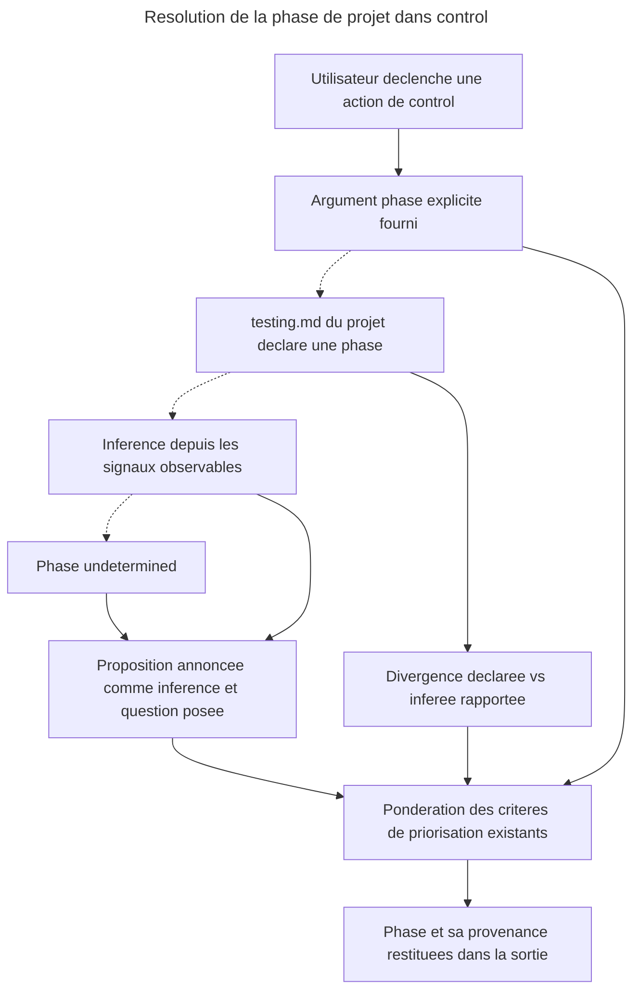

# Instruction : la phase de projet comme contexte de lecture de `control`

## Feature

- **Summary** : donner à `control` la dimension qui lui manque pour arbitrer autre chose que dans l'absolu — le **moment de vie du produit**. Une suite de tests ne prouve pas la même chose quand le modèle de domaine bouge encore, quand il est figé sans utilisateurs, quand de vrais clients paient, ou quand plus rien de neuf n'arrive. Cette partie installe la notion, sa résolution, et sa répercussion sur les quatre actions existantes — en lecture seule.
- **Stack** : `markdown` (skills et références) · projets de validation : `Vitest 3.x` + `@vitest/coverage-v8` + `Playwright`
- **Branch name** : `overcode/control-phase-governance`
- **Parent Plan** : `2026_07_22-control-phase-governance-master.md`
- **Sequence** : `1 of 3`
- Confidence : 9/10
- Time to implement : ~2 h 15 (dont ~35 min de validation réelle)

## Paramètres d'exécution

- `TARGET_PROJECT` — projet JS réel avec suite de tests **et** `aidd_docs/memory/testing.md`. Défaut retenu : `/home/tnn/Projets/SmartLockers/multisite-clients` (vérifié : `@vitest/coverage-v8` câblé, `aidd_docs/memory/testing.md` présent).
- `NO_DOC_PROJECT` — projet JS réel **sans** `aidd_docs/`. Défaut retenu : `/home/tnn/Projets/MyApps/moodboard-generator` (vérifié : aucun `aidd_docs/memory/`).

Ces variables ne sont utilisées que dans le corps des phases, **jamais dans le `success_condition`** : celui-ci ne vérifie que des artefacts de ce dépôt, la preuve de la validation réelle étant portée par la ligne `Validation reelle — Pass` du Log, que seule la phase 5 autorise à écrire.

## Langue des artefacts

Ce plan est rédigé en français ; **les fichiers de skill produits sont rédigés en anglais**, comme les cinq actions, `SKILL.md`, `decision-framework.md` et `pivot-contract.md` existants, et comme les titres de section du pivot `sc-js` (alignés mot pour mot sur les noms de champ du contrat). Les trois `success_condition` greppent des chaînes anglaises : écrire ces fichiers en français les ferait échouer en bloc.

## Architecture projection

### Files to modify

- `plugins/overcode/skills/control/SKILL.md` - règle transversale de frontière (la phase priorise, ne classe jamais) et pointeur vers la nouvelle référence
- `plugins/overcode/skills/control/actions/01-write.md` - la phase entre dans le contexte de décision et dans la restitution ; le tier reste décidé par le tier table seul
- `plugins/overcode/skills/control/actions/02-audit.md` - la phase pré-classe et ordonne les candidats sans valeur ; régime de confirmation inchangé
- `plugins/overcode/skills/control/actions/04-strengthen.md` - la phase repondère les critères de risque existants, en priorisation seule
- `plugins/overcode/skills/control/actions/05-stats.md` - bloc `PHASE` (valeur, provenance, divergence) et ordre des trois bassins attendu vs observé
- `plugins/overcode/skills/control/references/pivot-contract.md` - le champ **Risk signals** existant est précisé : il porte aussi l'inventaire des **frontières externes** de la stack (SDK et scripts tiers), qui est de la connaissance stack et non projet
- `plugins/sc-js/skills/sniff/references/capabilities/tools/testing.md` - section *Risk signals* enrichie de la détection des intégrations tierces côté JS (Meta Pixel/CAPI, GTM, Brevo, Klaviyo, SDK de paiement, webhooks sortants) et du gotcha des majeures de SDK qui bougent sans qu'aucun test ne les touche

### Files to create

- `plugins/overcode/skills/control/references/phase-framework.md` - les quatre phases, leur question définitoire, leurs signaux d'inférence, ce que chacune relève et abaisse, l'ordre attendu des trois bassins

### Files to delete

- aucun

## Applicable rules

`node ${CLAUDE_PLUGIN_ROOT}/scripts/list-rules.mjs` retourne `[]` depuis la racine du dépôt. Aucune surface de règles installée : `none`.

| Tool | Name | Path | Why it applies |
| ---- | ---- | ---- | -------------- |
| none | -    | -    | aucune règle installée sur ce dépôt |

## User Journey

## Risk register

| Risk | Impact | Mitigation |
| ---- | ------ | ---------- |
| La phase inférée écrase une phase déclarée | Une heuristique remplace une décision humaine | La divergence est **rapportée**, jamais résolue. La déclaration gagne toujours. |
| La phase devient un second tier table par la bande | L'autorité de classement se dédouble, les décisions deviennent imprévisibles | Règle transversale explicite, formulée dans les mêmes termes que celle des *Risk signals* du pivot. Aucun mot de `decision-framework.md` n'est touché. |
| L'ordre des trois bassins introduit des pourcentages par la petite porte | Contredit la règle « aucun chiffre n'est un objectif » | Le framework définit un **ordre**, jamais une part. `05-stats` compare des rangs. |
| Le classement d'un test existant dans un bassin est arbitraire | La comparaison attendu/observé devient du bruit | L'approximation est **déclarée** dans la sortie, avec la règle de classement utilisée (tier + rôle du fichier source exercé + churn). |
| Un projet sans git ni manifeste rend l'inférence vide | L'action s'arrête ou invente | `undetermined` est une valeur de première classe : l'action le dit et demande, elle ne devine pas. |
| Le critère de frontière externe fait proposer des tests appelant réellement le fournisseur | Suite lente, instable, soumise à quota — exactement ce que la skill existe pour empêcher | Le framework énonce que l'acceptation par le fournisseur n'est **pas prouvable par la suite** et la renvoie à la surveillance. Seuls la charge utile construite et le chemin dégradé sont proposés, tous deux en process. |
| Le critère de frontière externe fait exploser le nombre de tests | Dix intégrations produisent vingt tests, dans une skill dont la raison d'être est de borner le nombre | Plafond écrit par frontière : un test par défaut (le chemin dégradé), un second seulement si la charge utile porte une donnée à conséquence, aucun si l'échec du fournisseur ne se voit pas côté client. |
| L'inventaire des intégrations tierces est codé en dur dans `control` | La skill devient stack-dépendante et périme à chaque nouveau fournisseur | Le critère reste générique dans `control` ; la détection vit dans le champ *Risk signals* du pivot de langage, dont c'est déjà le rôle. |

## Implementation phases

### Phase 1 : la référence de phase

> Poser la définition avant tout branchement, pour qu'aucune action ne réinvente sa propre lecture.

#### Tasks

1. Créer `references/phase-framework.md` avec les quatre valeurs `scaffolding` / `hardening` / `production` / `sustaining`, plus `undetermined`.
2. Pour chaque phase, écrire sa **question définitoire binaire** : le modèle de domaine bouge-t-il encore (`scaffolding`) ; est-il figé sans utilisateurs réels (`hardening`) ; y a-t-il des utilisateurs réels et de la donnée non reconstituable (`production`) ; du code neuf arrive-t-il encore de façon significative (`sustaining`).
3. Pour chaque phase, écrire ce que la suite doit prouver et ce qu'elle assume de ne pas couvrir.
4. Pour chaque phase, écrire les **poids relevés et abaissés** parmi les critères de risque de `04-strengthen` (conséquence, branches, churn, blast radius, absence d'autre filet, **dépendance à un contrat externe**).
4-bis. Introduire le **seul critère nouveau** de ce plan : **dépendance à un contrat externe**. Tous les critères existants sont internes — churn, branches, blast radius, commits de fix — et aucun ne se déclenche quand c'est le fournisseur qui casse. Une intégration Meta, GTM, Brevo, Klaviyo, un SDK de paiement ou un webhook tiers rompt sans qu'une seule ligne du dépôt ne bouge. Écrire ce que ce critère relève, et surtout **ce qu'un test peut et ne peut pas prouver** ici :
   - prouvable en `contract`, sans appeler le fournisseur : la charge utile construite est bien celle qu'on croit envoyer ; le chemin dégradé se comporte correctement quand le fournisseur renvoie une erreur, un schéma inattendu ou rien du tout ;
   - **non prouvable par la suite de tests** : que le fournisseur accepte encore cette charge utile. Cela demande un appel réel, lent et soumis à quota, qui n'a pas sa place dans une suite bloquant chaque boucle de validation. `04-strengthen` le **déclare comme hors de portée du test** et le renvoie à la surveillance, au lieu de proposer un test qui donnerait une fausse assurance.
   - Ce critère est **relevé en `production` et dominant en `sustaining`**, abaissé en `scaffolding` où les intégrations ne sont pas encore branchées.
4-ter. Borner ce que ce critère peut coûter en nombre de tests — sans quoi dix intégrations en produisent vingt, dans une skill qui existe pour empêcher exactement cela. Règle à écrire : **une frontière externe vaut un test par défaut, le chemin dégradé.**
   - Le **chemin dégradé** est proposé quand l'échec du fournisseur peut interrompre le parcours : script bloquant, promesse non rattrapée, réponse dont le schéma est consommé sans garde. Une intégration purement sortante dont l'échec ne se voit nulle part côté client n'obtient **aucun test** : elle est déclarée *surveillée hors test*, au même titre que l'acceptation par le fournisseur.
   - La **charge utile construite** n'ajoute un second test que si elle porte une donnée à conséquence vérifiable en process : montant, identifiant de commande, statut d'autorisation, consentement. Un pixel de mesure n'en porte pas ; une Conversions API qui transmet une valeur d'achat réconciliée plus tard, si.
   - Cette borne est un **plafond par frontière**, pas un quota : une intégration peut légitimement ne rien recevoir du tout.
5. Écrire les **signaux d'inférence** observables, chacun avec sa lecture et sa fiabilité déclarée : churn sur les fichiers de modèle/schéma, tags de version, présence d'une configuration de déploiement, volume de commits sur 90 j, dominance `fix:` sur `feat:`, présence de migrations de données. Énoncer noir sur blanc que **la frontière `hardening` → `production` n'est pas inférable de façon fiable** et que l'inférence doit poser la question.
6. Définir les **trois bassins** (fondations / code récent / parcours critiques), leur règle de classement approximative, et l'**ordre de priorité attendu** par phase — un ordre, jamais une part.
7. Définir l'ordre de résolution : argument explicite → `testing.md` du projet → inférence annoncée → `undetermined`.

#### Acceptance criteria

- [ ] Les cinq valeurs figurent dans le fichier, chacune avec une question définitoire à réponse binaire
- [ ] Un seul critère de risque nouveau est introduit — **dépendance à un contrat externe** — et il est justifié par le fait qu'aucun critère existant n'est déclenché par une rupture venue du fournisseur
- [ ] Ce critère énonce explicitement ce qu'un test peut prouver et ce qu'il ne peut pas prouver, et renvoie le second à la surveillance plutôt qu'à un test
- [ ] Le coût du critère est borné : un test par frontière par défaut, le second conditionné à une charge utile à conséquence, et l'intégration sans effet sur le parcours n'en reçoit aucun
- [ ] `sustaining` porte l'exception au solde net négatif : les frontières externes restent le seul motif d'ajout légitime dans cette phase
- [ ] Aucun pourcentage, aucun seuil chiffré de couverture n'apparaît dans le fichier
- [ ] La non-inférabilité de la frontière `hardening` → `production` est écrite explicitement
- [ ] L'ordre de résolution des sources est écrit et se termine par `undetermined`

### Phase 2 : la règle de frontière

> Rendre impossible la dérive où la phase se met à décider de tiers.

#### Tasks

1. Ajouter dans les règles transversales de `SKILL.md` la règle « la phase priorise, elle ne classe jamais », formulée dans les mêmes termes que celle qui borne déjà les *Risk signals* du pivot.
2. Ajouter `references/phase-framework.md` à la section References de `SKILL.md`, avec une ligne disant à quoi elle sert.
3. Vérifier qu'aucun mot de `references/decision-framework.md` n'a besoin de changer, et le consigner comme non-changement assumé dans le Log — le tier table garde son autorité intacte.
4. Consigner de même le second non-changement assumé : `actions/03-configure.md` n'est pas touché. La configuration d'outillage est vraie ou fausse indépendamment du moment de vie du produit — une gate de couverture inerte l'est autant en `scaffolding` qu'en `production`. C'est la seule des cinq actions que la phase ne module pas, et il faut que ce soit un choix écrit plutôt qu'un oubli.

#### Acceptance criteria

- [ ] `SKILL.md` contient la règle de frontière et la mention de la nouvelle référence
- [ ] `git diff --stat` ne montre aucune modification de `decision-framework.md` ni de `03-configure.md`, les deux non-changements étant consignés dans le Log
- [ ] La règle nomme explicitement le tier table comme seule autorité de classement

### Phase 3 : répercussion sur les quatre actions

> Une seule résolution, quatre consommations distinctes — et chacune reste lisible seule.

#### Tasks

1. `01-write.md` — ajouter la phase aux entrées (optionnelle, surcharge) et à la résolution des sources chargées, au même rang que la stratégie documentée et le pivot ; la citer dans le `rationale` et dans le commentaire de `budget_check` ; répéter que le `tier` sort du tier table seul.
2. `04-strengthen.md` — brancher la repondération des critères de risque existants sur la phase en force ; la déclarer dans l'en-tête du rapport avec sa provenance ; ne toucher ni aux tiers proposés, ni aux exclusions, ni aux deux cas limites déjà bornés.
3. `02-audit.md` — la phase ordonne et pré-classe les candidats sans valeur (ce qu'une phase abaisse remonte dans la liste des retraits possibles) ; écrire explicitement que le régime de confirmation par item reste inchangé dans cette action.
4. `05-stats.md` — ajouter un bloc `PHASE` en tête de sortie : valeur, provenance (déclarée / inférée / surchargée / `undetermined`), signaux ayant mené à l'inférence, divergence éventuelle ; ajouter l'ordre attendu des trois bassins face à l'ordre observé, avec l'approximation de classement déclarée ; ajouter un flag « centre de gravité resté sur la phase précédente ». Ce flag se déduit de la **comparaison d'ordres**, jamais d'un historique stocké : l'ordre observé des bassins correspond mieux à celui attendu d'une phase antérieure qu'à celui de la phase résolue. `control` ne conserve aucun état entre exécutions.
5. Vérifier qu'aucune des quatre actions ne modifie un fichier du projet cible : cette partie est intégralement en lecture.

#### Acceptance criteria

- [ ] Les quatre fichiers d'action mentionnent la phase et nomment `phase-framework.md` comme source
- [ ] `05-stats.md` décrit un bloc `PHASE` avec les quatre provenances possibles
- [ ] Aucune des quatre actions ne décrit d'écriture sur le projet cible
- [ ] `04-strengthen.md` liste **six** critères de risque, le sixième étant la dépendance à un contrat externe, avec sa mention explicite de ce qui n'est pas prouvable par un test

### Phase 4 : les frontières externes, côté pivot

> Le critère est générique, sa détection ne l'est pas. `control` sait qu'une frontière externe compte ; seul le pivot de langage sait à quoi elle ressemble dans la stack.

#### Tasks

1. Dans `references/pivot-contract.md`, préciser le champ **Risk signals** existant : il porte aussi l'inventaire des **frontières externes** de la stack — SDK, scripts et clients d'API tiers — et le repli en leur absence reste la pondération générique de `control`. Aucun champ nouveau n'est créé : la répartition d'autorité déjà écrite (« les signaux de risque priorisent, ils ne classent jamais un tier ») s'applique telle quelle.
2. Dans `plugins/sc-js/.../capabilities/tools/testing.md`, enrichir la section *Risk signals* de la détection JS des intégrations tierces : marketing et mesure (Meta Pixel et Conversions API, GTM, Klaviyo, Brevo), paiement, et tout client d'API sortant vers un domaine que le projet ne contrôle pas.
3. Ajouter le gotcha correspondant dans les *Known tooling gotchas* du pivot : une majeure de SDK tiers qui a bougé dans le manifeste sans qu'aucun fichier de test ne référence l'intégration — une rupture probable sans aucun signal interne.
4. Vérifier que rien de tout cela ne change un tier : la détection remonte des manques dans le classement, elle ne décide jamais du niveau auquel on les couvre.

#### Acceptance criteria

- [ ] `pivot-contract.md` mentionne les frontières externes dans le champ *Risk signals*, sans créer de champ nouveau
- [ ] Le pivot `sc-js` nomme au moins les catégories mesure/marketing, paiement et clients d'API sortants
- [ ] Le gotcha « majeure de SDK tiers déplacée, aucun test ne touche l'intégration » est écrit avec ses trois axes (issue, détection, fix)
- [ ] Aucun tier n'est attribué par le pivot au titre de ces signaux

### Phase 5 : validation réelle

> Une notion de phase qui ne se vérifie pas sur un vrai dépôt est une opinion.

#### Tasks

1. Exécuter `05-stats` sur `TARGET_PROJECT`. Vérifier que le bloc `PHASE` sort, que la provenance est correcte (`testing.md` présent mais ne déclarant aucune phase → inférence annoncée), et que les signaux ayant conduit à la valeur sont listés.
2. Exécuter `05-stats` sur `NO_DOC_PROJECT`. Vérifier que l'absence de `aidd_docs/` ne casse rien et que la phase sort en inférée ou en `undetermined`, avec la question posée.
3. Exécuter `04-strengthen` sur `TARGET_PROJECT` deux fois, avec deux phases surchargées différentes. Vérifier que **l'ordre du classement change** et que **les tiers proposés ne changent pas**.
4. Exécuter `01-write` sur `TARGET_PROJECT` avec un comportement non couvert. Vérifier que la phase apparaît dans le `rationale` et que le `tier` reste celui qu'aurait donné le tier table seul.
5. Vérifier le critère de frontière externe : lister les dépendances tierces réellement présentes dans le manifeste de `TARGET_PROJECT`, puis contrôler que `04-strengthen` en phase `production` les remonte, et que sa sortie **distingue** ce qu'il propose de couvrir (charge utile construite, chemin dégradé) de ce qu'il déclare hors de portée du test (le fournisseur accepte-t-il encore). Vérifier aussi la borne de coût : aucune frontière ne se voit proposer plus de deux tests, et une intégration sans effet sur le parcours n'en reçoit aucun. Si `TARGET_PROJECT` n'a aucune intégration tierce, le consigner et rejouer ce seul point sur `NO_DOC_PROJECT` ; si aucun des deux n'en a, le déclarer non validé sur dépôt réel dans le Log plutôt que de le cocher — ce point ne bloque pas la partie, mais il ne se coche pas sans preuve.
6. Soumettre les sorties à l'utilisateur. Sur son accord, écrire la ligne `Validation reelle — Pass` dans le Log.

#### Acceptance criteria

- [ ] `05-stats` produit un bloc `PHASE` sur les deux projets, sans erreur sur celui qui n'a pas de `aidd_docs/`
- [ ] Deux phases surchargées produisent deux ordres de classement différents dans `04-strengthen`
- [ ] Aucun tier proposé ne diffère entre les deux exécutions de `04-strengthen`
- [ ] Aucun fichier des deux projets cibles n'est modifié (`git status` propre chez eux)
- [ ] Les intégrations tierces réellement présentes sont remontées en phase `production`, avec la séparation prouvable / non prouvable explicite dans la sortie
- [ ] Aucune frontière externe ne se voit proposer plus de deux tests, et celles sans effet sur le parcours sont déclarées surveillées hors test
- [ ] La ligne `Validation reelle — Pass` figure dans le Log, écrite après accord utilisateur

## Amendments

<!-- AI-initiated changes during implementation. Each entry is prefixed with 🤖. -->

- 🤖 **Resserrement annoncé comme résultat légitime.** La validation réelle a buté sur un cas que le format ne prévoyait pas : les signaux excluaient `scaffolding` et `sustaining` sans trancher entre `hardening` et `production`, alors que le bloc `PHASE` imposait une valeur de l'énumération. `phase-framework.md` et `05-stats.md` admettent désormais `undetermined (narrowed to <candidats>)`, plutôt qu'un choix arbitraire pour remplir le champ.
- 🤖 **Fiabilité du signal de volume ramenée de « Good » à « Medium ».** `moodboard-generator` a montré qu'un volume nul ne distingue pas la maturité de l'abandon : dix jours d'activité puis silence se lisaient `sustaining`. Le signal se lit maintenant contre l'âge total du dépôt.
- 🤖 **`template-shaped` doit dire lequel des deux cas il désigne.** Le `testing.md` de `multisite-clients` est richement rempli, sans aucun placeholder, mais ne nomme aucun critère de décision — même classe qu'un gabarit vide, correctif opposé. `05-stats.md` exige de distinguer les deux.
- 🤖 **L'inférence de phase est supprimée, pas assouplie.** Sur demande de l'utilisateur : la phase est soit passée en paramètre de l'action, soit déclarée dans les fichiers md du projet, soit **questionnée avant d'avancer** — ce n'est pas à la skill de la déduire. `phase-framework.md` remplace son ordre de résolution et sa table de signaux par une section « ce que le dépôt sait et ne sait pas dire » dont les observations n'alimentent que la question. Les provenances deviennent `argument | declared | answered | undetermined` dans les cinq actions ; `undetermined` signifie désormais « question posée, sans réponse ». Le resserrement `narrowed to` disparaît avec l'inférence qui le produisait. Décision 4 du master réécrite en conséquence. `success_condition` de la partie 1 rejoué : exit 0.

## Log

<!-- APPEND ONLY. One entry per step attempt. Never rewrite. -->

- Phases 1 à 4 — Pass. `phase-framework.md` créé ; `SKILL.md`, `01-write`, `02-audit`, `04-strengthen`, `05-stats`, `pivot-contract.md` et le pivot `sc-js` modifiés.
- Validation reelle — Pass. `05-stats` sorti sur les deux projets (`multisite-clients` : phase inférée, resserrée à `hardening | production` ; `moodboard-generator` : `undetermined`, question posée, aucune erreur malgré l'absence de `aidd_docs/`). `04-strengthen` joué deux fois avec `phase=scaffolding` puis `phase=production` : ordres de classement entièrement différents, tiers identiques sur les gaps communs (`init.js`, `pricing-view.js` — `contract` des deux côtés). `01-write` sur le chemin dégradé de `maps-helper.js` : `tier: contract` donné par la seule tier table, phase citée en contexte dans le `rationale`. Frontières externes réelles (`js.stripe.com`, `maps.googleapis.com`, `newassets.hcaptcha.com`) remontées en `production` avec séparation prouvable / hors de portée ; borne de coût tenue — 1 test pour Maps, 0 pour Stripe et hCaptcha, aucune frontière au-delà de deux. Validation approuvée par l'utilisateur.
- Trois constats reportés en amendement : rendu de la phase resserrée absent du contrat de sortie de `05-stats` ; classification `actionable` / `template-shaped` trop grossière ; fiabilité « bonne » du signal de volume à nuancer (il ne distingue pas maturité et abandon).
- `moodboard-generator` : `git status` strictement propre. `multisite-clients` : modifications concurrentes de l'utilisateur sur le routage SEO, confirmées par lui ; aucune commande de cette validation n'écrit hors de `coverage/` (gitignoré).

## Validation flow demonstration

1. Ouvrir un terminal sur `/home/tnn/Projets/SmartLockers/multisite-clients`.
2. Lancer `/overcode:control stats`. Lire le bloc `PHASE` : il annonce une valeur et dit d'où elle vient. Sans paramètre ni déclaration dans le projet, il pose la question et attend la réponse avant de produire quoi que ce soit.
3. Lancer `/overcode:control strengthen` tel quel, noter l'ordre des cinq premières lignes.
4. Relancer `/overcode:control strengthen` en surchargeant la phase en `production`. Constater que les parcours client et les actes irréversibles sont remontés, et que la colonne `proposed_tier` de chaque gap commun aux deux exécutions est identique.
5. Vérifier `git status` sur le projet : aucun fichier touché.
