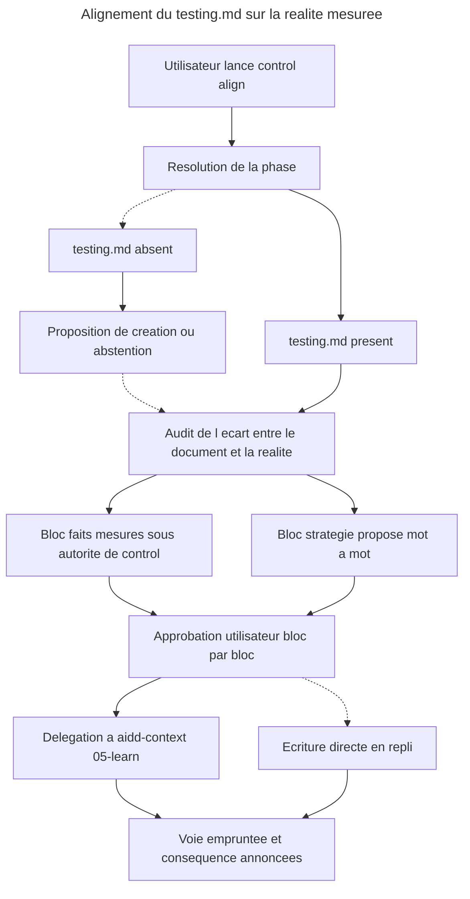

# Instruction : action `06-align` et retour vers le `testing.md` du projet

## Feature

- **Summary** : `control` sait depuis toujours **lire** une stratégie de test, et n'a jamais rien pu faire des écarts qu'il constate. `05-stats` détecte qu'un `testing.md` est un gabarit non rempli, qu'il nomme un outil absent du projet, qu'aucune phase n'y est déclarée — et s'arrête là. Cette partie donne une sortie à ces constats : une action qui propose la mise à jour du document, en séparant strictement ce qu'elle a mesuré (son autorité) de ce qui relève d'une décision de stratégie (l'autorité du projet).
- **Stack** : `markdown` (skills et références) · délégataire : `aidd-context:05-learn` (installé en `1.0.1`, actions `01-scope` → `02-write` → `03-sync`)
- **Branch name** : `overcode/control-phase-governance`
- **Parent Plan** : `2026_07_22-control-phase-governance-master.md`
- **Sequence** : `2 of 3`
- Confidence : 9/10
- Time to implement : ~1 h 45 (dont ~35 min de validation réelle)

## Paramètres d'exécution

- `TARGET_PROJECT` — `/home/tnn/Projets/SmartLockers/multisite-clients` (vérifié : `aidd_docs/memory/testing.md` présent).
- `NO_DOC_PROJECT` — `/home/tnn/Projets/MyApps/moodboard-generator` (vérifié : aucun `aidd_docs/`), pour éprouver le cas « document absent ».

## Contexte vérifié en amont

- `aidd-context:05-learn` en `1.0.1` enchaîne `01-scope` (analyse, catégorisation, **approbation utilisateur**) → `02-write` (crée ou met à jour les fichiers de `memory/`) → `03-sync` (rafraîchit le bloc `<aidd_project_memory>` des fichiers de contexte IA installés). C'est le délégataire naturel : il possède `memory/`, il porte déjà une porte d'approbation, et il fait une chose que l'écriture directe **ne fait pas** — la resynchronisation.
- Le gabarit `testing.md` d'`aidd-context 1.0.1` ne comporte **ni** champ de phase, **ni** champ de répartition, **ni** vocabulaire de tier. Les deux blocs produits par `06-align` sont donc des **sections ajoutées**, pas des champs remplis.
- Conséquence à écrire dans l'action : tant qu'un `testing.md` n'a pas été aligné, `05-stats` continue de le classer *template-shaped*. C'est précisément le cas où `06-align` a le plus de valeur.
- **Le délégataire n'est pas un scribe.** `01-scope` analyse, catégorise et reformule ce qu'il retient avant que `02-write` n'écrive. Rien dans son contrat ne garantit qu'il inscrit mot pour mot le texte qu'on lui remet. La garantie « validé ligne à ligne » de `control` se briserait donc en silence si l'action se contentait de passer la main : elle doit passer le texte approuvé **en tant que contenu littéral à inscrire**, puis **relire le fichier écrit** et rapporter tout écart. C'est le prix de la délégation, et il est moins cher que la perte de `03-sync`.
- Rappel de convention, valable pour toute cette partie : `06-align.md` et `SKILL.md` sont rédigés **en anglais**, comme les cinq actions existantes. Le `success_condition` greppe des chaînes anglaises.

## Architecture projection

### Files to modify

- `plugins/overcode/skills/control/SKILL.md` - frontmatter `description` (périmètre et phrases de déclenchement de l'alignement), paragraphe d'ouverture (« All five actions » → six, et la reformulation du rôle), garde du chemin projet (« none of the three » — décompte déjà faux avant ce plan, corrigé au passage), table des actions (+ `06-align`), routage par intention, et remplacement de la règle « n'écrit jamais `testing.md` » par sa version restreinte

### Files to create

- `plugins/overcode/skills/control/actions/06-align.md` - l'action : résolution de phase, audit d'écart doc ⇄ réalité, proposition en deux blocs, voie d'écriture avec repli

### Files to delete

- aucun

## Applicable rules

`node ${CLAUDE_PLUGIN_ROOT}/scripts/list-rules.mjs` retourne `[]`. Aucune surface de règles installée : `none`.

| Tool | Name | Path | Why it applies |
| ---- | ---- | ---- | -------------- |
| none | -    | -    | aucune règle installée sur ce dépôt |

## User Journey

## Risk register

| Risk | Impact | Mitigation |
| ---- | ------ | ---------- |
| `control` écrit une décision de stratégie que le projet n'a pas prise | La skill s'auto-attribue une autorité qu'elle refuse par principe | Deux blocs séparés, approuvables indépendamment. Le bloc stratégie est **proposé**, jamais appliqué sans validation mot à mot. |
| Le délégataire reformule le texte approuvé au lieu de l'inscrire | La garantie « validé ligne à ligne » se brise en silence : l'utilisateur a approuvé un texte, le document en porte un autre | Le texte est remis comme contenu littéral, le fichier est relu après écriture, et tout écart est rapporté sans être corrigé d'office. |
| Le repli en écriture directe devient la voie normale | Un document possédé par `aidd-context` est écrit par un autre plugin, et la resynchronisation est perdue en silence | La voie empruntée est annoncée dans la sortie, et le repli annonce **ce qu'il ne fait pas** : pas de `03-sync`. |
| L'utilisateur refuse le bloc stratégie et perd aussi les faits | L'action devient tout-ou-rien, donc inutilisable | Approbation indépendante par bloc. Refuser la stratégie laisse les faits s'écrire. |
| L'audit d'écart recalcule ce que `05-stats` sait déjà | Deux sources de vérité qui divergeront | `06-align` réutilise la production de `05-stats`, elle ne la réimplémente pas. |
| Écrire dans un `testing.md` que l'utilisateur a rédigé à la main | Perte de contenu humain | Aucune section existante n'est réécrite sans que la différence soit montrée. Ajout par défaut, remplacement seulement sur validation explicite de la ligne. |

## Implementation phases

### Phase 1 : lever la règle d'écriture

> Une garantie documentée ne se contredit pas en silence : on la remplace, et on dit par quoi.

#### Tasks

1. Dans `SKILL.md`, remplacer la règle transversale « This skill never writes the target project's test strategy document » par sa version restreinte : `control` **n'en décide jamais seul le contenu stratégique**, il peut en revanche y inscrire ce qu'il a mesuré et y proposer une rédaction, via `06-align` uniquement.
2. Conserver la mention que `aidd_docs/memory/testing.md` est possédé par la skill de mémoire projet d'`aidd-context`, et que la référence se fait au **document**, jamais à un numéro d'action figé.
3. Ajouter `06-align` à la table des actions et au routage par intention (« aligne la doc de test », « la stratégie est-elle à jour », « déclare la phase du projet », « le document ne correspond plus au projet »).
4. Propager le passage de cinq à six actions partout où le décompte est écrit en toutes lettres : le paragraphe d'ouverture (« All five actions are generic ») et la garde du chemin projet, qui dit aujourd'hui « none of the three » — décompte déjà faux avant ce plan, corrigé au passage.
5. Mettre à jour le frontmatter `description` : le périmètre annoncé (aujourd'hui « test creation, existing-test value, coverage gaps, suite-wide reporting, and test-tooling configuration ») ignore l'alignement de la stratégie, et aucune phrase de déclenchement ne mène à `06-align`. La skill portant `disable-model-invocation: true`, cette description est ce que l'utilisateur lit pour savoir que l'action existe : la laisser en l'état rendrait `06-align` invisible.

#### Acceptance criteria

- [x] La règle inversée est écrite, avec la restriction à `06-align` nommée
- [x] La table des actions compte six lignes, la table de routage six entrées
- [x] Aucun décompte d'actions périmé ne subsiste dans `SKILL.md` (`grep -n 'five\|three' SKILL.md` ne renvoie plus de décompte d'actions)
- [x] Le frontmatter `description` annonce l'alignement de stratégie et porte au moins une phrase de déclenchement menant à `06-align`
- [x] La propriété du document par `aidd-context` reste mentionnée

### Phase 2 : l'audit d'écart

> Constater avant de proposer, et ne rien recalculer de ce qui existe déjà.

#### Tasks

1. Créer `actions/06-align.md` avec ses entrées (`project_path` requis, `scope` optionnel, `phase` optionnelle en surcharge) et son bloc de sortie.
2. Décrire la résolution de phase par renvoi à `phase-framework.md`, sans la réécrire.
3. Décrire l'audit d'écart en réutilisant la production de `05-stats` : autorité en force, lisibilité du document, outillage réellement câblé, volume par tier, ordre observé des trois bassins.
4. Classer chaque écart en trois natures : **fait absent** du document, **fait périmé** dans le document, **décision manquante** (aucune ligne du document ne tranche ce que la skill doit pourtant trancher).
5. Traiter le cas `testing.md` absent : proposer sa création ou s'abstenir, sur choix explicite de l'utilisateur, sans jamais le créer d'office.

#### Acceptance criteria

- [x] L'action décrit ses entrées, sa sortie et son processus dans le format des cinq actions existantes
- [x] L'audit d'écart s'appuie explicitement sur `05-stats` et ne redéfinit aucun de ses calculs
- [x] Les trois natures d'écart sont nommées et distinguées
- [x] Le cas du document absent est traité, et n'aboutit jamais à une création silencieuse

### Phase 3 : les deux blocs et la voie d'écriture

> Ce que la skill a mesuré, elle l'écrit. Ce que le projet doit décider, elle le propose.

#### Tasks

1. Définir le bloc `MEASURED FACTS` : runner réellement câblé, outil E2E établi, gate de couverture configurée et invoquée ou inerte, volume par tier, ordre observé des trois bassins, phase et sa provenance, et **inventaire des frontières externes** détectées (intégrations tierces présentes dans le manifeste, et lesquelles sont référencées par au moins un test). Écrit sous l'autorité de `control`, parce qu'il en est la seule source.
1-bis. Cet inventaire est le fait le plus périssable du bloc : c'est lui qui rend un second passage de `06-align` utile même sur un projet dont le code n'a pas bougé — une majeure de SDK tiers déplacée est un écart de fait, détectable sans aucun signal interne.
2. Définir le bloc `PROPOSED STRATEGY` : phase déclarée, vocabulaire de tiers, ce que le projet refuse de tester, plafond éventuel de nombre de tests. Proposé en rédaction complète, validé ligne à ligne, jamais appliqué par défaut.
3. Écrire l'approbation **indépendante par bloc** : refuser l'un n'annule pas l'autre.
4. Décrire la voie d'écriture : `aidd-context:05-learn` si le plugin est installé — en passant par `01-scope` pour hériter de sa propre porte, et en s'assurant que `03-sync` s'exécute ; `direct write` en repli, avec annonce explicite de la voie et de ce que le repli ne fait pas.
4-bis. Écrire la **règle de fidélité**, sans laquelle la garantie « validé ligne à ligne » ne survit pas à la délégation : le texte approuvé est remis au délégataire comme **contenu littéral à inscrire**, et non comme matière à analyser ; après écriture, `06-align` **relit le fichier** et compare au texte approuvé. Tout écart — reformulation, section déplacée, ligne absorbée — est **rapporté à l'utilisateur**, jamais corrigé d'office : c'est le document d'un autre plugin, et le corriger en silence recréerait exactement le problème que la délégation évite.
5. Écrire la règle de non-écrasement : toute section existante est montrée en différence avant remplacement ; l'ajout est le comportement par défaut.
6. Écrire la conséquence sur `05-stats` : un document non encore aligné reste classé *template-shaped*, ce n'est pas un défaut de détection.

#### Acceptance criteria

- [x] Les deux blocs sont définis, avec la liste exacte de ce que chacun contient
- [x] Le bloc faits ne contient rien qui ne soit mesurable par la skill elle-même
- [x] L'inventaire des frontières externes figure dans le bloc faits, avec pour chacune si un test la référence ou non
- [x] Le bloc stratégie ne contient rien que la skill applique sans validation
- [x] Les deux voies d'écriture sont décrites, avec la voie annoncée dans la sortie
- [x] La règle de fidélité est écrite : texte remis comme littéral, relecture après écriture, écart rapporté et jamais corrigé d'office
- [x] La règle de non-écrasement est écrite

### Phase 4 : validation réelle

> L'écriture d'un document possédé par un autre plugin ne se valide pas sur un dépôt de test.

#### Tasks

1. Exécuter `06-align` sur `TARGET_PROJECT`. Vérifier que l'audit d'écart classe correctement les trois natures, et que le document est reconnu comme *template-shaped* ou renseigné selon son état réel.
2. Refuser le bloc `PROPOSED STRATEGY`, accepter le bloc `MEASURED FACTS`. Vérifier que le document reçoit les faits et rien d'autre.
3. Vérifier que la délégation à `aidd-context:05-learn` a bien eu lieu, que sa porte d'approbation s'est présentée, et que `03-sync` a rafraîchi le bloc de contexte IA.
3-bis. Comparer le texte réellement inscrit dans `testing.md` au texte approuvé à l'écran. S'ils diffèrent, vérifier que l'action l'a **dit** — c'est le comportement attendu, pas l'échec du test.
4. Rejouer l'action pour vérifier l'**idempotence** : un second passage sans changement du projet ne doit produire aucun écart de fait.
5. Exécuter `06-align` sur `NO_DOC_PROJECT`. Refuser la création. Vérifier qu'aucun fichier n'est créé.
6. Soumettre les sorties à l'utilisateur. Sur son accord, écrire `Validation reelle — Pass` dans le Log.

#### Acceptance criteria

- [x] `testing.md` de `TARGET_PROJECT` contient les faits mesurés, et aucune ligne de stratégie non validée
- [x] La porte d'approbation d'`aidd-context:05-learn` s'est présentée, et `03-sync` s'est exécuté
- [x] Le texte inscrit est identique au texte approuvé, ou l'écart a été rapporté à l'écran
- [x] Un second passage sans changement ne propose aucun écart de fait
- [x] Aucun fichier n'est créé sur `NO_DOC_PROJECT` après refus
- [x] La ligne `Validation reelle — Pass` figure dans le Log, écrite après accord utilisateur

## Amendments

<!-- AI-initiated changes during implementation. Each entry is prefixed with 🤖. -->

- 🤖 **Un `03-sync` muet est indiscernable d'un échec.** Révélé par la validation réelle : sur `TARGET_PROJECT`, l'étape de resynchronisation sort avec le code 0 et **zéro octet**. C'était légitime — le bloc `<aidd_project_memory>` de `CLAUDE.md` listait déjà `testing.md`, il n'y avait rien à faire — mais je ne l'ai su qu'en allant lire `CLAUDE.md` moi-même. La consigne « s'assurer que l'étape de sync s'exécute » demandait donc une vérification qu'elle ne décrivait pas. `06-align.md` étape 8 reçoit la contrainte manquante : ne jamais prendre une sortie propre pour une preuve, ouvrir le fichier de contexte IA, et **rapporter laquelle des deux situations** s'est produite — resynchronisé, ou déjà à jour.
- 🤖 **L'idempotence ne se teste pas sur un arbre de travail qui bouge.** `TARGET_PROJECT` a été modifié par l'utilisateur pendant la session (12 fichiers suivis modifiés, 1 nouveau fichier de test non suivi). Le second passage a donc bien détecté des écarts de fait — et c'est le bon résultat : **chaque écart s'explique intégralement par ces modifications** (60 fichiers de contrat au lieu de 59, +1 = le fichier non suivi ; 1783 cas au lieu de 1775 ; 107 déclarations e2e au lieu de 108, dans les deux specs `prerender-*` modifiées), et **aucun autre fait n'a bougé** — jsdom 48, seuils par fichier 12, sources `lib` 72, specs e2e 23, `skip` 17, `fixme` 11, toutes identiques. Le critère « pas de changement → pas d'écart » est validé dans la seule forme que l'arbre permettait : l'audit ne signale que la dérive réelle, et rien qu'elle.
- 🤖 **Aucune commande de comptage de tests dans le pivot `sc-js`.** Constaté en mesurant le volume : ni Vitest ni Jest n'expose de commande de comptage, le pivot n'en propose donc aucune, et le chiffre de cas est un appariement de motif — déclaré comme tel dans le bloc faits. Playwright, lui, en a une (`--list`), et c'est ce qui a permis de rapporter un chiffre outillé côté e2e. Asymétrie à traiter en **partie 4**, où la contrainte de nombre devient une densité et où la source du dénombrement cesse d'être un détail.
- 🤖 **La phase n'est plus déduite — répercussion sur `06-align`.** Amendement transversal décidé pendant cette partie et appliqué aussi à la partie 1 (voir son propre journal d'amendements). Conséquences propres à `06-align` : la phase sort du bloc `MEASURED FACTS` — la skill n'en mesure plus aucune et n'a donc rien à y écrire ; le bloc `PHASE` restitue la question posée à la place des signaux d'inférence ; et une contrainte est ajoutée, celle qui donne à cette action sa raison d'être — **c'est elle qui met fin au questionnement**, en transformant une réponse valable un seul run en déclaration inscrite dans le document du projet. Quand l'utilisateur refuse de la déclarer, l'action dit explicitement que la question sera reposée au run suivant.

## Log

<!-- APPEND ONLY. One entry per step attempt. Never rewrite. -->

- Validation reelle — Pass. `06-align` joue sur `TARGET_PROJECT` (`multisite-clients`), phase repondue `production` par l'utilisateur. Audit d'ecart : trois natures distinguees, cinq faits errones du transcript corriges avant inscription (12 seuils par fichier et non 14 ; 225 tests e2e outilles via `playwright test --list` a cote des 107 declarations ; 17 `test.skip` + 11 `test.fixme` et non « 29 skip » ; hCaptcha sans aucun code appelant). Bloc faits ecrit seul d'abord — le document a porte les faits et rien d'autre, l'approbation independante par bloc est donc demontree — puis bloc strategie apres validation. Regle de fidelite : `diff` texte approuve / texte inscrit vide dans les deux cas, 54 lignes preexistantes intactes. Voie : delegation a `aidd-context:05-learn`, porte `01-scope` presentee, `02-write` execute, `03-sync` sans effet legitime. Non-ecrasement : six faits perimes montres en difference et remplaces sur validation explicite (quatre dans `testing.md`, un dans `CLAUDE.md`, un sixieme sorti de la verification). `NO_DOC_PROJECT` (`moodboard-generator`) : creation refusee, empreinte du projet identique avant et apres, aucun `aidd_docs/` ni `testing.md` cree.
- Phases 1 a 3 — Pass. `SKILL.md` : regle d'ecriture inversee et restreinte a `06-align`, table d'actions et routage a six entrees, `description` du frontmatter etendue a l'alignement. `actions/06-align.md` cree : audit d'ecart adosse a `05-stats`, trois natures d'ecart, cas du document absent, deux blocs a approbation independante, voie d'ecriture annoncee, regle de fidelite et regle de non-ecrasement.

## Validation flow demonstration

1. Ouvrir un terminal sur `/home/tnn/Projets/SmartLockers/multisite-clients`, vérifier `git status` propre.
2. Lancer `/overcode:control align`. Lire l'audit d'écart, puis les deux blocs proposés.
3. Répondre « faits oui, stratégie non ». Constater que la porte d'`aidd-context` s'ouvre pour les seuls faits.
4. Ouvrir `aidd_docs/memory/testing.md` : les faits mesurés y sont, aucune décision de stratégie n'y a été inscrite.
5. Relancer `/overcode:control align` : l'action annonce qu'il n'y a plus d'écart de fait à combler.
