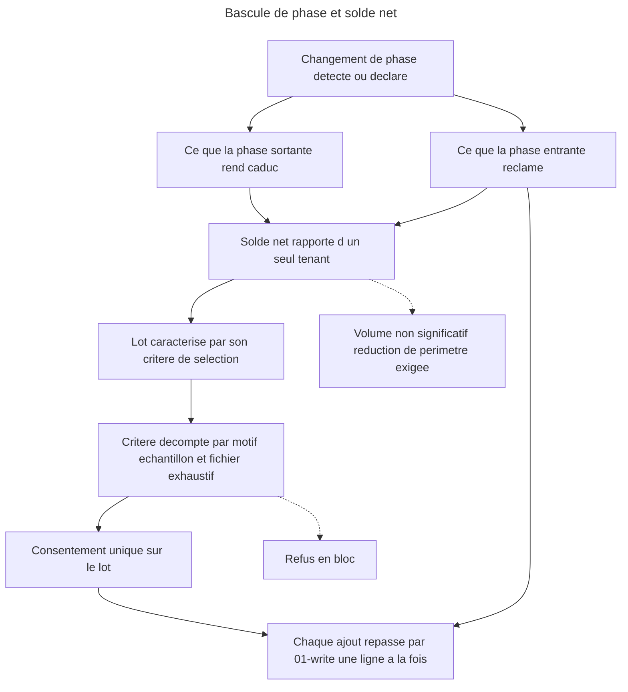

# Instruction : bascule de phase, solde net et lot borné

## Feature

- **Summary** : la phase change, et la suite doit suivre — pas en s'empilant, mais en **déplaçant son centre de gravité**. Cette partie outille la bascule : ce que la phase sortante rend caduc, ce que la phase entrante réclame, l'effet résultant sur le nombre de tests, rapportés d'un seul tenant. Elle lève la confirmation par item — uniquement ici, uniquement pour un lot caractérisé par son **critère de sélection** — parce qu'à 2000 tests par langage, confirmer un par un coûte plus cher que ce que la garantie protège, et parce qu'un test généré par IA se réécrit à faible coût.
- **Stack** : `markdown` (skills, README, CHANGELOG, manifestes)
- **Branch name** : `overcode/control-phase-governance`
- **Parent Plan** : `2026_07_22-control-phase-governance-master.md`
- **Sequence** : `3 of 3`
- Confidence : 9/10
- Time to implement : ~1 h 50 (dont ~30 min de validation réelle)

## Paramètres d'exécution

- `TARGET_PROJECT` — `/home/tnn/Projets/SmartLockers/multisite-clients`, seul projet local disposant à la fois d'une suite réelle, d'une couverture câblée et d'un `testing.md`.

## Langue des artefacts

`06-align.md` et `SKILL.md` sont rédigés **en anglais** (le `success_condition` greppe des chaînes anglaises) ; `README.md`, les deux `CHANGELOG.md` et la description marketplace restent **en français**, conformément à l'existant.

## Décision de conception héritée du brainstorm

La condition d'affichage intégral du lot est **écartée** : à l'échelle où le lot devient utile, une liste de plusieurs centaines de lignes n'est pas plus lisible qu'un compteur. Le consentement porte donc sur **une règle qu'on comprend**, pas sur un défilement qu'on ne lit pas :

- le **critère de sélection** est énoncé en toutes lettres ;
- le **décompte par motif de rejet** est affiché ;
- un **échantillon représentatif** est montré à l'écran ;
- la **liste exhaustive** est écrite dans un fichier consultable avant confirmation ;
- un **seul consentement** couvre l'ensemble.

## Architecture projection

### Files to modify

- `plugins/overcode/skills/control/actions/06-align.md` - solde net de bascule, lot borné, exception `sustaining`
- `plugins/overcode/skills/control/SKILL.md` - la règle « no batch auto-apply » devient « confirmation par item, sauf lot caractérisé de `06-align` »
- `plugins/overcode/README.md` - ligne `control` de la table : six actions
- `plugins/overcode/CHANGELOG.md` - section `[3.5.0]` couvrant les trois parties
- `plugins/overcode/.claude-plugin/plugin.json` - `3.4.0` → `3.5.0`
- `plugins/sc-js/.claude-plugin/plugin.json` - `0.10.0` → `0.11.0` (le pivot `testing` est modifié par la partie 1)
- `plugins/sc-js/CHANGELOG.md` - section `[0.11.0]` : frontières externes dans *Risk signals* et gotcha des majeures de SDK
- `.claude-plugin/marketplace.json` - **deux** entrées : `overcode` (`version` `3.4.0` → `3.5.0` **et** description mentionnant la gouvernance par phase) et `sc-js` (`version` `0.10.0` → `0.11.0`)

### Files to create

- aucun

### Files to delete

- aucun

## Applicable rules

`node ${CLAUDE_PLUGIN_ROOT}/scripts/list-rules.mjs` retourne `[]`. Aucune surface de règles installée : `none`.

| Tool | Name | Path | Why it applies |
| ---- | ---- | ---- | -------------- |
| none | -    | -    | aucune règle installée sur ce dépôt |

## User Journey

## Risk register

| Risk | Impact | Mitigation |
| ---- | ------ | ---------- |
| Le lot devient le régime courant de suppression | La garantie de confirmation par item disparaît en pratique | L'exception est nommément restreinte à `06-align` et conditionnée à une bascule de phase. `02-audit` garde son régime, et la règle transversale le dit dans la même phrase. |
| Un consentement unique emporte la moitié de la suite | Perte massive de couverture sur un malentendu | Le critère est affiché, le décompte par motif aussi, la liste exhaustive est consultable **avant** confirmation. Le refus est en bloc et sans condition. |
| Le solde net se lit comme un objectif de réduction | La skill devient une machine à supprimer | Le solde net est un **constat**, jamais une cible. Aucune phase n'exige un solde négatif — `sustaining` l'attend, elle ne l'impose pas. |
| Les ajouts de la phase entrante contournent la contrainte de nombre | La suite grossit sans arbitrage | Chaque ligne confirmée repasse par `01-write`, **une à la fois**, la contrainte étant réévaluée entre chaque — même garde de cumul que `04-strengthen`. |
| L'obsolescence de phase devient un motif fourre-tout | N'importe quel test du bassin abaissé devient supprimable, et la bascule se transforme en purge | Trois exclusions écrites et cumulatives : un test tenu par la conséquence, par un contrat externe, ou en tant que seul filet sur son sujet ne qualifie jamais, quel que soit son bassin. |
| Une bascule vers `sustaining` supprime aussi les tests des frontières externes | Les intégrations tierces perdent leur seul filet au moment où elles en ont le plus besoin | Exception explicite : en `sustaining`, les frontières externes sont exclues du lot de suppression et restent le seul motif d'ajout légitime. |

## Implementation phases

### Phase 1 : lever la règle de lot

> Une exception qui n'est pas bornée dans le texte devient la règle dans les faits.

#### Tasks

1. Dans `SKILL.md`, réécrire la règle « Never delete a test file... No batch auto-apply » : la confirmation par item reste le régime de `02-audit` et de toute suppression courante ; un **lot caractérisé** est autorisé dans `06-align` seulement, et seulement à l'occasion d'une bascule de phase.
2. Écrire dans la même règle la justification, pour qu'elle ne se perde pas : un test généré se réécrit à faible coût, donc la suppression n'est plus l'acte irréversible que la confirmation par item protégeait ; ce qui reste à protéger, c'est de savoir **ce qu'on supprime**, et c'est le critère qui le dit, pas l'énumération.
3. Écrire la borne d'échelle : au-delà d'un volume rendant l'analyse non significative, exiger une réduction de `scope` plutôt que dérouler — même traitement que le cas *saturation* déjà borné dans `04-strengthen`.

#### Acceptance criteria

- [ ] La règle nomme `06-align` comme unique lieu du lot, et la bascule de phase comme unique occasion
- [ ] La justification par le coût de réécriture est écrite dans la règle
- [ ] `02-audit.md` reste inchangé sur son régime de confirmation

### Phase 2 : le solde net de bascule

> Un déplacement de centre de gravité se rapporte comme un mouvement, pas comme deux listes sans rapport.

#### Tasks

1. Dans `06-align.md`, ajouter la détection de bascule : la phase résolue diffère de celle inscrite dans `testing.md`, ou l'utilisateur la surcharge explicitement.
2. Décrire le calcul du **sortant**, sur **deux** motifs distincts — et non sur les seules heuristiques de `02-audit`, dont l'intersection avec une bascule de phase est vide en pratique : un test de forme de modèle écrit en `scaffolding` n'est ni un doublon, ni trivial, ni un getter, et aucune heuristique existante ne le qualifierait jamais. Ne garder que ce croisement produirait un lot systématiquement vide, donc une partie 3 inerte.
   - **Motif hérité** : les heuristiques de valeur de `02-audit` (doublon, trivial, getter/setter), simplement remontées dans le classement par la phase entrante. Inchangées, non redéfinies.
   - **Motif propre à la bascule — l'obsolescence de phase** : un test dont **la seule** justification est un critère que la phase sortante relevait et que la phase entrante abaisse. Il ne qualifie que si **aucun autre critère ne le tient par ailleurs** : ni conséquence (argent, autorisation, persistance, suppression), ni dépendance à un contrat externe, ni statut de seul filet sur son sujet. Un test tenu par l'un de ces trois reste, quelle que soit la bascule.
   - C'est le seul motif de suppression que ce plan ajoute, et il est borné par ces trois exclusions. La phase continue de ne rien décider en matière de **tier** : elle qualifie un retrait, jamais un classement.
3. Décrire le calcul de l'**entrant** : les manques que la phase entrante relève, obtenus en réutilisant `04-strengthen` avec la nouvelle phase en force, jamais en réimplémentant son classement.
4. Décrire la restitution du **solde net** d'un seul tenant : combien de tests partent, combien arrivent, effet résultant sur le compte total, et l'énoncé du déplacement en une phrase.
5. Écrire l'exception `sustaining` : la phase attend un solde négatif, **sauf sur les frontières externes**, qui restent le seul motif d'ajout légitime — c'est la phase où plus rien d'interne ne bouge pendant que les contrats externes, eux, continuent de bouger.
6. Router chaque entrant par `01-write`, une ligne à la fois, avec la garde de cumul déjà en vigueur.

#### Acceptance criteria

- [ ] La bascule est détectée par comparaison, jamais supposée
- [ ] Le sortant repose sur deux motifs nommés — heuristiques de `02-audit` reprises telles quelles, et obsolescence de phase — et l'entrant réutilise `04-strengthen` sans dupliquer son classement
- [ ] L'obsolescence de phase porte ses trois exclusions écrites : conséquence, contrat externe, seul filet
- [ ] Le solde net est rapporté d'un seul tenant, et présenté comme un constat
- [ ] L'exception `sustaining` sur les frontières externes est écrite
- [ ] Les entrants passent par `01-write` un à un

### Phase 3 : le lot borné

> Le consentement porte sur une règle, pas sur un défilement.

#### Tasks

1. Décrire la composition d'un lot : son **critère de sélection** en une phrase, le **décompte par motif de rejet**, un **échantillon représentatif**, et le chemin du fichier portant la **liste exhaustive**.
2. Écrire que le fichier exhaustif est produit **avant** la demande de confirmation, et que sa consultation est proposée explicitement.
3. Écrire le refus : en bloc, sans condition, sans repli automatique vers une confirmation par item qui contournerait le refus.
4. Exclure du lot, quelle que soit la bascule : les tests couvrant une frontière externe, ceux qu'un critère de conséquence tient par ailleurs, ceux qui sont le seul filet sur leur sujet, et ceux qu'**aucun des deux motifs** — heuristique de `02-audit` ou obsolescence de phase — ne qualifie. Un test n'entre jamais dans un lot au seul titre d'appartenir au bassin que la phase abaisse.

#### Acceptance criteria

- [ ] Les quatre éléments de composition du lot sont décrits
- [ ] Le fichier exhaustif est produit avant la confirmation, et son chemin est affiché
- [ ] Le refus en bloc est décrit et ne déclenche aucun repli
- [ ] Les exclusions du lot sont écrites : frontières externes, conséquence, seul filet, et absence de motif qualifiant
- [ ] Un lot réel sur `TARGET_PROJECT` n'est pas vide par construction — si aucun test ne qualifie, l'action le dit, elle ne présente pas un lot creux

### Phase 4 : artefacts de release

> Trois parties, une seule version.

#### Tasks

1. Mettre à jour la ligne `control` de `plugins/overcode/README.md` : six actions, avec la formule d'une ligne pour `align`.
2. Écrire la section `[3.5.0]` du `CHANGELOG.md` d'`overcode`, couvrant les trois parties : la phase de projet et ses quatre valeurs, le critère de frontière externe, `06-align` et le retour au `testing.md`, le solde net et le lot borné. Suivre le style des sections `[3.3.0]` et `[3.4.0]` — `Added — control`, `Changed — control`.
3. **`sc-js` est bumpé** — la question est tranchée ici, pas à l'exécution : la partie 1 modifie un fichier livré de ce plugin (`skills/sniff/references/capabilities/tools/testing.md`), et sa `0.10.0` documente précisément ce pivot, publiée le même jour. Ajout de contenu sans rupture → `0.11.0`. Écrire la section `[0.11.0]` du `CHANGELOG.md` de `sc-js` dans le style de la `[0.10.0]` — titrée par champ de pivot touché (`Risk signals`, gotchas) — et passer `plugins/sc-js/.claude-plugin/plugin.json` en `0.11.0`.
4. Passer `plugins/overcode/.claude-plugin/plugin.json` en `3.5.0`.
5. Mettre à jour `.claude-plugin/marketplace.json` sur **deux** entrées : `overcode` — champ `version` en `3.5.0` **et** description enrichie de la gouvernance par phase — et `sc-js` — champ `version` en `0.11.0`. Le champ `version` du manifeste marketplace est distinct de celui du `plugin.json` : ne bumper que le second laisserait le marketplace annoncer une version périmée.

#### Acceptance criteria

- [ ] `README.md` décrit six actions pour `control`
- [ ] `CHANGELOG.md` d'`overcode` porte une section `[3.5.0]` couvrant les trois parties
- [ ] `CHANGELOG.md` de `sc-js` porte une section `[0.11.0]`, et son `plugin.json` est en `0.11.0`
- [ ] `plugin.json` d'`overcode` est en `3.5.0` et sa description marketplace mentionne la phase
- [ ] Les deux `version` de `marketplace.json` sont alignées sur les `plugin.json` correspondants (`3.5.0` et `0.11.0`)

### Phase 5 : validation réelle

> Une bascule qui n'a jamais été jouée sur un vrai dépôt n'est pas outillée, elle est décrite.

#### Tasks

1. Sur `TARGET_PROJECT`, faire déclarer une phase par `06-align`, puis rejouer l'action en surchargeant une phase différente. Vérifier que la bascule est détectée et que le solde net sort d'un seul tenant.
2. Vérifier le lot : critère lisible, décompte par motif, échantillon affiché, fichier exhaustif produit et consultable avant la question.
3. **Refuser le lot.** Vérifier qu'aucun fichier de test n'est supprimé et qu'aucune confirmation par item ne prend le relais.
4. Rejouer, accepter le lot, vérifier que seuls les fichiers du critère disparaissent, et qu'aucun test couvrant une frontière externe n'en fait partie.
5. Vérifier que les entrants sont passés par `01-write` un par un, avec un `budget_check` réévalué entre chaque.
6. Soumettre les sorties à l'utilisateur. Sur son accord, écrire `Validation reelle — Pass` dans le Log.

#### Acceptance criteria

- [ ] Une bascule réelle produit un solde net cohérent avec l'état du projet
- [ ] Le fichier exhaustif du lot existe et est consultable avant la confirmation
- [ ] Le refus en bloc ne supprime rien et ne déclenche aucun repli
- [ ] Aucun test de frontière externe n'entre dans un lot de suppression
- [ ] La ligne `Validation reelle — Pass` figure dans le Log, écrite après accord utilisateur

## Amendments

<!-- AI-initiated changes during implementation. Each entry is prefixed with 🤖. -->

## Log

<!-- APPEND ONLY. One entry per step attempt. Never rewrite. -->

## Validation flow demonstration

1. Ouvrir un terminal sur `/home/tnn/Projets/SmartLockers/multisite-clients`, vérifier `git status` propre.
2. Lancer `/overcode:control align` en surchargeant la phase vers `sustaining`.
3. Lire le solde net : combien de tests la bascule rend caducs, combien elle en réclame, l'effet sur le total.
4. Lire le critère du lot, ouvrir le fichier exhaustif, y vérifier qu'aucun test d'intégration tierce n'apparaît.
5. Répondre non. Vérifier `git status` : aucun fichier de test supprimé, aucune question de repli posée.
