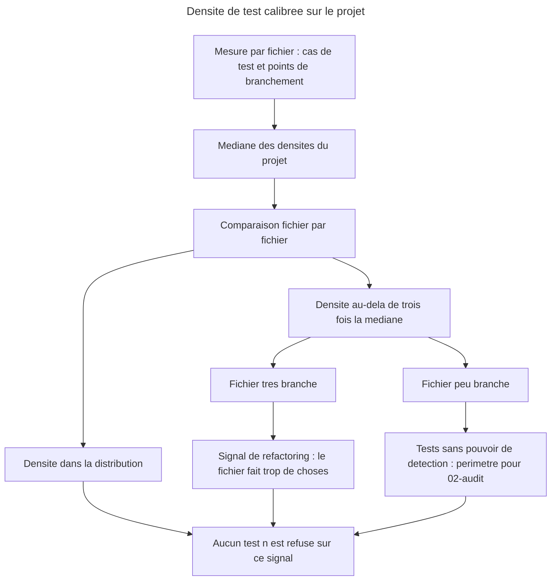

# Instruction : la densité de test remplace la contrainte de nombre

## Feature

- **Summary** : la skill borne aujourd'hui sa suite par un **nombre absolu**, lu dans le document du projet ou nul en son absence. Un nombre absolu a deux défauts que l'usage a fait remonter : il punit un dépôt qui grossit légitimement, et il ne dit **pas où** se trouve l'excès. Une densité le dit. Cette partie remplace `limit` par une densité calibrée sur la distribution du projet lui-même, sans aucune constante arbitraire — le même refus que la skill oppose déjà aux pourcentages de couverture.
- **Stack** : `markdown` (skills et références) · mesures : rapport de couverture v8 (points de branchement) + glob source du pivot
- **Branch name** : `overcode/control-test-density`
- **Parent Plan** : `2026_07_22-control-phase-governance-master.md`
- **Sequence** : `4 of 4`
- Confidence : 8/10
- Risque : 5/10 — la formule touche la contrainte de nombre, c'est-à-dire le cœur de ce que la skill promet ; se tromper de dénominateur produirait un signal bruyant que l'utilisateur apprendrait à ignorer, ce qui est pire que pas de signal.
- Time to implement : ~2 h 10 (dont ~40 min de validation réelle)

## Paramètres d'exécution

- `TARGET_PROJECT` — `/home/tnn/Projets/SmartLockers/multisite-clients` : 1754 cas unitaires sur 72 fichiers source classifiables, avec un rapport de couverture v8 réel — le seul dépôt disponible où la distribution des densités est assez large pour que la médiane veuille dire quelque chose.
- `NO_DOC_PROJECT` — `/home/tnn/Projets/MyApps/moodboard-generator` : aucun test, pour éprouver le cas dégénéré (médiane indéfinie).

## Langue des artefacts

Ce plan est rédigé en français ; **les fichiers de skill produits sont rédigés en anglais**, comme tout l'existant de `control`. Le `success_condition` greppe des chaînes anglaises.

## Contexte vérifié en amont

- `references/decision-framework.md` porte aujourd'hui la section *Number constraint*, mais ce fichier n'est chargé **que** lorsque le projet n'a pas de stratégie documentée. La densité, elle, s'applique toujours : elle ne peut donc pas y vivre. D'où un fichier de référence propre.
- `04-strengthen` lit déjà le glob source du pivot et le rapport de couverture par fichier, avec les compteurs `covered`/`total` par branche. La densité ne demande **aucune mesure nouvelle** : elle recombine ce qui est déjà lu.
- `05-stats` annonce aujourd'hui `budget : null (no documented budget)` quand rien n'est écrit. C'est la ligne que cette partie rend utile : un projet sans budget documenté n'est pas non borné, il est borné par sa propre distribution.
- La règle transversale de phase (`la phase priorise, elle ne classifie jamais un tier`) fixe le précédent que la densité doit suivre mot pour mot. Un troisième mécanisme de priorisation qui se mettrait à refuser des tests casserait l'invariant que les parties 1 à 3 ont installé.

## Architecture projection

### Files to create

- `plugins/overcode/skills/control/references/test-density.md` - la formule, la calibration sur la médiane du projet, la double lecture d'un dépassement, les cas dégénérés

### Files to modify

- `plugins/overcode/skills/control/SKILL.md` - règle transversale de densité + ligne de références
- `plugins/overcode/skills/control/actions/01-write.md` - la contrainte de nombre consulte la densité du fichier visé, et ne refuse jamais sur elle
- `plugins/overcode/skills/control/actions/02-audit.md` - la densité cible le périmètre de chasse aux tests sans valeur
- `plugins/overcode/skills/control/actions/04-strengthen.md` - ne pas empiler sur un fichier déjà saturé sans le dire
- `plugins/overcode/skills/control/actions/05-stats.md` - la ligne `budget` devient une densité de référence + les valeurs aberrantes
- `plugins/overcode/skills/control/actions/06-align.md` - le bloc stratégie propose une densité, plus un plafond absolu
- `plugins/overcode/README.md`, `plugins/overcode/CHANGELOG.md`, `plugins/overcode/.claude-plugin/plugin.json`, `.claude-plugin/marketplace.json` - release `3.7.0`

### Files to delete

- aucun

## Applicable rules

`node ${CLAUDE_PLUGIN_ROOT}/scripts/list-rules.mjs` retourne `[]`. Aucune surface de règles installée : `none`.

| Tool | Name | Path | Why it applies |
| ---- | ---- | ---- | -------------- |
| none | -    | -    | aucune règle installée sur ce dépôt |

## User Journey

## Risk register

| Risk | Impact | Mitigation |
| ---- | ---- | ---------- |
| La densité se met à refuser des tests | La skill classifie sur un nombre, exactement ce que la règle de phase interdit | Écrit noir sur blanc dans la référence et dans `01-write` : la densité priorise et diagnostique, **elle ne refuse jamais**. Le refus reste un critère de tier. |
| La médiane est calculée sur une population trop petite | Un projet à trois fichiers testés produit une référence qui n'a aucun sens statistique | Seuil de population explicite en dessous duquel la référence est déclarée non calculable, et la ligne sort en `insufficient population` plutôt qu'en chiffre |
| Le dénominateur choisi produit du bruit | L'utilisateur apprend à ignorer le signal, ce qui est pire que pas de signal | Dénominateur = points de branchement, déjà lus par `04-strengthen` ; un fichier sans branche est explicitement hors distribution, pas à densité infinie |
| La double lecture est appliquée à l'envers | Un fichier qui a besoin d'un refactoring se voit proposer une suppression de tests | La discrimination est mesurée, pas devinée : décile haut de branchements = refactoring ; sinon tests sans valeur |
| Un fichier sans aucun test tire la médiane vers zéro | La référence devient inutilisable sur un dépôt peu couvert | Les fichiers à zéro test sont exclus du calcul de la médiane — ils relèvent de `04-strengthen`, pas de la densité |
| La densité entre en conflit avec un budget documenté | Deux bornes contradictoires, sans arbitre | Un plafond explicitement écrit par le projet **prime** ; la densité est alors rapportée en second, comme diagnostic |

## Implementation phases

### Phase 1 : la référence

> Une formule qui ne dit pas ce qu'elle ne fait pas devient une règle de refus en six mois.

#### Tasks

1. Créer `references/test-density.md` : la formule `densité(f) = cas de test exerçant f / max(1, points de branchement de f)`, la référence égale à la **médiane** des densités du projet, et le seuil d'alerte à trois fois cette médiane.
2. Écrire la calibration : **aucune constante arbitraire**. La référence est la distribution du projet, jamais un chiffre importé — même refus que celui opposé aux pourcentages de couverture.
3. Écrire la double lecture d'un dépassement, avec sa discrimination mesurée : décile haut en branchements → signal de **refactoring** (le fichier fait trop de choses, la suite paie la dette du code) ; sinon → tests sans pouvoir de détection, périmètre à passer à `02-audit`.
4. Écrire les cas dégénérés : aucun test dans le projet, population insuffisante pour une médiane, fichier sans point de branchement, fichiers à zéro test exclus du calcul.
5. Écrire la borne d'autorité : la densité **priorise et diagnostique, elle ne refuse jamais** (`never refuses`). Un test se refuse sur un critère de tier, jamais sur une densité — même frontière que la phase.
6. Écrire l'articulation avec un budget documenté : un plafond écrit par le projet prime, la densité passe en diagnostic.

#### Acceptance criteria

- [x] La formule, son dénominateur et sa référence médiane sont écrits
- [x] Aucune constante numérique arbitraire n'est introduite hors du facteur d'alerte, lui-même justifié
- [x] La double lecture est écrite, avec sa mesure de discrimination
- [x] Les quatre cas dégénérés sont traités
- [x] La phrase de non-refus est écrite et grepable

### Phase 2 : câblage dans les actions

> Une formule que personne ne consomme est une opinion rangée dans un fichier.

#### Tasks

1. `SKILL.md` : règle transversale de densité, calquée sur la règle de phase, et ligne de références vers `test-density.md`.
2. `01-write` : la contrainte de nombre consulte la densité du fichier visé et la **rapporte** dans le `rationale` ; elle ne fait jamais basculer la décision.
3. `02-audit` : quand une densité aberrante à faible branchement est constatée, elle **cible le périmètre** de la chasse — elle ne qualifie aucune ligne du tableau, les trois heuristiques restant seules juges.
4. `04-strengthen` : ne pas proposer un ajout sur un fichier déjà aberrant sans dire que le fichier est saturé, et rappeler la lecture refactoring quand elle s'applique.
5. `05-stats` : la ligne `budget` devient `reference density` + les valeurs aberrantes, avec `insufficient population` en cas dégénéré ; un budget documenté reste affiché en premier.
6. `06-align` : le bloc `PROPOSED STRATEGY` propose une **densité** et non un plafond absolu.

#### Acceptance criteria

- [x] Les six fichiers portent le mot `density` et le consomment chacun dans son propre rôle
- [x] Aucune action ne refuse quoi que ce soit sur la densité
- [x] `05-stats` ne produit plus `budget : null` comme état neutre

### Phase 3 : release `3.7.0`

#### Tasks

1. `plugins/overcode/.claude-plugin/plugin.json` → `3.7.0`.
2. Champ `version` correspondant dans `.claude-plugin/marketplace.json` → `3.7.0`.
3. `CHANGELOG.md` d'`overcode` : entrée `3.7.0`, en français.
4. `README.md` d'`overcode` : la densité dans la description de `control`.
5. Vérifier qu'aucun autre manifeste n'est concerné — `sc-js` n'est pas touché par cette partie.

#### Acceptance criteria

- [x] Les trois emplacements de version portent `3.7.0`
- [x] Le CHANGELOG décrit le remplacement de la contrainte de nombre, pas seulement son ajout

### Phase 4 : validation réelle

> Une médiane se valide sur une vraie distribution, jamais sur un jeu de données choisi.

#### Tasks

1. Calculer la distribution réelle des densités sur `TARGET_PROJECT` à partir du rapport de couverture v8 existant. Vérifier que la médiane est stable et que les valeurs aberrantes sont peu nombreuses — une formule qui signale un quart du dépôt ne signale rien.
2. Pour chaque fichier aberrant remonté, vérifier **à la main** que la lecture proposée (refactoring ou tests sans valeur) est la bonne. Un contre-exemple sur trois invalide la discrimination et impose de la revoir.
3. Exécuter `05-stats` sur `NO_DOC_PROJECT` : aucune erreur, `insufficient population` annoncé.
4. Vérifier qu'aucune action ne bascule une décision sur la densité : rejouer `01-write` sur un fichier aberrant et constater que le tier est inchangé.
5. Soumettre les sorties à l'utilisateur. Sur son accord, écrire `Validation reelle — Pass` dans le Log.

#### Acceptance criteria

- [x] La distribution réelle est calculée et rapportée, médiane comprise
- [x] Les fichiers aberrants représentent une minorité nette du dépôt
- [x] La lecture proposée est vérifiée à la main sur chaque aberrant, sans contre-exemple non expliqué
- [x] `05-stats` ne casse pas sur un projet sans test
- [x] Le tier proposé par `01-write` est insensible à la densité
- [ ] La ligne `Validation reelle — Pass` figure dans le Log, écrite après accord utilisateur

## Amendments

<!-- AI-initiated changes during implementation. Each entry is prefixed with 🤖. -->

- 🤖 **Un cinquième cas dégénéré, plus fréquent que les quatre prévus : aucun rapport de couverture.** Le plan listait quatre cas dégénérés, tous relatifs à la *population*. La validation sur `MyApps/mikadojo` en a produit un autre, situé plus en amont : un projet qui fait tourner une vraie suite (7 fichiers de test, `vitest run`) sans jamais produire de données de branchement. Il n'y a alors **aucun dénominateur**, donc rien à calculer — et surtout rien à approximer : substituer un compte de lignes au branchement fabriquerait un ratio qui a l'air d'une mesure. Écrit dans la référence comme *non mesurable, et pourquoi*, avec `03-configure` nommé comme ce qui y remédie.

- 🤖 **Ordre de report entre cas dégénérés cumulés.** `NO_DOC_PROJECT` (`moodboard-generator`) réunit trois cas à la fois : zéro test, aucun rapport de couverture, aucun document de stratégie. Sans règle d'ordre, l'action aurait pu annoncer « aucun rapport de couverture », ce qui laisse croire que câbler la couverture est ce qui manque. C'est faux : ce projet n'a pas de test. La référence impose donc de **vérifier « aucun test » en premier** et de rapporter le fait le plus extérieur, une seule fois.

- 🤖 **Le plan attendait `insufficient population` sur `NO_DOC_PROJECT` ; c'est le mauvais cas.** Un projet à zéro test relève de « aucun test du tout », pas d'une population trop petite pour une médiane. `insufficient population` a donc été validé là où il se produit réellement : sur un **scope étroit** d'un projet couvert (`05-stats --scope lib/components/` sur `TARGET_PROJECT`), qui sort `insufficient population` sans erreur. Le critère d'acceptation est tenu, sur un cas correct plutôt que sur celui que le plan supposait.

- 🤖 **La discrimination admet un contre-exemple, et il est documenté plutôt que corrigé.** Des deux aberrants à 3×, la vérification à la main en a validé un (`lib/constants.js` — 26 cas asservis à des littéraux, aucun pouvoir de détection) et **infirmé l'autre** (`lib/utils.js` — 41 cas dont huit exercent chacun une alternative distincte d'une regex de validation d'e-mail, que v8 compte pour **un seul** point de branchement). La cause n'est pas la discrimination décile-haut / décile-bas : c'est le **dénominateur**, aveugle à la discrimination portée par les données. Revoir la formule pour l'attraper aurait demandé une analyse de la valeur des littéraux — hors de portée d'un rapport de couverture. L'angle mort est donc écrit comme borne de la mesure, et il fonde la règle qui en découle : **un aberrant est un fichier à regarder, jamais un verdict rendu sur lui**. `02-audit` le reçoit comme périmètre, et un fichier examiné puis blanchi est rapporté comme tel.

## Log

<!-- APPEND ONLY. One entry per step attempt. Never rewrite. -->

- Phase 1 — Pass. `references/test-density.md` créé. Le facteur d'alerte 3× n'a pas été posé puis justifié : la distribution réelle a été **mesurée d'abord**, sur `TARGET_PROJECT`, et le facteur choisi sur ce qu'elle montrait (2× signale 21 % des fichiers testés, 3× en signale 8 %, 4× n'en signale aucun). Cinq cas dégénérés au lieu de quatre, avec leur ordre de report.
- Phase 2 — Pass. Les six fichiers portent `density` et le consomment chacun dans son rôle : `01-write` le rapporte après avoir décidé le tier, `02-audit` le reçoit comme périmètre sans qu'il qualifie une ligne, `04-strengthen` le lit comme le seul argument contre un ajout, `05-stats` le substitue à `budget : null`, `06-align` le propose au projet à la place d'un plafond.
- Phase 3 — Pass. `3.7.0` sur les deux manifestes (`plugin.json`, `marketplace.json`), CHANGELOG décrivant le **remplacement** de la contrainte de nombre, README mis à jour. `sc-js` inchangé à `0.11.0`, vérifié.
- Phase 4 — Mesures faites, accord utilisateur en attente. Distribution : médiane **0,714** sur 24 fichiers appariés (48 non appariés, exclus). Aberrants à 3× : **2 fichiers, 8 %** — minorité nette. Stabilité de la médiane vérifiée sur un sous-scope : `lib/views/` donne 0,645 sur 12 fichiers, sans aberrant — un scope étroit ne fabrique pas de faux positifs. `insufficient population` produit sans erreur sur `lib/components/`. Tier insensible à la densité, vérifié structurellement : `01-write` classifie à l'étape 3, calcule la densité à l'étape 4-bis, et aucune ligne des six fichiers n'énonce la densité comme cause d'un tier ou d'un refus. Vérification à la main des deux aberrants : un validé, un infirmé et documenté comme angle mort (voir Amendments).

## Validation flow demonstration

1. Ouvrir un terminal sur `/home/tnn/Projets/SmartLockers/multisite-clients`.
2. Lancer `/overcode:control stats`. Lire la ligne de densité de référence et la liste des valeurs aberrantes.
3. Ouvrir l'un des fichiers signalés en lecture « refactoring » : constater qu'il porte effectivement plusieurs responsabilités.
4. Ouvrir l'un des fichiers signalés en lecture « tests sans valeur » : constater que ses tests se répètent.
5. Lancer `/overcode:control write` sur un comportement de ce dernier fichier : constater que le tier ne change pas à cause de la densité.
