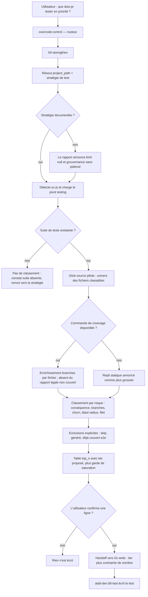

# Instruction : action `strengthen` de `overcode:control` + câblage du pivot `sc-js/testing.md`

## Feature

- **Summary** : donner à `control` le pendant positif de `02-audit` — au lieu de retirer les tests sans valeur, désigner les **tests manquants qui comptent**, classés par risque réel et non par pourcentage de couverture, et rendre ce classement exploitable sur une stack JS en dotant le pivot `testing.md` des trois champs qui lui manquent (rapport de coverage machine-lisible, glob source + exclusions, signaux de risque stack-aware).
- **Stack** : `markdown` (skills/pivots) · projet de validation : `Vitest 3.x` + `@vitest/coverage-v8` + `Playwright`
- **Branch name** : `overcode/control-strengthen-action`
- **Parent Plan** : `none`
- **Sequence** : `standalone` — suite directe de `2026_07_21-control-skill-testing-pivot-hardening.md`
- Confidence : 9/10
- Time to implement : ~2 h 30 (dont ~40 min de validation réelle)

## Paramètres d'exécution

- `TARGET_PROJECT` — projet JS réel servant de banc de validation. Défaut retenu : `/home/tnn/Projets/SmartLockers/multisite-clients` (seul candidat local avec `@vitest/coverage-v8` déjà câblé sur `test:unit`). Le `success_condition` lit cette variable : aucun chemin machine-dépendant n'est codé en dur dans les phases.
- `EMPTY_SUITE_PROJECT` — projet JS réel **sans aucun fichier de test**, pour éprouver le cas limite `suite absente`. Défaut retenu : `/home/tnn/Projets/MyApps/moodboard-generator` (vérifié : 0 fichier de test).

Ces deux variables ne sont utilisées que dans le corps des phases, **jamais dans le `success_condition`** : celui-ci ne vérifie que des artefacts de ce dépôt, la preuve de la validation réelle étant portée par la ligne `Validation reelle — Pass` du Log, que seule la phase 6 autorise à écrire.

## Contexte

`04-strengthen.md` a été rédigé le 2026-07-22 dans une première passe (structure, heuristique de risque, garde-fous, handoff vers `01-write`), et `pivot-contract.md` a reçu un champ **Coverage command** optionnel. Ce plan couvre la **consolidation** : l'action reste générique là où elle a besoin d'une source de vérité stack-aware, et le pivot `sc-js` ne fournit encore ni glob source, ni signaux de risque, ni commande de coverage machine-lisible.

**Décision de conception prise d'entrée, hors résultat d'enquête** : le classement est toujours piloté par le **glob source**, le rapport de coverage n'étant qu'un enrichissement de branches par fichier. Un fichier absent du rapport est donc traité comme non couvert, jamais comme inexistant. Cette décision neutralise par construction le risque « fichier jamais importé absent du rapport » ; l'enquête de la phase 1 ne sert donc plus à arbitrer la conception, mais à documenter la commande et le gotcha exacts dans le pivot.

## Hors périmètre (dette assumée, à traiter dans un plan suivant)

`control` sait **consommer** une stratégie de test (`aidd_docs/memory/testing.md` du projet, sinon `decision-framework.md`) mais **aucune action ne l'élicite ni ne l'écrit**. Conséquence structurelle : sur tout projet sans ce document, `budget_check.limit` reste `null` à vie (`01-write.md:24` interdit tout défaut interne).

Vérifié depuis : le document **est** produit, par la skill project-memory d'`aidd-context` (`02-project-init` en 1.0.1 installée, renommée `02-project-memory` en 2.4.0 upstream). Le vrai problème n'est donc pas l'absence d'auteur, c'est le **décalage de vocabulaire** : le template produit des *types* de tests (et, dans l'ancienne version, un « desired coverage percentage »), là où `control` raisonne en tiers `contract` / `e2e` / `skip` et refuse par principe qu'un pourcentage serve de budget.

Écrire une action d'élicitation de stratégie reste hors périmètre. Ce que ce plan fait : rendre le décalage visible et le traiter de façon déterministe — `05-stats` classe le document `actionable` vs `template-shaped`, déclare l'autorité en vigueur par son chemin, et n'accepte comme `budget` qu'une limite en nombre de tests (phase 4bis) ; `04-strengthen` rappelle la même chose dans son propre rapport (phase 4, tâche 5).

**Robustesse aux versions** : aucun fichier de `control` ne cite un numéro d'action d'`aidd-context` — ces noms changent d'un majeur à l'autre. On référence le document, jamais l'action. Les cibles de délégation `aidd-dev:06-test#01-test` / `#02-test-journey`, elles, ont été vérifiées comme toujours présentes en `aidd-dev` 2.3.1 upstream.

## Architecture projection

### Files to modify

- `plugins/sc-js/skills/sniff/references/capabilities/tools/testing.md` - ajouter les sections `Coverage command`, `Glob source et exclusions`, `Signaux de risque`, plus le gotcha de coverage qui fausse le classement
- `plugins/overcode/skills/control/actions/04-strengthen.md` - piloter par le glob source, brancher les signaux de risque, définir le cas suite absente et le garde-fou de saturation
- `plugins/overcode/skills/control/actions/05-stats.md` - **nouvelle action** : instantané lecture seule (volume par tier, stratégie en vigueur, lisibilité du document, outillage, flags)
- `plugins/overcode/skills/control/references/pivot-contract.md` - formaliser `Source glob & exclusions` et `Risk signals` à côté de `Coverage command`, et figer la correspondance nom-de-contrat ↔ titre-de-section réel
- `plugins/overcode/skills/control/SKILL.md` - relation `audit` ⇄ `strengthen` (solde net) et visibilité de l'absence de stratégie documentée
- `plugins/overcode/README.md` - ligne `control` manquante dans la table des skills depuis `cefae47`
- `README.md` (racine) - la ligne d'index `overcode` ne mentionnait pas la gouvernance des tests
- `plugins/sc-js/README.md` - le pivot `testing` n'était décrit nulle part comme consommé par un autre plugin
- `plugins/overcode/CHANGELOG.md` - entrée `strengthen` (déjà amorcée, à compléter des phases 2-4)
- `plugins/overcode/.claude-plugin/plugin.json` - 3.2.0 → 3.3.0
- `plugins/sc-js/CHANGELOG.md` - entrée 0.10.0 **et** comblement du trou 0.9.0 (non documentée)
- `plugins/sc-js/.claude-plugin/plugin.json` - 0.9.0 → 0.10.0

### Files to create

- `aidd_docs/tasks/2026_07/2026_07_22-control-strengthen-action.md` - ce plan

### Files to delete

- aucun

## Applicable rules

`none` — `list-rules.mjs` retourne `[]` : aucune surface de règles outillée n'est installée sur ce dépôt (`~/.claude/rules/` vide, `aidd_docs/memory/` ne contient que des mémoires de stack, pas de normatif applicable à l'écriture de skills).

## User Journey

## Risk register

| Risk | Impact | Mitigation |
| --- | --- | --- |
| Un fichier source jamais importé par un test est absent du rapport de coverage | Les modules les plus à risque disparaissent du classement | Décision de conception prise d'entrée : le glob source pilote, le coverage enrichit. Phase 1 ne fait que documenter la commande et le gotcha, elle n'arbitre plus |
| Projet sans suite de tests, ou sans outillage de coverage | Le rapport déverse tout le code source en « gaps » et nie la contrainte de nombre | Phase 4 : cas `suite absente` traité à part (constat, pas de classement) + garde de saturation quand les gaps dépassent largement `top_n` |
| Le classement dérive vers « remonter le pourcentage » | Test de masse à faible valeur, exactement ce que `control` existe pour empêcher | Règle transversale déjà posée dans `SKILL.md` ; critère d'acceptation explicite en phase 6 sur un cas discriminant réel |
| Cache plugin antérieur aux sources marketplace | `overcode/3.1.0` chargé ne contient **aucune** skill `control`, `sc-js/0.7.0` aucun `capabilities/` — une invocation live ne verrait rien du travail | **Cause du réordonnancement** : la publication (phase 5) précède la validation (phase 6), qui exige une réinstallation effective avant de commencer |
| Duplication entre `Tier thresholds` et `Signaux de risque` | Deux sections du même pivot se contredisant sur un même cas | Les signaux de risque **priorisent** et ne classent jamais un tier ; règle écrite dans les deux fichiers |
| Publication (phase 5) antérieure à la validation (phase 6) | Une 3.3.0 défectueuse est déjà installable si la phase 6 échoue | Contrepartie assumée du chargement par cache ; correctif en bump patch, et aucun tag/annonce de release avant que la phase 6 ne passe |
| `strengthen` propose ce que `audit` vient de faire supprimer | Boucle stérile entre les deux actions | Phase 4 : règle de solde net en transversal `SKILL.md` (chargée par le routeur pour les deux actions) |

## Implementation phases

### Phase 1 : relever les mécaniques de coverage réelles

> Documenter, pas arbitrer : la conception est déjà tranchée (glob source pilote).

**Déjà constaté sur `TARGET_PROJECT` (2026-07-22, à confirmer par un run)** : `vitest.config.js` déclare `coverage.provider: 'v8'` et `coverage.include: ['lib/**/*.js']` — le glob source existe donc déjà côté outil, et les fichiers jamais importés par un test y remontent à 0 % plutôt que d'être absents. Le dossier `coverage/` produit contient `coverage-final.json` et `clover.xml`, **pas** `coverage-summary.json` : le reporter `json-summary` n'est pas actif par défaut. Le pivot devra donc documenter le reporter à demander explicitement.

#### Tasks

1. Consulter la doc Vitest (via Context7) : flags de reporter machine-lisible, fichiers produits, granularité par branche.
2. Confirmer par un run que `coverage.include` fait bien remonter à 0 % les fichiers non importés, et relever le réglage à documenter quand le projet ne déclare aucun `include`.
3. Faire le même relevé pour Jest (branche legacy du pivot).
4. Exécuter réellement la commande retenue sur `TARGET_PROJECT` et lire le fichier produit.
5. Retenir une commande **découplée du gate de seuils** : `TARGET_PROJECT` déclare des `thresholds`, donc `vitest run --coverage` sort en code ≠ 0 dès que la couverture est sous le seuil. `strengthen` lit un rapport, il ne fait pas passer un gate : la commande documentée doit produire le rapport indépendamment du code de sortie.

#### Acceptance criteria

- [ ] La commande de coverage retenue est exécutée pour de vrai et produit un fichier non vide
- [ ] Le fichier produit expose une granularité **par branche et par fichier**, vérifiée sur un fichier réel du projet
- [ ] Le comportement des fichiers non testés (absents vs 0 %) est constaté sur ce run, pas supposé
- [ ] Le reporter à demander explicitement est identifié (le défaut ne suffit pas)
- [ ] La commande retenue produit son rapport même quand le gate de seuils échoue
- [ ] Les équivalents Jest sont relevés en doc officielle

### Phase 2 : étendre le contrat de pivot

> `pivot-contract.md` décrit ce qu'un pivot peut fournir à `strengthen`, avant que `sc-js` ne le fournisse.

#### Tasks

1. Formaliser le champ optionnel `Source glob & exclusions` (ce qui compte comme code classable).
2. Formaliser le champ optionnel `Risk signals` (ce qui est structurellement à haute conséquence dans cette stack, et ce qui ne mérite structurellement pas de test).
3. Préciser que `Risk signals` **priorise** sans jamais reclasser un tier — l'autorité de tier reste `Tier thresholds`.
4. Figer la correspondance entre nom de champ du contrat (anglais) et titre de section réel du pivot (langue du plugin), pour que la découverte ne dépende pas d'une traduction improvisée.
5. Préciser le repli de `strengthen` quand chaque champ est absent.

#### Acceptance criteria

- [ ] Les trois champs consommés par `strengthen` sont décrits dans la section « Expected shape »
- [ ] Chacun est marqué optionnel avec son repli explicite
- [ ] La frontière priorisation/tier est écrite noir sur blanc
- [ ] La règle de correspondance nom/titre est écrite et illustrée sur le cas `sc-js` (contrat anglais, pivot français)
- [ ] Aucun champ existant du contrat n'est modifié de façon incompatible

### Phase 3 : alimenter le pivot `sc-js/testing.md`

> Le pivot devient réellement exploitable par `strengthen`, en cohérence avec la phase 1.

#### Tasks

1. Sortir la commande de coverage de « Test runner(s) » vers une section `Coverage command` propre, avec le reporter machine-lisible validé en phase 1 (Vitest et Jest).
2. Écrire `Source glob & exclusions` : ce qui est du code classable et ce qui ne l'est jamais (artefacts de build, code généré, fichiers de config).
3. Écrire `Risk signals` en réutilisant le vocabulaire déjà présent dans le pivot (Nuxt/Nitro, Pinia, Firebase) : ce qui est à haute conséquence, et ce qui est structurellement non classable.
4. Ajouter aux « Known tooling gotchas » le piège de coverage constaté en phase 1, aux trois axes du contrat (problème, détection, correctif).

#### Acceptance criteria

- [ ] Les trois nouvelles sections existent, nommées conformément à la règle de correspondance de la phase 2
- [ ] La commande de coverage documentée est celle réellement exécutée en phase 1, à l'identique
- [ ] Le gotcha ajouté couvre les trois axes
- [ ] Aucun signal de risque n'y reclasse un tier
- [ ] Le fichier reste en français, comme le reste du tree `sc-js`

### Phase 4 : aligner `04-strengthen.md` et `SKILL.md`

> L'action cesse d'être générique là où le pivot fournit désormais une source de vérité, et cesse d'être muette sur ses angles morts.

#### Tasks

1. Étape 2 de l'action : le **glob source pilote**, le rapport de coverage enrichit ; un fichier absent du rapport est traité comme non couvert.
2. Étape 4 : brancher les exclusions sur le glob source du pivot, avec repli générique documenté.
3. Étape 3 : rattacher la pondération « conséquence » aux `Risk signals` du pivot quand ils existent.
4. Cas limites : **suite absente** (aucun fichier de test → constat et renvoi vers la stratégie, aucun classement) et **saturation** (gaps très supérieurs à `top_n` → le rapport le dit et propose de réduire le `scope` plutôt que de dérouler une liste).
5. Rendre visible l'absence de stratégie documentée : quand aucun `testing.md` projet n'existe, le rapport le déclare et signale que `limit` reste `null` (renvoi à la section « Hors périmètre »).
6. Garde de cumul : quand l'utilisateur confirme plusieurs lignes, elles passent une par une par `01-write`, et le rapport rappelle le total confirmé avant la première délégation.
7. `SKILL.md` : règle de solde net `audit` ⇄ `strengthen`, et non-réintroduction des chemins que l'utilisateur vient de faire supprimer.

#### Acceptance criteria

- [ ] Chaque champ du pivot consommé par l'action est cité par son nom de contrat, avec son repli
- [ ] Le pilotage par glob source est explicite, ainsi que le traitement d'un fichier absent du rapport
- [ ] Les deux cas limites (suite absente, saturation) sont écrits et produisent une sortie bornée
- [ ] L'absence de stratégie documentée apparaît dans la sortie de l'action
- [ ] La règle de solde net figure dans les règles transversales
- [ ] Aucune règle transversale existante n'est contredite

### Phase 4bis : action `05-stats`

> Savoir d'un coup d'œil où en est un projet, et surtout **quelle stratégie fait autorité** — la sienne, ou le défaut générique.

#### Tasks

1. Écrire `actions/05-stats.md` : instantané lecture seule en quatre blocs (STRATEGY, VOLUME, TOOLING, FLAGS).
2. Provenance de la stratégie : autorité déclarée par son chemin, jamais de fusion silencieuse entre document projet et défaut générique.
3. Lisibilité du document : classer `actionable` vs `template-shaped`, avec la correspondance appliquée par défaut (unit/integration → `contract`, e2e → `e2e`) quand le document ne parle pas la langue des tiers.
4. `budget` alimenté uniquement par une limite en **nombre de tests** ; tout pourcentage de couverture déclaré est reporté à part, en `declared`, jamais promu en objectif.
5. Volume par tier via la commande de comptage du pivot (cas), sinon comptage de fichiers annoncé comme tel ; ratio source/test via le glob source de la phase 2.
6. Flags : chacun nomme l'action qui traite le cas (`02-audit`, `03-configure`, `04-strengthen`), sans jamais la lancer.
7. Enregistrer l'action dans `SKILL.md` (table, déclencheurs, description) et y poser la règle transversale : `control` ne rédige jamais le document de stratégie, il le lit.

#### Acceptance criteria

- [ ] L'action ne modifie rien : aucun fichier du projet cible n'est touché par son exécution
- [ ] L'autorité en vigueur est nommée par son chemin, ou le défaut générique est déclaré explicitement
- [ ] Un document encore au format template est signalé comme tel, pas compté comme une stratégie
- [ ] Aucun pourcentage de couverture n'apparaît dans le champ `budget`
- [ ] Chaque flag nomme l'action qui le traite, sans l'exécuter
- [ ] Aucun nom d'action d'`aidd-context` n'est codé en dur (robustesse inter-versions)

### Phase 5 : publication (préalable technique à la validation)

> Sans réinstallation, la phase 6 ne peut pas exister : le cache chargé est `overcode/3.1.0` (sans `control`) et `sc-js/0.7.0` (sans `capabilities/`).
>
> **Contrepartie assumée** : cet ordre publie une version non encore validée sur banc réel. C'est le prix du mécanisme de chargement des plugins, pas un choix de confort. Conséquence explicite : la phase 6 fait autorité, et un échec s'y solde par un correctif suivi d'un bump **patch** (3.3.1 / 0.10.1), jamais par une rétractation de la 3.3.0. Aucune annonce ni tag de release n'est émis avant que la phase 6 ne soit passée.

#### Tasks

1. ~~Ajouter la ligne `control` à la table des skills du README `overcode`~~ — **fait** (voir Log), ainsi que le README racine et la section pivot `testing` du README `sc-js`.
2. Créer la branche `overcode/control-strengthen-action` depuis `main` **avant tout commit**, et y basculer les modifications en cours (elles sont actuellement dans le working tree de `main`, non committées — un simple `git switch -c` les emporte).
3. Compléter le CHANGELOG `overcode` des phases 2-4, et bumper 3.2.0 → 3.3.0.
4. Écrire l'entrée CHANGELOG `sc-js` 0.10.0 **et** combler l'entrée 0.9.0 manquante, puis bumper 0.9.0 → 0.10.0.
5. Commits séparés par plugin selon la convention du dépôt (`feat(overcode):`, `feat(sc-js):`, puis `chore(...): bump version`).
6. Réinstaller/mettre à jour les deux plugins et **vérifier sur disque** que le cache chargé contient `skills/control/actions/04-strengthen.md` et `capabilities/tools/testing.md`.

#### Acceptance criteria

- [ ] La branche `overcode/control-strengthen-action` existe et porte tous les commits ; `main` n'en reçoit aucun
- [ ] `control` figure dans la table des skills du README avec son déclencheur
- [ ] Les deux CHANGELOGs décrivent le comportement livré, pas la liste des fichiers touchés ; aucune version n'est laissée sans entrée
- [ ] Les deux versions sont bumpées de façon cohérente avec l'ajout de fonctionnalité
- [ ] `ls` sur le cache plugin confirme la présence de `04-strengthen.md` **et** du pivot `testing.md`
- [ ] `git status` est propre après les commits

### Phase 6 : validation réelle sur `TARGET_PROJECT`

> Bloquante avant clôture. Aucun double de test simulé, conformément à la clause « Test » de l'action.

#### Tasks

1. Exécuter `04-strengthen` pour de vrai contre `TARGET_PROJECT`, chemin coverage.
2. Vérifier le classement sur un cas discriminant : un gap à forte conséquence et peu de lignes manquantes doit sortir devant un gap à faible conséquence et beaucoup de lignes manquantes.
3. Vérifier la présence et la justesse de la section « exclusions » du rapport.
4. Ré-exécuter en neutralisant le coverage pour éprouver le repli statique et sa mention explicite.
5. Éprouver le cas `suite absente` sur `EMPTY_SUITE_PROJECT`, et vérifier qu'aucun classement n'est produit.
6. Non-régression : `02-audit` sur le même projet, vérifier l'absence de contradiction avec les gaps proposés.
7. Exécuter `05-stats` sur `TARGET_PROJECT` (document de stratégie présent ou non) **et** sur un projet dont le `testing.md` est resté au format template, vérifier que la lisibilité est correctement classée dans les deux cas.
8. Consigner pass/fail par point dans la section Log, et y inscrire la ligne `Validation reelle — Pass` seulement si les points 1 à 7 passent.

#### Acceptance criteria

- [ ] Le rapport est produit sur données de coverage réelles, pas sur un rapport fabriqué
- [ ] Le cas discriminant conséquence-vs-volume est vérifié sur deux gaps réels du projet
- [ ] Le repli statique s'annonce lui-même comme plus grossier dans le rapport
- [ ] Le cas `suite absente` ne produit aucun classement
- [ ] Aucun fichier de test n'est créé par l'exécution seule de `strengthen`
- [ ] `02-audit` et `strengthen` ne se contredisent sur aucun fichier
- [ ] `05-stats` classe correctement un document actionnable et un document resté au format template
- [ ] Le Log porte `Validation reelle — Pass` uniquement si les sept points précédents (tâches 1 à 7) passent

## Amendments

🤖 **2026-07-22 — ajout de la phase 4bis (`05-stats`)**. Demande utilisateur : connaître d'un coup d'œil le volume de tests et la stratégie en place. Rationale : cette action donne la réponse déterministe au trou identifié au challenge (« quelle stratégie fait autorité ? »), sans sortir du périmètre lecture seule de ce plan. Impacts : projection (+1 fichier créé), phase 6 (+1 point de validation), `SKILL.md` (5 actions au lieu de 4).

🤖 **2026-07-22 — titres de section du pivot maintenus en anglais**. Le plan prévoyait `Glob source et exclusions` / `Signaux de risque`, en supposant le pivot intégralement francophone. Constat à l'écriture : `sc-js/testing.md` utilise déjà des **titres anglais avec prose française** (`Test file glob`, `Test-count command`, `Known tooling gotchas`, `Tier thresholds`). Correctif : les nouvelles sections s'appellent `Coverage command`, `Source glob & exclusions`, `Risk signals`, alignées mot pour mot sur les noms du contrat. Bénéfice : la règle de correspondance de la phase 2 devient triviale pour `sc-js` (aucune liste de correspondance nécessaire), et le pivot reste homogène. `success_condition` et la phase 3 mis à jour en conséquence.

🤖 **2026-07-22 — `05-stats` promue au rang de condition de succès**. Constat de challenge : la phase 4bis était devenue une phase de plein droit sans qu'aucune garde ne l'exige, donc le plan pouvait être déclaré terminé sans l'action. Correctif : `objective` élargi aux deux actions, et `success_condition` complété de deux `grep` (`template-shaped` dans l'action, `05-stats` dans `SKILL.md`).

🤖 **2026-07-22 — `success_condition` recentré sur ce dépôt**. Il contenait `test -s $TARGET_PROJECT/coverage/coverage-summary.json`, doublement faux : la variable n'était liée nulle part dans la chaîne, et le projet cible ne produit pas ce fichier (reporter `json-summary` inactif ; sortie réelle `coverage-final.json` + `clover.xml`). Rationale : une condition de succès doit vérifier des artefacts que ce dépôt contrôle ; la preuve de la validation réelle reste la ligne `Validation reelle — Pass`, que seule la phase 6 autorise. Effet de bord utile : le constat a alimenté la phase 1 (reporter à demander explicitement, commande à découpler du gate de seuils).

🤖 **2026-07-22 — dé-épinglage des références `aidd-context`**. Vérification faite sur le dépôt distant : le marketplace `aidd-framework` local est 158 commits en retard, `02-project-init` (1.0.1) est devenu `02-project-memory` (2.4.0) et le template `testing.md` a été réécrit. Rationale : citer un numéro d'action d'un plugin tiers rend `control` cassable à chaque majeur du framework. Correctif : on référence le document (`aidd_docs/memory/testing.md`), jamais l'action qui le produit. Les cibles `aidd-dev:06-test#01-test` / `#02-test-journey` ont été vérifiées comme stables en 2.3.1.

## Log

**2026-07-22 — état réel avant démarrage des phases.** Une partie du travail a été écrite avant que ce plan n'existe ou en réponse directe à des demandes utilisateur, hors ordre des phases. Constaté sur disque (`git status`) :

| Élément | Phase de rattachement | État |
| --- | --- | --- |
| `actions/04-strengthen.md` (non suivi) | 4 | Écrit en première passe — reste à aligner sur le pivot (glob source, signaux de risque, cas limites) |
| `actions/05-stats.md` (non suivi) | 4bis | Écrit intégralement — reste à valider en phase 6 |
| `SKILL.md` (modifié) | 4 / 4bis | Cinq actions enregistrées, règles transversales posées — reste la règle de solde net `audit` ⇄ `strengthen` |
| `references/pivot-contract.md` (modifié) | 2 | `Coverage command` ajouté — restent `Source glob & exclusions`, `Risk signals`, règle de correspondance nom/titre |
| `plugins/overcode/README.md` (modifié) | 5, tâche 1 | **Fait** — ligne `control` avec ses cinq actions |
| `README.md` racine, `plugins/sc-js/README.md` (modifiés) | 5 | **Fait** — index et section « Pivot de gouvernance `testing` » |
| `plugins/overcode/CHANGELOG.md` (modifié) | 5, tâche 2 | Entrées `strengthen` et `stats` rédigées — à compléter des phases 2-4, bump non fait |
| Pivot `sc-js/testing.md` | 3 | **Non commencé** |
| `plugins/sc-js/CHANGELOG.md`, les deux `plugin.json` | 5 | **Non commencés** |

Rien n'est committé : le dépôt est encore sur `main` avec ces modifications non suivies.

**2026-07-22 — Phase 1 : Pass.** Branche `overcode/control-strengthen-action` créée. Run réel sur `TARGET_PROJECT` (Vitest 4.1.0, `@vitest/coverage-v8`) : `npx vitest run --coverage --coverage.reporter=json-summary --coverage.reportOnFailure` → 55 fichiers, 1829 tests, exit 0, `coverage/coverage-summary.json` produit.

- **Reporter à demander explicitement** : les reporters par défaut du projet produisaient `coverage-final.json` + `clover.xml` + HTML, jamais `coverage-summary.json`. `json-summary` doit être passé en argument.
- **Granularité** : 72 fichiers rapportés, chacun avec `branches` / `functions` / `lines` / `statements` en `{total, covered, skipped, pct}`. Granularité par branche et par fichier confirmée sur fichiers réels.
- **Fichiers non testés** : 27 fichiers à 0 ligne couverte **sont présents** dans le rapport, grâce à `coverage.include: ['lib/**/*.js']` déclaré par le projet. Confirmé : avec un `include`, les fichiers jamais importés remontent à 0 %, ils ne disparaissent pas. Sans `include`, Vitest ne rapporte que les fichiers effectivement couverts (`coverage.all` a été supprimé en Vitest 4 : `include` est désormais le seul mécanisme).
- **Découplage du gate** : les seuils sont évalués après l'écriture des rapports et n'affectent que le code de sortie. Le rapport est donc lisible même sous seuil. En revanche `coverage.reportOnFailure` vaut `false` par défaut : **un seul test rouge supprime tout le rapport**, ce qui ferait conclure à tort à l'absence d'outillage de coverage. Le flag est obligatoire dans la commande documentée.
- **Piège de classement découvert** : `lib/mode-views-config.js` affiche `branches.pct = 100` alors qu'aucune de ses lignes n'est couverte — il n'a simplement aucune branche (`total: 0`). Classer au pourcentage de branches ferait passer un fichier non testé pour parfaitement couvert. Il faut lire `covered`/`total`, jamais `pct` seul.
- **Flakiness constatée** : un premier run a échoué en `ENOENT coverage/.tmp/coverage-<n>.json` (race du provider v8 sur les fichiers temporaires). Relance à l'identique : Pass. À documenter comme gotcha, pas comme blocage.
- **Équivalents Jest** (doc officielle) : `jest --coverage --coverageReporters=json-summary` produit le même `coverage-summary.json` ; `collectCoverageFrom` joue le rôle de `coverage.include` et remonte les fichiers non testés ; `coverageThreshold` agit sur le code de sortie.

**2026-07-22 — Phase 2 : Pass.** `pivot-contract.md` : `Coverage command` durci (rapport machine-lisible + chemin du fichier, reporter à demander explicitement, découplage du gate), `Source glob & exclusions` et `Risk signals` ajoutés en champs optionnels avec repli documenté, frontière priorisation/tier écrite noir sur blanc, et nouvelle section « Field names versus section titles » (une section par champ, titre énonçant le champ, liste de correspondance à la charge du pivot quand les titres divergent, champ introuvable = champ absent). Aucun champ existant modifié de façon incompatible.

**2026-07-22 — Phase 3 : Pass.** `sc-js/testing.md` : sections `Coverage command`, `Source glob & exclusions`, `Risk signals` ajoutées, titres alignés mot pour mot sur le contrat (voir amendement). La commande documentée est exactement celle exécutée en phase 1. Quatre gotchas ajoutés aux trois axes (rapport supprimé par un test rouge, fichiers non testés absents sans `include`, `pct` trompeur à zéro branche, race `.tmp` du provider v8). Aucun signal de risque n'y reclasse un tier — la règle est écrite dans le pivot comme dans le contrat.

**2026-07-22 — Phase 4 : Pass.** `04-strengthen.md` : pilotage par `Source glob & exclusions` explicite (fichier absent du rapport = non couvert), `Coverage command` citée par son nom de contrat avec son repli statique, `Risk signals` branchés sur la pondération « conséquence » en priorisation seule, deux cas limites bornés (`no suite at all` → aucun classement ; `saturation` → total annoncé et réduction de `scope` proposée), absence de stratégie documentée déclarée dans le rapport avec sa conséquence (`limit` reste `null`), et garde de cumul (passage un par un par `01-write`). `SKILL.md` : règle de solde net `audit` ⇄ `strengthen` ajoutée aux transversales, sans contredire aucune règle existante.

**2026-07-22 — Phase 4bis : Pass.** `05-stats.md` était déjà écrit et enregistré dans `SKILL.md` (table, déclencheurs, description, règles transversales). Vérifié contre ses six critères : action strictement en lecture, autorité nommée par son chemin ou défaut générique déclaré, classement `actionable` / `template-shaped`, `budget` alimenté par une limite en nombre de tests uniquement (tout pourcentage reporté à part en `declared`), chaque flag nommant l'action qui le traite, aucun nom d'action `aidd-context` codé en dur. Reste sa validation d'exécution en phase 6.

**2026-07-22 — `success_condition` : toutes les clauses de code passent.** Une clause cherchait `suite absente` dans un fichier rédigé en anglais ; corrigée en `no suite at all` + `saturation` (le fichier n'a pas été francisé : `overcode` est un tree anglophone). Seule reste ouverte la clause `Validation reelle — Pass`, que la phase 6 seule peut satisfaire.

## Validation flow demonstration

1. Depuis `TARGET_PROJECT`, lancer `/overcode:control` et demander « qu'est-ce que je dois tester en priorité ? ».
2. Constater que le pivot `sc-js/testing.md` est découvert et que la commande de coverage documentée est exécutée telle quelle.
3. Lire la table classée : chaque ligne porte un gap réel, ses facteurs de risque, un tier proposé et une justification d'une ligne ; la section exclusions suit.
4. Vérifier qu'un module à forte conséquence peu couvert en branches passe devant un module volumineux mais anodin.
5. Confirmer une seule ligne, et constater que la main passe à `01-write` (décision de tier + contrainte de nombre) avant toute écriture.
6. Vérifier qu'aucun fichier de test n'a été créé pour les lignes non confirmées.
