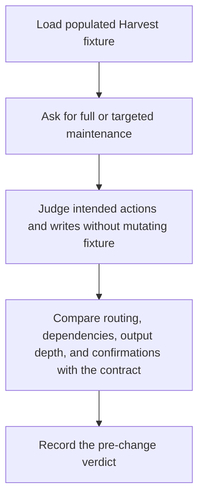
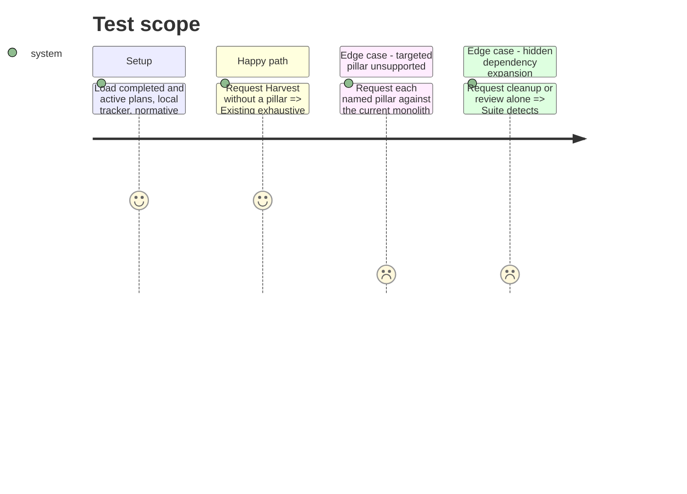

# Instruction: Pin the routing and dependency behaviour

## Architecture projection

> Tree of the final files. ✅ create · ✏️ modify · ❌ delete

```txt
.
└── plugins/overcode/skills/harvest/evals/
    ├── pillar-routing-scenarios.md                                      ✅ behavioural regression specification and Results log
    └── fixtures/tiered-project/
        ├── environment.md                                             ✅ pin OS, unavailable forge CLIs, local tracker, and read-only boundaries
        ├── src/checkout.ts                                              ✅ source root for the freshness-only path
        └── aidd_docs/
            ├── backlog/stories/checkout.md                              ✅ populated local tracker item
            ├── memory/internal/decisions/001-checkout.md                ✅ normative material required before cleanup
            └── tasks/
                ├── status/2025_01_01_project_status.md                  ✅ aged non-plan output for review
                └── 2026_01/
                    ├── 2026_01_05_checkout/
                    │   ├── plan.md                                      ✅ completed feature fixture
                    │   └── phase-1.md                                   ✅ owned completed phase fixture
                    └── 2026_01_20_active/plan.md                        ✅ active-plan fixture
```

No files are modified or deleted in this phase.

## User Journey



## Test Scope



## Tasks to do

### `1)` Build a populated read-only fixture

> Give every routing and dependency branch concrete state to reason against.

1. Create one completed feature directory, one active feature directory, and a local tracker story.
2. Add normative material, an aged non-plan report, and a minimal source root.
3. Pin the simulated environment to Windows with unavailable forge CLIs and Local tracker detection, so repository-parent discovery cannot reach the real remote tracker.
4. Keep the fixture self-contained and safe for intended-write reasoning; no test may mutate it.

### `2)` Specify the selective contract

> Make prompt dispatch traceable without introducing references to actions that do not exist yet.

1. Add behavioural scenarios for no argument, explicit `all`, each of the five pillars, a pillar plus configuration overrides, and an unknown pillar.
2. State the exact future action identity and decisive intended work for each valid request inside the suite.
3. Keep configuration-only invocations specified as the exhaustive default, and defer the machine-readable routing file until those actions exist.

### `3)` Reproduce the current limitation behaviourally

> Prove that the suite detects the absence of selective execution before changing Harvest.

1. Write scenarios for exhaustive default, each targeted pillar, dependency closure, compact dependency receipts, confirmation preservation, invalid input, and partial-report avoidance.
2. Include clear intended-write observables and controls following the shared Behave harness contract.
3. Run the suite read-only against the fixture and append the dated initial verdict, with targeted scenarios failing for the current monolith and the exhaustive positive control passing.

## Test acceptance criteria

| Task | Acceptance criteria |
| ---- | ------------------- |
| 1 | The fixture contains enough state to exercise tracker reconciliation, normative protection, cleanup, freshness, and remaining-artifact review; its pinned detector outcomes prevent reads or intended writes against the real remote tracker. |
| 2 | Every supported invocation form has an exact expected future action route, and an unknown or multiple-pillar request cannot silently become an exhaustive run; no validator sees a dangling action id. |
| 3 | The Results log records a read-only pre-change run that catches missing targeting while demonstrating that the established exhaustive path is still understood. |
