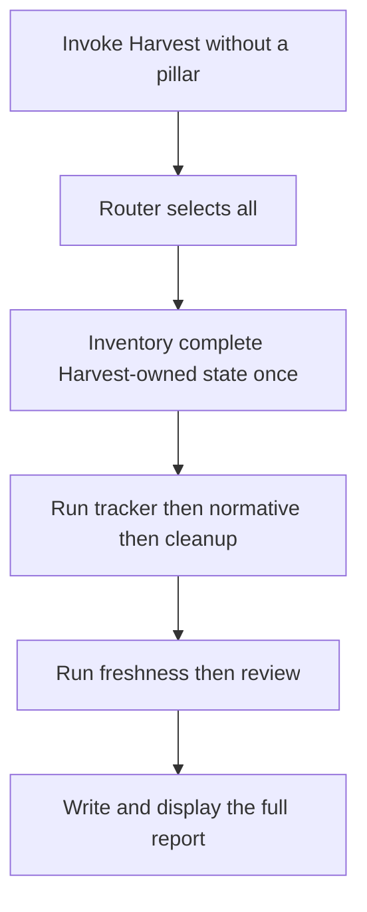
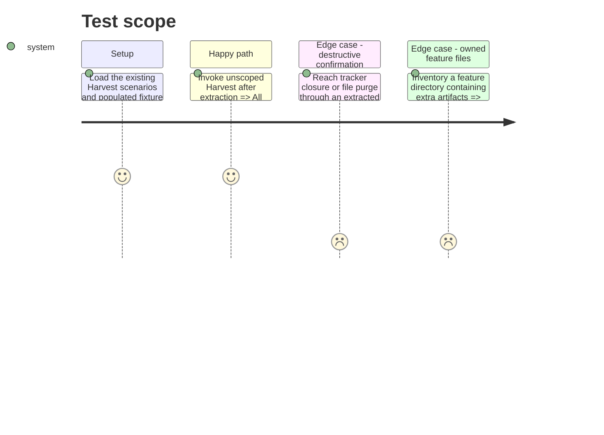

# Instruction: Extract the monolith into scoped actions

## Architecture projection

> Tree of the final files. ✅ create · ✏️ modify · ❌ delete

```txt
.
└── plugins/overcode/skills/harvest/
    ├── SKILL.md                                      ✏️ become a lean router while retaining exhaustive default execution
    ├── actions/
    │   ├── 01-inventory.md                           ✅ build only the context requested by the execution mode
    │   ├── 02-tracker.md                             ✅ reconcile tracker state and guarded closures
    │   ├── 03-normative.md                           ✅ delegate normative reconciliation and return its metrics
    │   ├── 04-cleanup.md                             ✅ protect learning and purge eligible completed artifacts
    │   ├── 05-freshness.md                           ✅ delegate documentation and source freshness checks
    │   ├── 06-review.md                              ✅ arbitrate remaining artifacts by type and age
    │   ├── 07-report.md                              ✅ assemble and persist the exhaustive report
    │   └── 08-all.md                                 ✅ orchestrate the exact exhaustive route and reuse action outputs
    ├── references/
    │   ├── pillar-contract.md                        ✅ define invocation grammar, dependencies, receipts, and execution context
    │   ├── feature-lifecycle.md                      ✅ centralize feature, tracker association, group, and purge rules
    │   ├── remaining-artifacts.md                    ✅ centralize non-plan classification and age rules
    │   └── report-template.md                        ✅ hold the full-run report schema
    └── evals/
        ├── plan-layout-scenarios.md                  ✏️ append extraction-parity evidence
        └── aidd-artifact-scenarios.md                ✏️ append classification-parity evidence
```

No files are deleted in this phase.

## User Journey



## Test Scope



## Tasks to do

### `1)` Define the modular contract

> Separate routing from procedures without duplicating shared lifecycle rules.

1. Make `SKILL.md` list the `all` orchestrator, supporting actions, five pillars, exhaustive flow, and transversal safety invariants.
2. Define an execution context that records requested pillar, inventory scope, dependency level, collected metrics, and completed actions.
3. Move shared feature lifecycle, remaining-artifact, and report contracts into references loaded only by actions that need them.

### `2)` Extract each existing phase

> Preserve present behaviour behind independently loadable action files.

1. Move full inventory into `01-inventory.md` with explicit full and scoped inputs.
2. Move tracker reconciliation and closure, normative delegation, purge, freshness delegation, remaining-file review, report assembly, and exhaustive orchestration into their named actions.
3. Give every action Inputs, Process, Outputs, and observable Test sections required by repository conventions.
4. Keep tracker CLI selection, plan status ownership, learn-before-purge protection, source detection, age rules, and all report metrics unchanged.

### `3)` Prove extraction parity

> Ensure modularization changes loading boundaries, not the default outcome.

1. Run the existing feature-directory and AIDD-artifact scenario suites against the extracted actions.
2. Verify an unscoped dry run selects every action once, reuses inventory state, and writes only the existing full report artifact.
3. Confirm all external mutations remain behind the same user confirmations.

## Test acceptance criteria

| Task | Acceptance criteria |
| ---- | ------------------- |
| 1 | The router can determine what to load without containing the former phase procedures, and shared rules have one authoritative home. |
| 2 | The eight actions together cover every rule and output in the former monolithic `SKILL.md`, with no changed deletion, tracker, age, or reporting semantics. |
| 3 | Both existing Harvest suites retain their passing outcomes, and the exhaustive behavioural control produces the same intended actions, writes, and confirmation boundaries as before extraction. |
