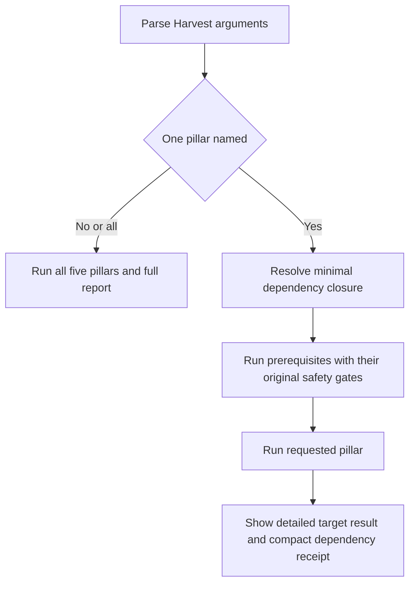
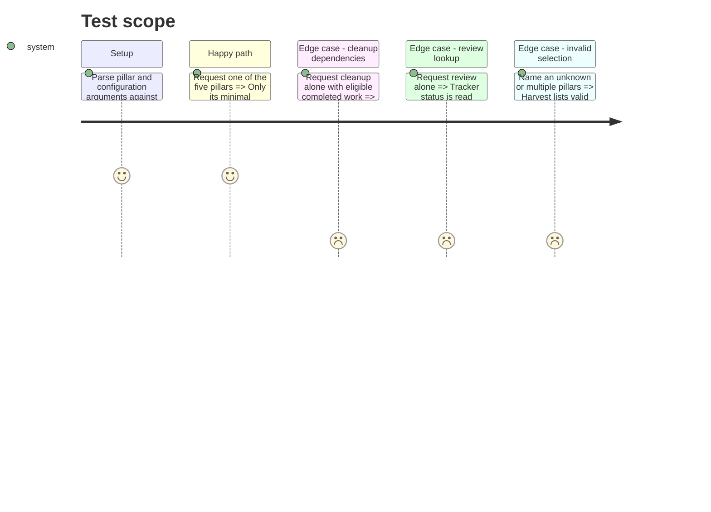

# Instruction: Enable targeted pillars and dependency receipts

## Architecture projection

> Tree of the final files. ✅ create · ✏️ modify · ❌ delete

```txt
.
└── plugins/overcode/skills/harvest/
    ├── SKILL.md                                      ✏️ route one named pillar or the exhaustive default
    ├── actions/
    │   ├── 01-inventory.md                           ✏️ enforce pillar-specific discovery scopes
    │   ├── 02-tracker.md                             ✏️ distinguish status lookup from full reconciliation
    │   ├── 03-normative.md                           ✏️ support requested and prerequisite output modes
    │   ├── 04-cleanup.md                             ✏️ require tracker reconciliation and normative protection
    │   ├── 05-freshness.md                           ✏️ consume only document and source discovery context
    │   ├── 06-review.md                              ✏️ request tracker status without unrelated closure
    │   ├── 07-report.md                              ✏️ render full reports only for exhaustive runs
    │   └── 08-all.md                                 ✏️ run the complete dependency graph once when selected or defaulted
    ├── references/pillar-contract.md                 ✏️ finalize dependency closure and receipt semantics
    └── evals/scenarios.json                          ✅ map invocation prompts to exact final action identifiers
```

No files are deleted in this phase.

## User Journey



## Test Scope



## Tasks to do

### `1)` Parse the selective invocation

> Preserve configuration overrides while making the selected work unambiguous.

1. Recognize `tracker`, `normative`, `cleanup`, `freshness`, `review`, and explicit `all` as pillar tokens.
2. Treat no pillar, including configuration-only input, as `all` without asking an extra question.
3. Refuse unknown or multiple pillar tokens before inventory, tracker access, delegated skills, or writes begin.
4. Add machine-readable routing scenarios only after every referenced action identifier exists.

### `2)` Resolve minimal dependencies

> Satisfy correctness prerequisites without recreating the exhaustive run.

1. Give `tracker` only tracker-scoped inventory; give `normative` no inventory dependency.
2. Give `cleanup` cleanup-scoped inventory, tracker reconciliation, and normative reconciliation before purge.
3. Give `freshness` only document and source discovery; give `review` review-scoped inventory plus read-only tracker status lookup.
4. Reuse completed action outputs during `all` so no prerequisite reruns and no second full scan occurs.
5. Preserve every prompt and confirmation emitted by a prerequisite even though its final metrics are summarized.

### `3)` Bound outputs and report writes

> Make token savings visible in both loading and response behaviour.

1. Render the requested pillar in full and list each executed prerequisite with one short reason and outcome.
2. Omit unrelated sections rather than showing zeros, empty tables, or speculative metrics.
3. Write `aidd_docs/harvests/YYYY_MM_DD-harvest.md` only for `all`; targeted delegated actions may write only their already documented artifacts.
4. Keep configuration values and any skipped or blocked dependency visible in the targeted result.
5. Instruct a targeted run to load no unrelated action or pillar-specific reference; use that bounded instruction set as the structural proxy for token reduction.

## Test acceptance criteria

| Task | Acceptance criteria |
| ---- | ------------------- |
| 1 | No-argument, explicit `all`, and configuration-only calls select the exact `all` action; each valid pillar selects its exact action; invalid or multiple selections cause zero maintenance work. |
| 2 | Every pillar runs only the dependency modes listed above, cleanup cannot purge before normative reconciliation, review cannot close an unrelated tracker item, and full mode reuses dependency outputs. |
| 3 | A targeted response contains one developed pillar plus a brief dependency receipt and no partial global report; its instruction load is limited to the router, requested action, dependencies, and their references; all mode still writes the complete report with every existing metric. |
