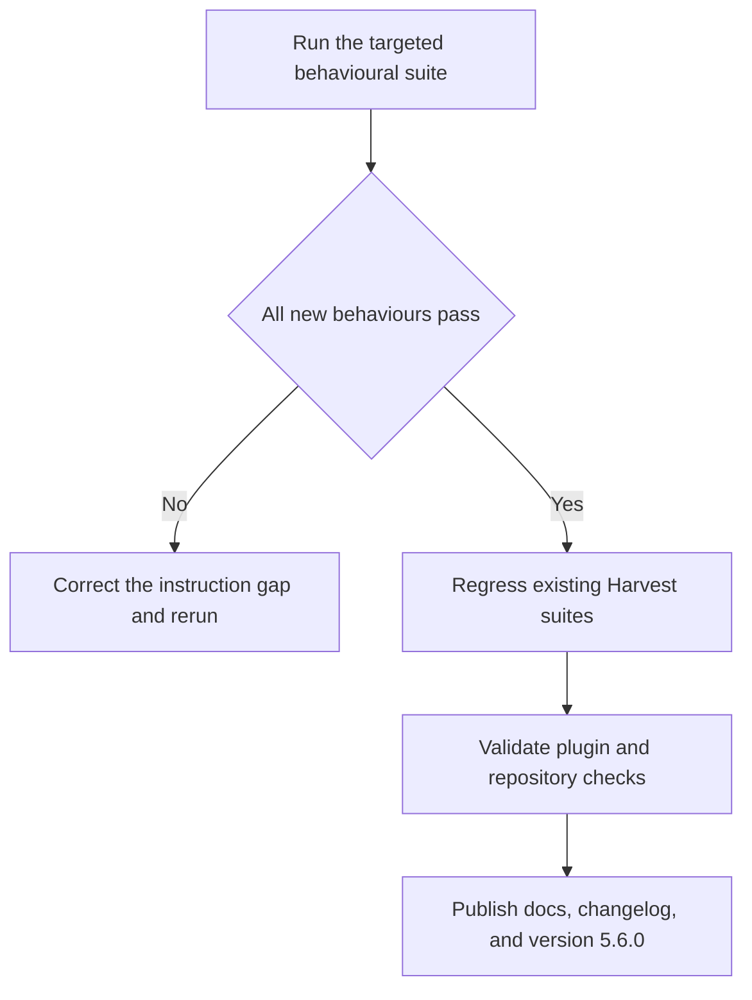
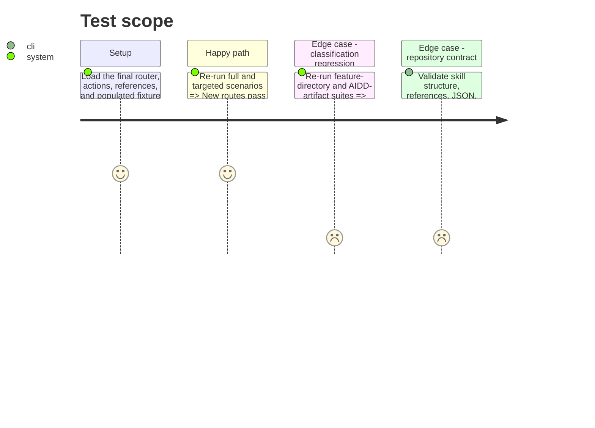

# Instruction: Prove compatibility and publish the contract

## Architecture projection

> Tree of the final files. ✅ create · ✏️ modify · ❌ delete

```txt
.
├── .claude-plugin/marketplace.json                              ✏️ publish the overcode minor version
└── plugins/overcode/
    ├── .claude-plugin/plugin.json                               ✏️ bump the canonical plugin version
    ├── .codex-plugin/plugin.json                                ✏️ sync the version with a fresh Codex cachebuster
    ├── README.md                                                ✏️ document Harvest pillar invocations and default
    ├── CHANGELOG.md                                             ✏️ record selective execution, dependencies, and tests
    └── skills/harvest/
        ├── SKILL.md                                             ✏️ align skill version metadata with the release
        └── evals/
            ├── pillar-routing-scenarios.md                      ✏️ append post-change and regression Results logs
            ├── plan-layout-scenarios.md                         ✏️ append extraction regression evidence
            └── aidd-artifact-scenarios.md                       ✏️ append artifact-classification regression evidence
```

No files are created or deleted in this phase.

## User Journey



## Test Scope



## Tasks to do

### `1)` Close the behavioural regression loop

> Demonstrate the feature and its non-regression with dated evidence.

1. Run `pillar-routing-scenarios.md` after implementation and append verdicts plus deltas from the initial run.
2. Regress `plan-layout-scenarios.md` and `aidd-artifact-scenarios.md` against the modular instructions.
3. Treat any missing instruction citation, unexpected action, undeclared write, or weakened confirmation as a failure and correct the target before recording a green run.

### `2)` Validate the repository contract

> Catch structural and cross-reference errors outside the judged behaviour.

1. Validate `SKILL.md`, every action, every new reference, fixture path, and both scenario formats.
2. Run the plugin and skill validators plus the repository's default test command.
3. Confirm the worktree diff contains no fixture mutation from behavioural judges and no unrelated files.

### `3)` Document and version the feature

> Make the selective mode discoverable on both supported hosts.

1. Document the five pillar names, no-argument `all` default, configuration composition, dependency receipts, and targeted-report boundary.
2. Add the change under Overcode's changelog and bump the backward-compatible feature release from 5.5.0 to 5.6.0.
3. Synchronize the Claude manifest, Claude marketplace entry, and Codex manifest while leaving the Codex marketplace catalogue and root index unchanged.

## Test acceptance criteria

| Task | Acceptance criteria |
| ---- | ------------------- |
| 1 | The post-change targeted suite records all specified routes and dependency behaviours as passing, with no PASS-to-FAIL regression in either existing Harvest suite. |
| 2 | Skill and plugin validation, JSON parsing, cross-reference checks, and the default repository test command all pass; behavioural runs leave the fixture unchanged. |
| 3 | README and changelog describe the same invocation contract as the router, and every version-bearing Overcode registry or manifest consistently publishes 5.6.0 with a fresh Codex cachebuster. |
