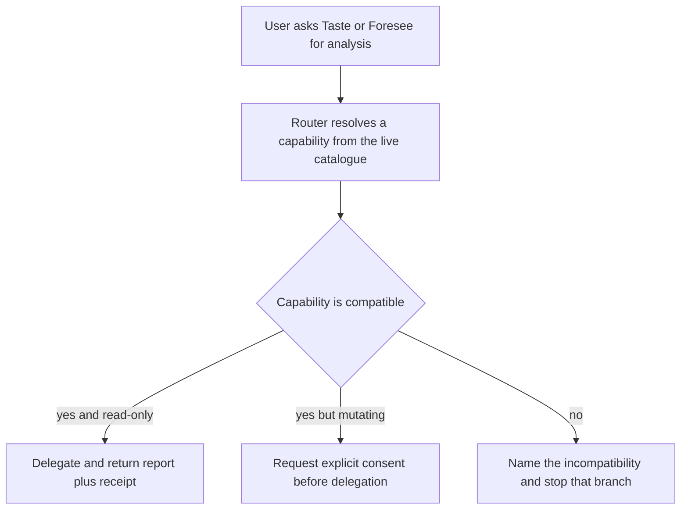
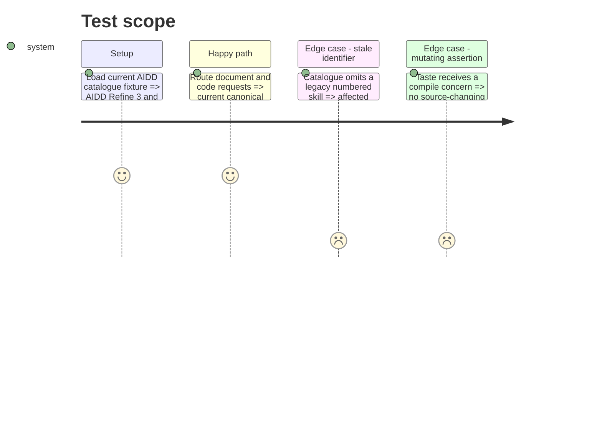

# Instruction: Repair the AIDD delegation boundary

## Architecture projection

> Tree of the final files. ✅ create · ✏️ modify · ❌ delete

```txt
.
├── tools/eval/
│   ├── aidd-delegation.mjs                         ✏️ validate current capability routes and mutation boundaries
│   └── fixtures-aidd-delegation/
│       └── current-compatible.json                 ✅ populated deterministic catalogue fixture
└── plugins/overcode/
    ├── references/aidd-delegation.md                  ✏️ repair canonical routes and consent contract
    ├── docs/workflow.md                               ✏️ remove stale AIDD identifiers
    └── skills/
        ├── taste/
        │   ├── actions/01-assess-doc.md                 ✏️ route fact checking to the installed canonical skill
        │   ├── actions/02-assess-code.md                ✏️ prevent implicit mutation through assert
        │   ├── assets/claim-types.md                    ✏️ align the external-claim route
        │   ├── evals/delegation-scenarios.md            ✏️ cover compatibility and consent behavior
        │   └── evals/scenarios.json                     ✏️ cover consent-aware assertion routing
        └── foresee/
            ├── actions/01-analyze-doc.md                 ✏️ route prospective documents to current Shadow Areas
            ├── evals/delegation-scenarios.md            ✏️ cover current and missing-capability paths
            └── evals/scenarios.json                     ✏️ update deterministic routing expectations
```

## User Journey



## Test Scope



## Tasks to do

### `1)` Repair capability identities

> Make the shared contract agree with the installed AIDD catalogue.

1. Replace retired Shadow Areas and Fact Check identifiers with their current canonical identifiers.
2. Update every active action, asset, documentation reference, static route token, and scenario expectation together.
3. Add a populated catalogue fixture for reproducible compatibility validation.
4. Give each capability its actual minimum package version, including AIDD Dev 2.5.0 for `aidd-dev:05-review` `relevancy`.
5. Keep capability lookup host-native; never resolve through an installed cache path.

### `2)` Restore the read-only promise

> Prevent Taste from silently invoking an AIDD flow that can edit source.

1. Classify audit and review as analytical even when their contracts persist disclosed report artifacts under `aidd_docs/`; distinguish those artifacts from changes to assessed source or tests.
2. Classify assertion as potentially mutating and require an explicit user request or consent before handing it a runnable-resolution concern.
3. When consent is absent, return the proposed capability and receipt without invoking it.
4. Make every permitted report write visible in the delegation receipt and preserve explicit failure without a local replacement scanner.

### `3)` Strengthen the structural guard

> Make compatibility and consent failures reproducible.

1. Update the required capability set and route checks.
2. Validate the populated AIDD 3 catalogue fixture in the deterministic test path.
3. Add negative fixtures for retired identifiers, cache-path resolution, silent fallback, and implicit mutating delegation.

## Test acceptance criteria

| Task | Acceptance criteria |
| ---- | ------------------- |
| 1 | An unfinished document resolves to `aidd-refine:03-shadow-areas`, an external factual claim resolves to `aidd-refine:04-fact-check`, review relevancy requires AIDD Dev 2.5.0 or newer, and no active file names retired identifiers. |
| 2 | A plain Taste assessment leaves source and tests unchanged; any AIDD report artifact is announced in its receipt, and a potentially mutating assertion is invoked only after explicit consent recorded in the response. |
| 3 | The deterministic guard accepts the populated current catalogue and rejects each fixture containing a retired route, hidden cache lookup, local fallback, or consent bypass. |
