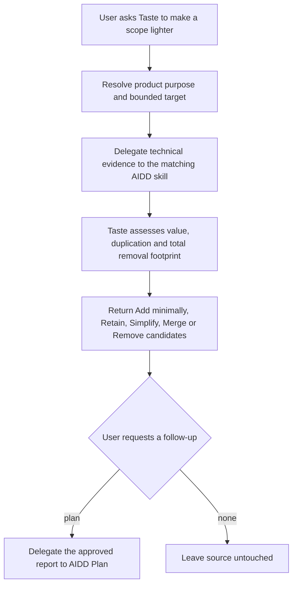
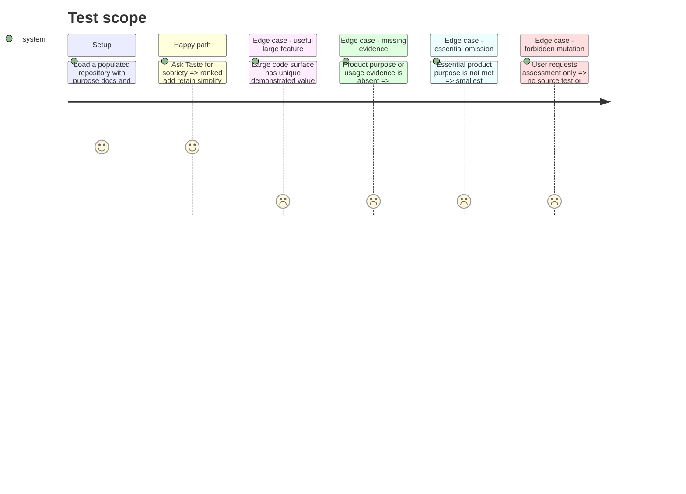

# Instruction: Add Taste sobriety assessment

## Architecture projection

> Tree of the final files. ✅ create · ✏️ modify · ❌ delete

```txt
.
├── tools/eval/aidd-delegation.mjs                  ✏️ validate the new sobriety evidence routes
└── plugins/overcode/
    ├── references/aidd-delegation.md                  ✏️ add evidence routes for sobriety
    └── skills/taste/
        ├── SKILL.md                                      ✏️ expose freshness and sobriety as distinct actions
        ├── actions/03-assess-sobriety.md                 ✅ orchestrate the bounded sobriety assessment
        ├── references/sobriety-signals.md                ✅ define product and code excess evidence
        ├── evals/scenarios.json                          ✏️ cover sobriety routing triggers and exclusions
        ├── evals/delegation-scenarios.md                 ✏️ cover evidence delegation and receipts
        └── evals/sobriety-scenarios.md                   ✅ pin feature challenge and reduction behavior
```

## User Journey



## Test Scope



## Tasks to do

### `1)` Define sobriety as a separate Taste action

> Judge whether code and functionality are present in the right amount.

1. Before changing the target instructions, scaffold and run the behavioral suite from task 4; the recorded pre-change failures gate the remaining tasks.
2. Route explicit lightness, bloat, removal, unnecessary-feature, over-engineering, and simplification requests to `assess-sobriety`.
3. Keep Markdown freshness and narrow code-quality requests on their existing actions.
4. Require a repository, module, diff, or completed feature as the sobriety target; ask once when explicit sobriety intent has no bounded target.
5. Resolve product purpose in this order: explicit current user intent, active specification or plan, then repository memory or README; expose conflicts rather than choosing silently.
6. Report a missing ingredient when the essential product purpose cannot be met without it. Prefer the smallest necessary addition and state why its added volume is justified.

### `2)` Delegate evidence without delegating the verdict

> Reuse AIDD where it has authority and keep the product decision in Taste.

1. Use `aidd-dev:04-audit` `code-quality` for dead code, duplication, vestigial flags and size evidence.
2. Use `aidd-dev:05-review` `relevancy` for a diff against its need.
3. Use `aidd-refine:02-challenge` for completed work against an agreed reference.
4. Preserve every delegated report unchanged and record a receipt for each capability actually invoked.
5. Do not invoke refactor or implementation from assessment; an approved `--plan` follow-up may delegate the Taste report to `aidd-dev:01-plan`.
6. Extend the deterministic guard with the new action and every canonical evidence route in the same phase.

### `3)` Produce an actionable sobriety verdict

> Make reduction recommendations comparable without reducing usefulness to raw line count.

1. Classify each bounded candidate as `Add minimally`, `Retain`, `Simplify`, `Merge`, or `Remove`.
2. Cite its user or product value, maintenance footprint across source, tests, configuration and documentation, duplication, dependencies, estimated net surface change, functional loss, confidence, and evidence gaps.
3. Rank deletion first when the essential product purpose remains intact.
4. Never present absent usage telemetry as proof of absence of value.
5. Aggregate retained and removable footprints without treating raw line count as a proxy for product value.

### `4)` Specify behaviour before implementation

> Build a durable behavioural regression suite for Taste sobriety.

1. Add concrete populated-fixture scenarios for useful large code, unused working features, duplicated variants, premature abstractions, compatibility residue, a missing unifier that reduces net volume, and a missing essential capability whose smallest valid correction adds code.
2. Add a positive control and mutation-, line-count-, and unsupported-value negative controls.
3. Record an initial dry-run that exposes the current missing behavior before implementing the action; do not begin target edits until this run exists.

## Test acceptance criteria

| Task | Acceptance criteria |
| ---- | ------------------- |
| 1 | The initial behavioral run exists before target edits; afterward sobriety language selects `assess-sobriety`, while documentation freshness and narrow code concerns retain their existing routes. A missing essential capability may yield a minimal justified addition. |
| 2 | Technical findings remain attributable to their AIDD reports, the final feature-value and reduction verdict is visibly authored by Taste, and the deterministic guard recognizes every new route. |
| 3 | Every recommendation states what changes, whether the essential purpose survives or requires a minimal addition, the complete affected footprint, net volume change, loss, confidence, and missing evidence. |
| 4 | The new suite fails on the pre-change target for the intended missing behaviors, includes discriminating controls, and its judge performs no writes to the populated fixture. |
