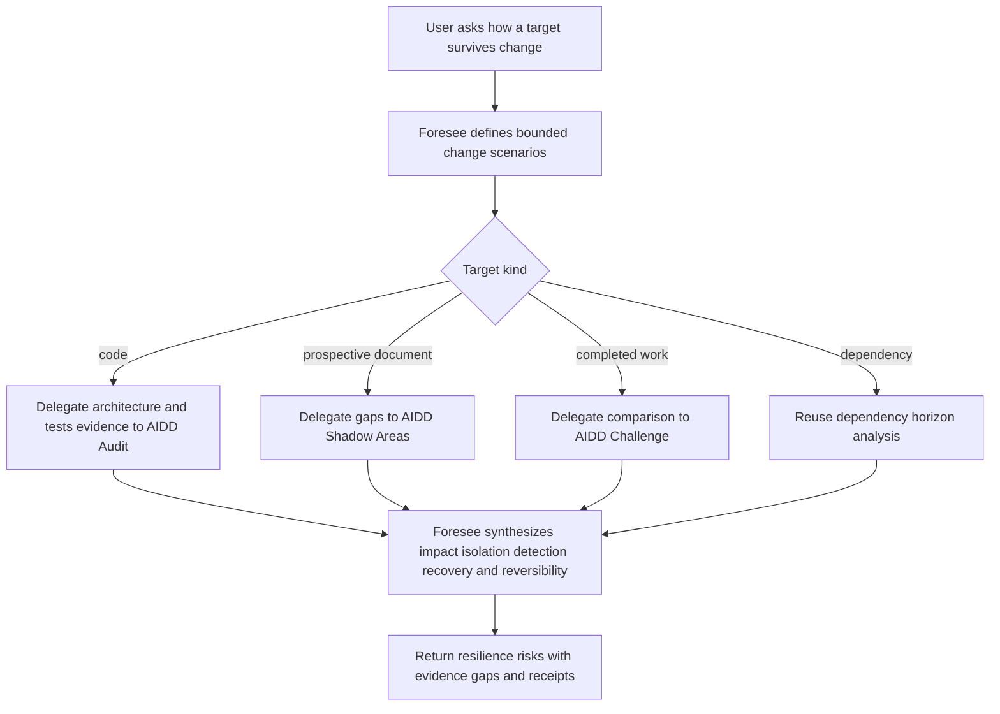
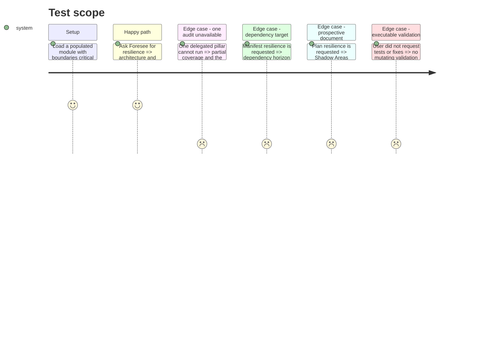

# Instruction: Add Foresee resilience assessment

## Architecture projection

> Tree of the final files. ✅ create · ✏️ modify · ❌ delete

```txt
.
├── tools/eval/aidd-delegation.mjs                  ✏️ validate target-specific resilience routes
└── plugins/overcode/
    ├── references/aidd-delegation.md                  ✏️ add the composite resilience route
    └── skills/foresee/
        ├── SKILL.md                                      ✏️ expose resilience separately from generic foresight
        ├── actions/02-analyze-code.md                    ✏️ hand explicit resilience intent to the composite action
        ├── actions/04-analyze-resilience.md              ✅ compose bounded architecture and test evidence
        ├── references/resilience-signals.md              ✅ define change scenarios recovery and reversibility
        ├── evals/scenarios.json                          ✏️ cover resilience routing and exclusions
        ├── evals/delegation-scenarios.md                 ✏️ cover ordered multi-report delegation
        └── evals/resilience-scenarios.md                 ✅ pin the prospective synthesis behavior
```

## User Journey



## Test Scope



## Tasks to do

### `1)` Define the resilience route

> Distinguish resilience from a generic architecture or test-health request.

1. Before changing the target instructions, scaffold and run the behavioral suite from task 4; the recorded pre-change failures gate the remaining tasks.
2. Give explicit resilience, change tolerance, failure recovery, reversibility, and blast-radius intent priority over extension-only dispatch and route it to `analyze-resilience`.
3. Inside that action, route prospective documents through Shadow Areas, completed work through Challenge, code through architecture plus tests audits, and dependencies through the existing horizon action.
4. Keep non-resilience single-angle architecture, code-quality, tests, document, and dependency requests on their current routes.
5. Bound the target and select at most the three highest-risk plausible change scenarios by default; expand only on explicit request, and ask only when conflicting scopes would materially change the assessment.

### `2)` Compose authoritative AIDD evidence

> Combine the two audit pillars needed for static resilience evidence.

1. For code, delegate architecture boundaries, coupling and isolation to `aidd-dev:04-audit` `architecture`, and critical-path coverage, flakiness and test balance to its `tests` pillar.
2. For prospective documents, delegate blind-spot evidence to `aidd-refine:03-shadow-areas`; for completed work, delegate comparison evidence to `aidd-refine:02-challenge`.
3. Preserve every delegated report and issue one receipt per invocation.
4. Keep dependency abandonment and migration horizon on `analyze-dep`, linking it without rescoring it.
5. Do not invoke `assert` or `test` during read-only analysis; expose executable validation only as a separately consented follow-up.
6. Extend the deterministic guard with the target-specific routes in the same phase.

### `3)` Synthesize resilience without duplicating Audit

> Translate separate findings into prospective failure and recovery scenarios.

1. For each material scenario state the change or failure trigger, affected boundary, observable consequence, detection path, containment, recovery, reversibility, evidence, confidence, and unknowns.
2. Distinguish confirmed weakness from inference and untested hypothesis.
3. Report partial coverage when either delegated pillar or required project context is unavailable.
4. Keep AIDD severities and findings authoritative; do not create a competing quality score.

### `4)` Specify behaviour before implementation

> Build a durable behavioural regression suite for Foresee resilience.

1. Add populated-fixture scenarios for a prospective plan, completed work, API change, dependency loss, partial failure, state corruption, rollback, tightly coupled modules, and well-isolated code with sparse tests.
2. Add positive controls plus negative controls for single-pillar masquerading as resilience, duplicated dependency scoring, invented recovery, and implicit test execution.
3. Record an initial dry-run that exposes the current absence of composite resilience behavior; do not begin target edits until this run exists.

## Test acceptance criteria

| Task | Acceptance criteria |
| ---- | ------------------- |
| 1 | The initial behavioral run exists before target edits; afterward explicit resilience intent selects the composite action and at most three scenarios by default, while non-resilience architecture, tests, document, and dependency intents remain independently routable. |
| 2 | Each target kind delegates only to its applicable authority, returns unchanged reports with separate receipts, passes the deterministic route guard, and invokes no source- or test-writing capability by default. |
| 3 | Each resilience finding is scenario-based and traceable to evidence or clearly labeled uncertainty; no AIDD audit finding is rescored or duplicated. |
| 4 | The new suite fails against the pre-change target for the missing composite behavior, uses a populated fixture and discriminating controls, and records no fixture write. |
