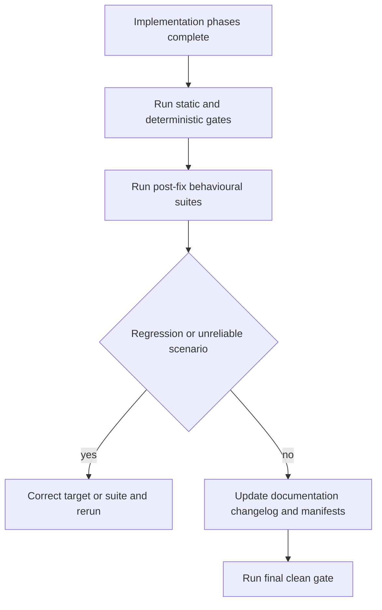
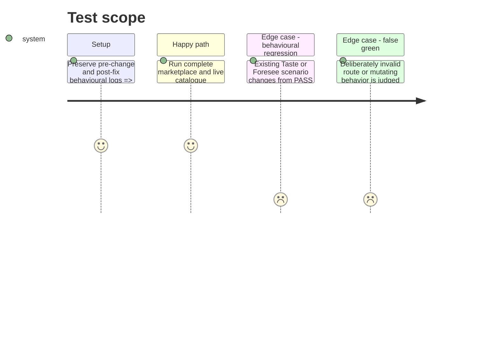

# Instruction: Prove behaviour and publish the contract

## Architecture projection

> Tree of the final files. ✅ create · ✏️ modify · ❌ delete

```txt
.
├── .claude-plugin/marketplace.json                  ✏️ publish the new Overcode description and version
├── plugins/overcode/
│   ├── .claude-plugin/plugin.json                 ✏️ align Claude manifest metadata
│   ├── .codex-plugin/plugin.json                  ✏️ align Codex manifest metadata and cachebuster
│   ├── README.md                                  ✏️ document Taste sobriety and Foresee resilience
│   ├── CHANGELOG.md                               ✏️ record behavior, compatibility and test changes
│   ├── docs/workflow.md                           ✏️ document actions, boundaries and delegation receipts
│   ├── skills/taste/SKILL.md                      ✏️ align skill version and published description
│   ├── skills/taste/evals/sobriety-scenarios.md   ✏️ append post-fix and regression results
│   ├── skills/foresee/SKILL.md                    ✏️ align skill version and published description
│   └── skills/foresee/evals/resilience-scenarios.md ✏️ append post-fix and regression results
└── tools/eval/aidd-delegation.mjs                  ✏️ include all final routes in the release gate
```

## User Journey



## Test Scope



## Tasks to do

### `1)` Confirm behavioural repair

> Demonstrate the intended change rather than merely asserting it.

1. Run the new Taste and Foresee suites against the same populated fixture used by their initial dry-runs.
2. Append post-fix results and deltas without rewriting historical runs.
3. Regress the pre-existing delegation, routing, freshness, dependency-horizon, and legacy-flag suites.
4. Keep positive controls and exercise deliberate negative candidates in each behavioral family so the judge cannot pass everything indiscriminately.
5. Review any new suite whose verdict reliability is uncertain before accepting its run.

### `2)` Run deterministic repository gates

> Verify structure, routes, catalogue compatibility and cross-file consistency.

1. Run the AIDD delegation guard against its populated current-catalogue fixture.
2. Export or assemble the current host catalogue from the capabilities actually exposed at release time and run the guard in required-catalogue mode; a missing required capability fails the release.
3. Run routing coverage and consistency checks through the repository's complete test command.
4. Snapshot the populated fixture domain before and after dry-run judging, excluding the suite Results log owned by the orchestrator, and prove that the fixture domain itself was not mutated.
5. Resolve every failure and repeat a final clean sweep.

### `3)` Publish one coherent product contract

> Make the released descriptions match observable behavior.

1. Document the separation between freshness, sobriety, foresight and resilience.
2. Document delegated evidence, local verdict ownership, consent boundaries and receipts.
3. Add the release notes and apply a minor Overcode version bump through the repository's existing bump workflow.
4. Keep Claude marketplace, Claude manifest and Codex manifest descriptions identical where the consistency gate requires it.

## Test acceptance criteria

| Task | Acceptance criteria |
| ---- | ------------------- |
| 1 | Initial logs show the intended pre-change failures; post-fix logs show their repair; all prior scenarios avoid PASS-to-FAIL regression; deliberate negative candidates remain detectable. |
| 2 | Both the deterministic fixture and the release-time live catalogue pass required-capability validation, the complete marketplace gate passes, and behavioral dry-runs leave the populated fixture domain byte-for-byte unchanged, with only the orchestrator-owned Results log allowed to grow. |
| 3 | Public documentation describes the shipped actions and boundaries, the changelog records them, and every manifest passes version and description consistency checks. |
