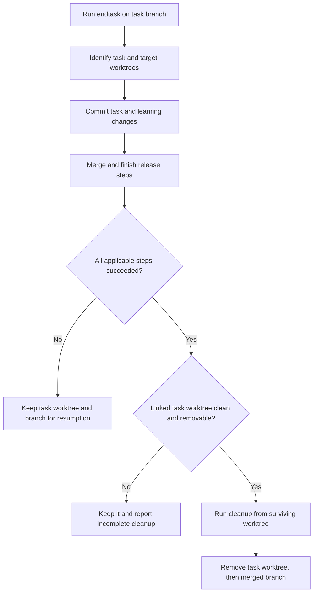
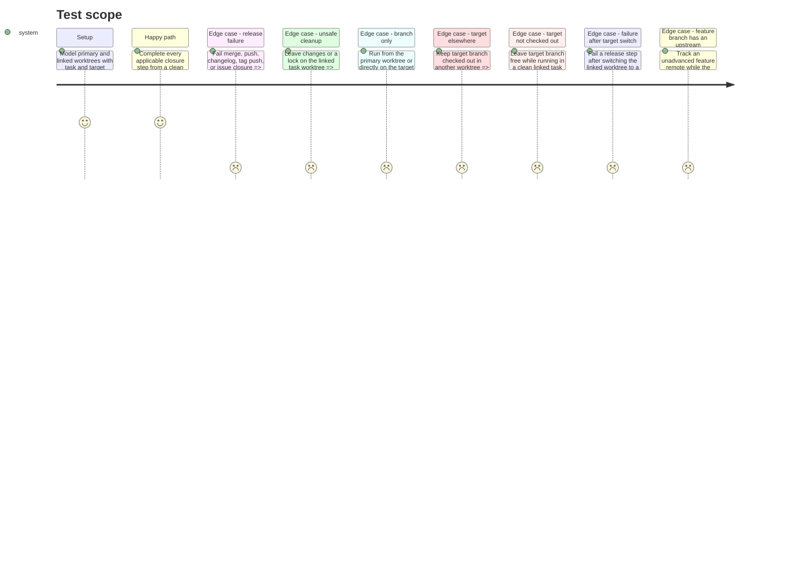

# Instruction: Make endtask worktree aware and verify safe cleanup

## Architecture projection

> Tree of the final files. ✅ create · ✏️ modify · ❌ delete

```txt
.
└── plugins/overcode/
    ├── docs/aliases.md                                  ✏️ describe the worktree-aware closure contract
    └── skills/alias/
        ├── SKILL.md                                      ✏️ include cleanup in the endtask action summary
        ├── actions/02-endtask.md                         ✏️ route merge to the right worktree and defer cleanup until closure succeeds
        └── evals/
            ├── endtask-worktree-scenarios.md             ✏️ extend the existing read-only cases and append a post-fix verdict
            └── fixtures/endtask-worktrees/fixture.md     ✏️ extend the existing concrete Git state for new cases
```

No files are deleted.

## User Journey



## Test Scope



## Tasks to do

### `1)` Resolve worktree ownership before changing branches

> Give `endtask` the right Git location for the merge and a precise cleanup target.

1. Extend branch detection in `02-endtask.md` with `git worktree list --porcelain`; distinguish the primary worktree, the task's linked worktree, and any worktree that already owns `target_branch`.
2. Direct merge and release commands, including the changelog skill, to the worktree that owns `target_branch`; if no worktree owns it, switch to it in the clean current worktree. Avoid conflicting checkouts or changing an unrelated dirty worktree.
3. Keep the existing direct-target-branch path and primary-worktree branch path functional without worktree removal.

### `2)` Finish all task writes and release steps before cleanup

> Make success mean the full approved closure, not merely a successful merge.

1. Account for files written by `10-learn` after the initial commit: review and commit those task changes before merge, then require a clean task worktree.
2. Move branch deletion out of the merge step. After merge/push, changelog/tag push, and optional issue closure succeed, run cleanup from a surviving worktree with an explicit working directory. If release fails after a branch switch, retain the original task branch and report the worktree's actual branch and path so work can resume.
3. Record the task branch tip before merge, verify it is an ancestor of the target after merge, then remove only the exact clean, unlocked linked task worktree with `git worktree remove` and delete only that verified merged branch. A forced branch deletion is allowed only after this ancestry proof if an upstream-aware `git branch -d` refuses. Never force-remove a worktree or globally prune; if a prerequisite fails, keep the remaining worktree or branch and report its actual state.
4. Update the result report to show the worktree path and whether cleanup completed; preserve the existing no-issue and direct-branch outcomes.

### `3)` Prove the boundary and document it

> Make prompt behaviour reviewable without performing a real release.

1. Extend the existing read-only behavioural suite and populated fixture with failure after switching to a free target, a feature branch tracking an unadvanced remote, and any release-step failures not yet covered. Keep the existing linked-task, primary-worktree, direct-target, dirty, and locked cases.
2. Preserve the recorded pre-change verdict and append a post-change verdict against the prompt; verify that no scenario proposes deleting another worktree, force-removing a task worktree, or deleting a branch before its worktree.
3. Update the alias summary and user documentation to state when automatic cleanup happens and when the task worktree is retained.

## Test acceptance criteria

| Task | Acceptance criteria |
| --- | --- |
| 1 | The prompt identifies the task's linked worktree and the worktree owning the target branch; a target branch already checked out elsewhere never triggers a conflicting checkout, and the changelog runs in the chosen target worktree. |
| 2 | A completed release removes only the clean linked task worktree and then its ancestry-verified merged branch, even if the task branch tracks an unadvanced remote; failed steps, remaining changes, or locks leave the task worktree available and produce an accurate report of its actual branch and path. Direct-target and primary-worktree flows never remove the primary worktree. |
| 3 | Read-only scenarios show the old gap and pass against the revised prompt; the alias description and documentation match the verified behavior. |
