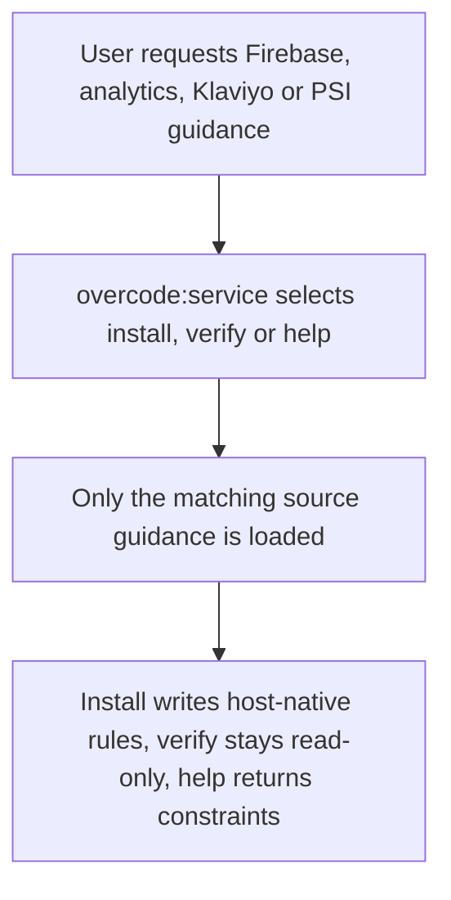
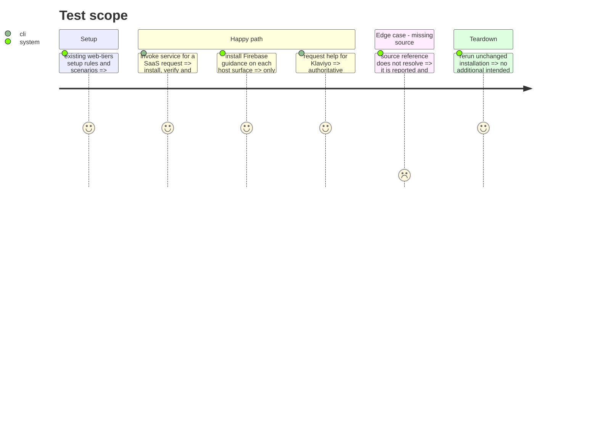

# Instruction: Migrer les règles et l’assistance SaaS vers `service`

## Architecture projection

> Tree of the final files. ✅ create · ✏️ modify · ❌ delete

```txt
plugins/overcode/
├── skills/
│   └── service/                                      ✅ router, actions, references and routing scenarios
├── references/pivot-providers.md                      ✏️ Firebase pivot provider becomes overcode:service
├── README.md                                          ✏️ publish service
├── docs/workflow.md                                   ✏️ route SaaS requests to service
├── CHANGELOG.md                                       ✏️ record the migration under Unreleased
├── .claude-plugin/plugin.json                         ✏️ describe the new capability
└── .codex-plugin/plugin.json                          ✏️ mirror the Claude manifest description
.claude-plugin/marketplace.json                        ✏️ mirror overcode metadata
```

## User Journey



## Test Scope



## Tasks to do

### `1)` Create the `overcode:service` contract

> Move the `setup` routing and its install, verify and help behavior under the service-oriented public name.

1. Create `skills/service/SKILL.md` with explicit routing for `install`, `verify` and `help`, preserving host portability and the distinction between write and read-only actions.
2. Move the nine SaaS and Firebase pivot references under the new skill and adapt references, output labels and examples from `web-tiers` to `overcode:service`.
3. Preserve target paths, source-missing behavior, bounded `AGENTS.md` updates and all service detection/checklist constraints.

### `2)` Transfer and adapt the behavioural coverage

> Keep the existing routing and pivot-installer evidence attached to the new owner.

1. Move `setup` routing scenarios and pivot-install scenarios to `service/evals/`.
2. Update their source paths, invocations and expected output identifiers without weakening the existing missing-source and derived-report assertions.
3. Add direct routing coverage for the new `service` router when the moved suite does not already make each public action reachable.

### `3)` Publish the SaaS ownership change

> Make every active Overcode surface name `service` as the installed source of SaaS rules and the Firebase data pivot.

1. Update the overcode manifests, marketplace mirror, README, workflow guide and Unreleased changelog.
2. Replace the `web-tiers` row in `pivot-providers.md` with `overcode:service`, then update the optimizer references and scenarios that consume that single provider mapping.
3. Keep version/description parity across the three manifests.

## Test acceptance criteria

| Task | Acceptance criteria |
| ---- | -------------------------------- |
| 1 | `overcode:service` selects install, verify and help predictably; installation preserves host-specific targets and never fabricates a missing source. |
| 2 | The moved scenarios cover every public action and retain their source-resolution and truthful-report assertions. |
| 3 | A missing Firebase pivot names `overcode:service` as its installable provider; manifests remain identical where required. |
