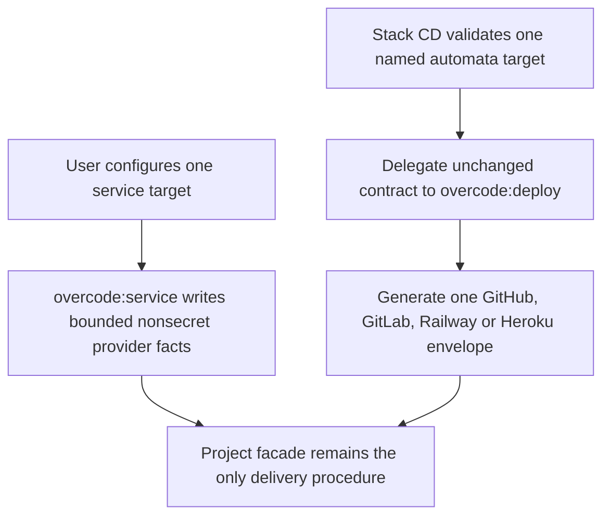
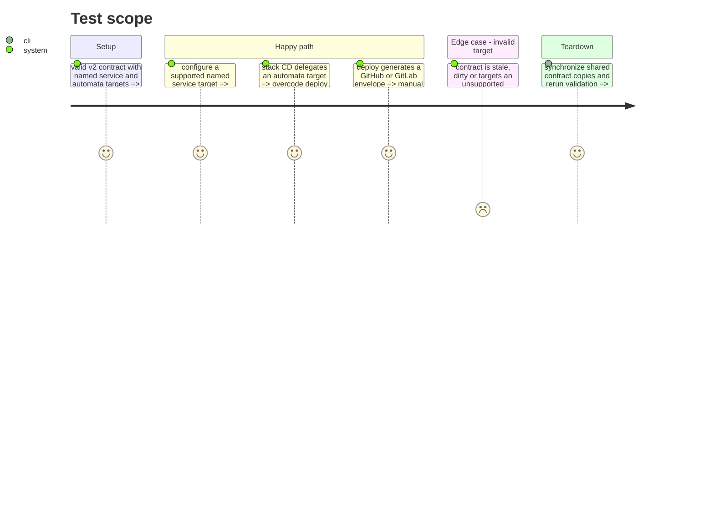

# Instruction: Séparer la configuration de service et les enveloppes de livraison

## Architecture projection

> Tree of the final files. ✅ create · ✏️ modify · ❌ delete

```txt
plugins/overcode/
├── skills/service/                                   ✏️ add local/server target-configuration actions and provider adapters
├── skills/deploy/                                    ✅ router, automata action, repository adapters and evals
├── references/cd-contract.md                          ✅ independent copy of the shared delivery contract
├── references/cd-project-contract.schema.json         ✅ independent copy of the shared schema
├── references/cd-differential-sync.md                 ✅ independent copy of shared synchronization constraints
└── references/host-portability.md                     ✏️ only if deploy needs an explicit path clarification
tools/sc-cd/
├── contract.md                                        ✏️ name overcode as the required delivery capability
└── sync-contract.mjs                                  ✏️ distribute shared copies to overcode instead of web-tiers
plugins/sc-css/, plugins/sc-js/, plugins/sc-php/, plugins/sc-python/, plugins/sc-rust/
├── references/cd-contract.md                          ✏️ synchronized contract wording
├── references/cd-project-contract.schema.json         ✏️ synchronized schema copy
├── references/cd-differential-sync.md                 ✏️ synchronized shared reference
└── skills/cd/actions/03-automata.md                   ✏️ delegate to overcode:deploy
```

## User Journey



## Test Scope



## Tasks to do

### `1)` Place provider configuration in `overcode:service`

> Extend service with the configuration behavior that connects a project to one target without running its delivery procedure.

1. Add `local` and `server` actions to `service`, with SSH, Alwaysdata, Railway and Heroku as target adapters and explicit not-applicable handling for unsupported local primitives.
2. Move the provider reference and the local/server portions of delivery scenarios to `service`, preserving one-target isolation, nonsecret metadata, lifecycle guards and no remote contact during configuration.
3. Keep SaaS rule installation and target configuration independently routable so service-specific requests do not create an automation envelope.

### `2)` Establish `overcode:deploy`

> Move the repository automation envelope behavior without absorbing configuration or application delivery logic.

1. Create a `deploy` router whose `automata` action generates the thin envelope for one valid named target.
2. Move the CI reference and automata portions of CD scenarios and safety scenarios; describe GitHub Actions and GitLab CI as repository integrations of `deploy`.
3. Preserve manual-default triggers, immutable source, lifecycle guard, concurrency, nonzero exit propagation and the no-duplicate-procedure boundary.

### `3)` Move shared-contract ownership from web-tiers to overcode

> Keep the independently installable contract copies valid after the provider plugin disappears.

1. Add overcode to the shared-contract synchronization recipients and remove web-tiers.
2. Update the canonical contract’s missing-capability clause to require `overcode:deploy`, then synchronize the contract, schema and differential-sync copies into all six recipients.
3. Run the synchronization checker to prove no recipient drift remains.

### `4)` Redirect all stack handoffs and their evidence

> Make each `sc-*:cd automata` call the new owner without changing a stack-owned delivery facade.

1. Update the five automata actions’ inputs, prerequisite refusal, delegation target and outputs from `web-tiers:cd` to `overcode:deploy`.
2. Update CD scenario and safety scenario assertions that name the old dependency or owner.
3. Amend active Overcode and root documentation that describes the delegation boundary; leave changelog and archived-plan history as historical evidence.

## Test acceptance criteria

| Task | Acceptance criteria |
| ---- | -------------------------------- |
| 1 | `overcode:service` configures only the selected valid target with bounded facts and returns not applicable for an unsupported local primitive. |
| 2 | `overcode:deploy` produces one thin repository/provider envelope for the selected valid automata target. |
| 3 | `node tools/sc-cd/sync-contract.mjs --check` reports all shared copies valid after web-tiers is removed from its recipient list. |
| 4 | Every stack’s automata handoff names `overcode:deploy`; it preserves its own facade byte-for-byte and refuses unavailable or invalid delivery prerequisites without fallback. |
