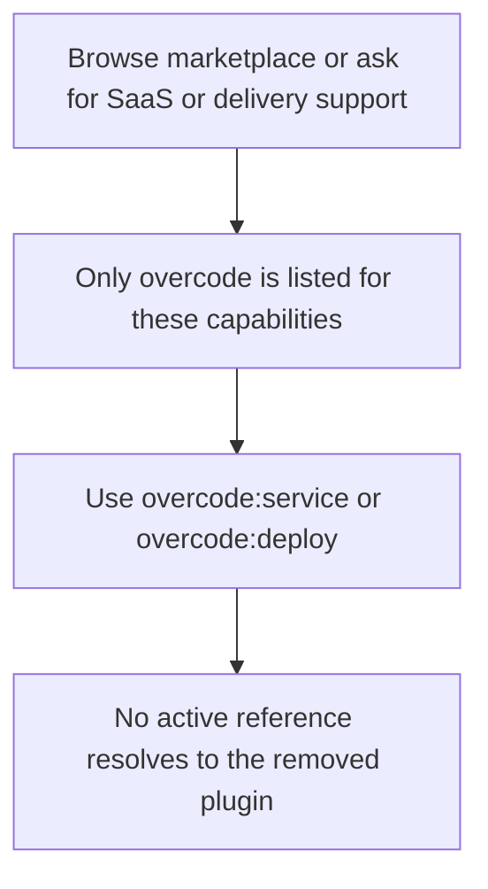
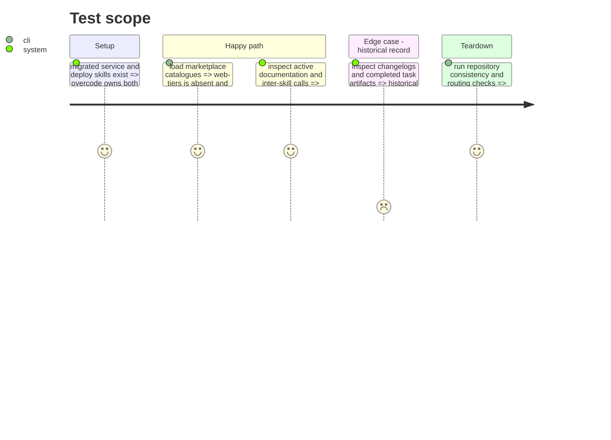

# Instruction: Retirer le plugin et réconcilier les surfaces publiques

## Architecture projection

> Tree of the final files. ✅ create · ✏️ modify · ❌ delete

```txt
plugins/web-tiers/                                    ❌ all remaining plugin source, manifests, docs and changelog
.claude-plugin/marketplace.json                        ✏️ remove web-tiers entry and retain overcode parity
.agents/plugins/marketplace.json                       ✏️ remove Codex plugin entry
index.json                                             ✏️ remove web-tiers index entry
README.md                                              ✏️ remove plugin listing and document overcode ownership
tools/migrate_skills_to_vibe.py                        ✏️ remove web-tiers metadata
aidd_docs/memory/marketplace-v3.md, pivots-testing.md, sc-cd.md ✏️ update current project memory
plugins/overcode/README.md, docs/, references/, skills/ ✏️ remove active web-tiers references and expose service/deploy
```

## User Journey



## Test Scope



## Tasks to do

### `1)` Remove the standalone plugin from marketplace registration

> Delete the completed source only after both replacement skills and their shared references exist.

1. Remove the entire `plugins/web-tiers/` tree, including both manifests, README, changelog, actions, references and evals after their migrated equivalents are verified.
2. Remove its entries from the Claude marketplace, Codex marketplace and lightweight index.
3. Remove its migration metadata and update the root marketplace description, installation instructions and quick-reference table.

### `2)` Reconcile active documentation and durable memory

> Replace operational references to the old plugin while preserving historical records.

1. Update `overcode` documentation, provider mappings, optimizer guidance and alias scenarios to name `service` or `deploy` precisely.
2. Update current marketplace, pivot and CD memory documents whose stated source of truth still includes web-tiers.
3. Do not rewrite changelogs, decisions, or completed plans solely to erase historical references.

### `3)` Run final structural and behavioral checks

> Prove the marketplace has one valid owner for the migrated capabilities.

1. Run the shared-contract synchronization check, manifest/action consistency check and routing coverage check.
2. Run the moved service and deploy behavioural suites against their existing fixtures, updating only stale ownership labels needed for their stated assertions.
3. Search active surfaces for removed invocations, validate JSON manifests, and run `git diff --check`.

## Test acceptance criteria

| Task | Acceptance criteria |
| ---- | -------------------------------- |
| 1 | `web-tiers` has no marketplace, index, Codex catalog or source-tree presence, while `overcode` remains a valid listed plugin. |
| 2 | Active user-facing and inter-skill references resolve to `overcode:service` or `overcode:deploy`; historical records retain their original context. |
| 3 | Shared-contract, consistency, coverage, behavioral and whitespace checks pass with no unresolved active reference to the retired plugin. |
