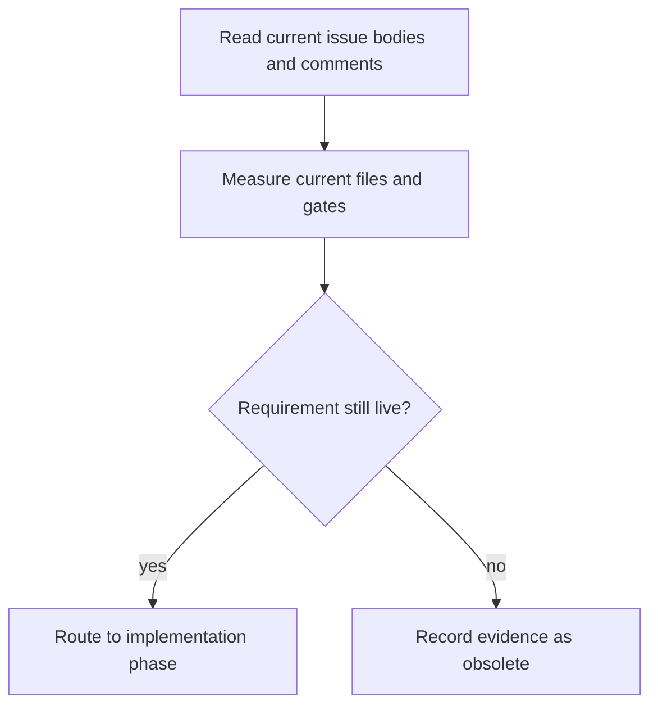
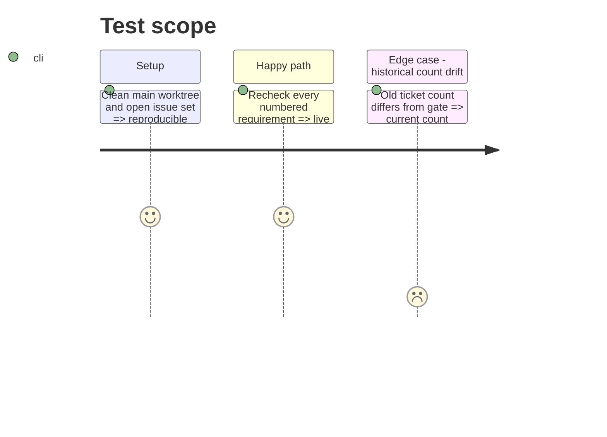

# Instruction: Adjudicate obsolete claims and establish a current baseline

## Architecture projection

> Tree of the final files. ✅ create · ✏️ modify · ❌ delete

```txt
.
├── aidd_docs/tasks/2026_09/2026_09_23-open-issues-closeout/
│   └── ✅ current-state.md
└── GitHub issues
    └── ✏️ #8, #9, #12, #13, #24 (evidence comments only in this phase)
```

## User Journey



## Test Scope



## Tasks to do

### `1)` Build the requirement ledger

> Convert every issue claim into a current-state verdict before editing.

1. Record the five issue sources, their current state, and each explicit deliverable.
2. Verify #13's Rust detection, template rung, and run-3 evidence in the migrated paths.
3. Verify that `ERR-09` has no current contract or registry referent and mark only that item obsolete.
4. Re-run the routing gate and record its current 9/2 baseline instead of #9's 11/7 historical counts.
5. Map every still-live claim to phases 2–6.

## Test acceptance criteria

| Task | Acceptance criteria |
| ---- | ------------------- |
| 1 | Every explicit item in all five open issues has a sourced `live`, `already satisfied`, or `obsolete` verdict; no implementation task rests only on an old line number or old count. |
